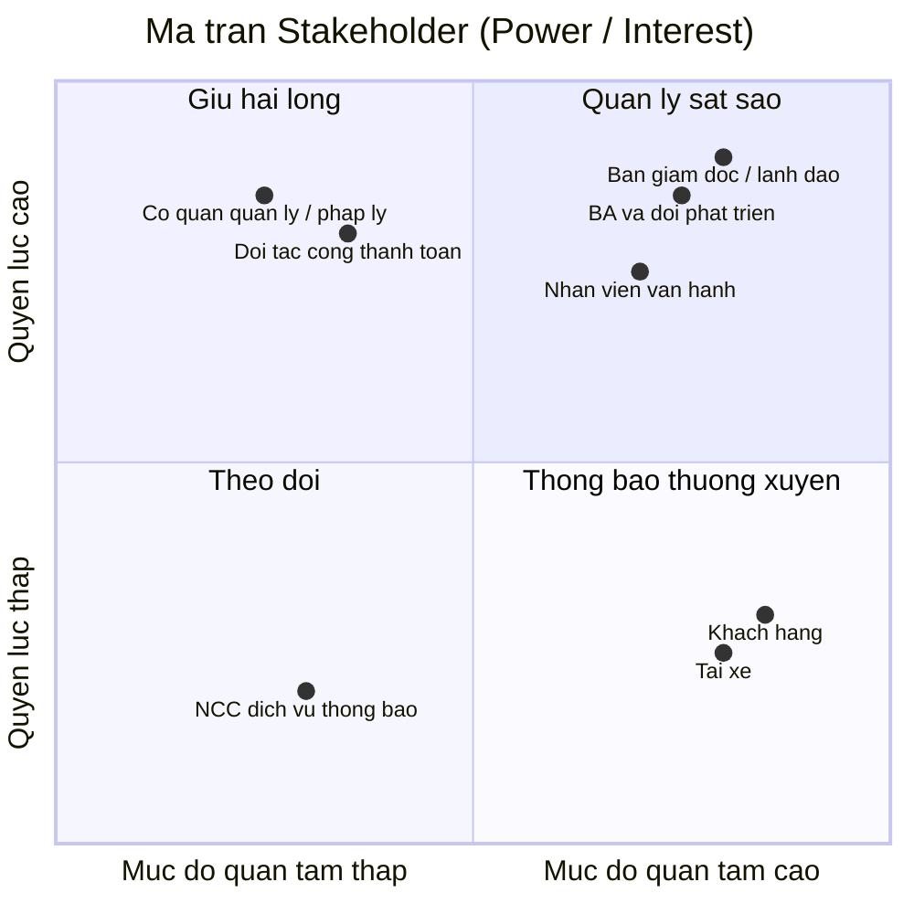
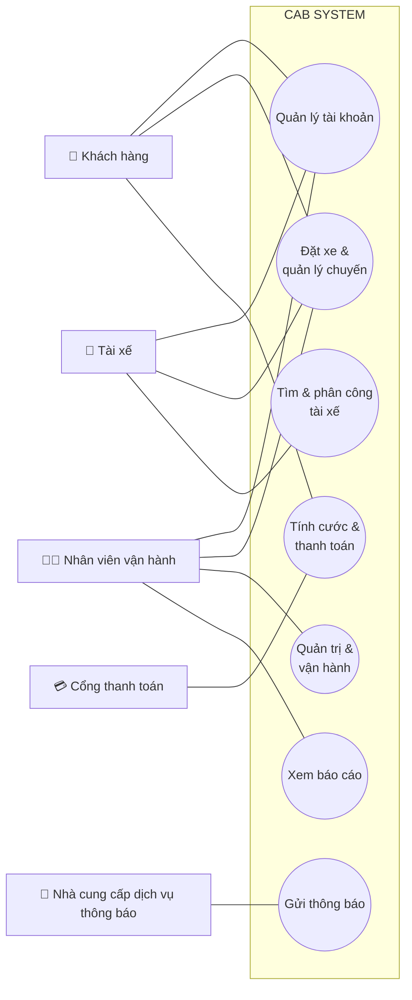
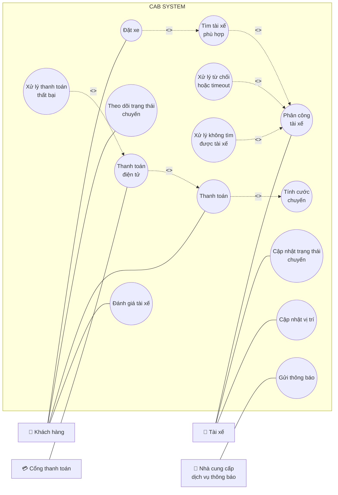

# CAB System — Nền tảng đặt xe

## 0. Tổng quan hệ thống

| Mục | Nội dung |
|---|---|
| **Tên dự án** | CAB System |
| **Loại hệ thống** | Nền tảng đặt xe trực tuyến (ride-hailing platform), tương tự mô hình Grab/Uber |
| **Khách hàng** | Công ty ABC — doanh nghiệp cung cấp dịch vụ đặt xe |
| **Thời gian triển khai** | 7 tuần |
| **Định hướng kiến trúc** | Service-Oriented Architecture / Microservices (do yêu cầu về khả năng mở rộng độc lập, triển khai từng phần, cô lập lỗi giữa các module) |
| **Phạm vi môn học** | Bài tập lớn môn Lập trình hướng dịch vụ (SOA) |

**Ý tưởng cốt lõi:** CAB System kết nối 3 nhóm người dùng — khách hàng, tài xế và nhân viên vận hành — thông qua một chuỗi nghiệp vụ xuyên suốt: *tạo yêu cầu đặt xe → tìm & phân công tài xế → thực hiện chuyến đi → tính cước & thanh toán → thông báo → đánh giá sau chuyến*. Hệ thống không chỉ là một ứng dụng đặt xe đơn thuần mà là một **nền tảng (platform)** có khả năng mở rộng thêm dịch vụ, phương thức thanh toán, kênh thông báo trong tương lai mà không phải xây dựng lại toàn bộ.

Vì hệ thống có nhiều nghiệp vụ độc lập nhưng liên kết chặt (đặt xe, matching, thanh toán, thông báo, quản trị), đây là bài toán rất phù hợp để thiết kế theo hướng **chia nhỏ thành các service riêng biệt**, giao tiếp với nhau qua API/message — đúng tinh thần môn SOA.

---

## Bước 1: Tìm hiểu nghiệp vụ

### 1.1 Vấn đề hiện tại của doanh nghiệp

Theo mô tả của khách hàng, hệ thống hiện tại (tổng đài + app đơn giản) đang gặp các vấn đề sau:

| # | Vấn đề hiện tại |
|---|---|
| 1 | **Phân công tài xế thủ công** — không có cơ chế tự động ghép tài xế phù hợp với khách hàng |
| 2 | **Khách hàng khó theo dõi trạng thái chuyến đi** — thiếu thông tin real-time (đang tìm tài xế, tài xế nhận chuyến, ETA...) |
| 3 | **Thông tin thanh toán không tập trung** — chưa có cơ chế quản lý thanh toán thống nhất, tích hợp |
| 4 | **Khó mở rộng hệ thống** — bộ phận vận hành gặp khó khăn khi muốn scale hoặc thêm tính năng mới |

### 1.2 Mục tiêu của hệ thống mới

- Xây dựng nền tảng CAB có khả năng **phục vụ số lượng lớn khách hàng và tài xế** cùng lúc, đặc biệt ổn định vào giờ cao điểm.
- **Tự động hóa việc tìm và phân công tài xế** dựa trên vị trí, trạng thái sẵn sàng và tiêu chí vận hành, có cơ chế fallback khi tài xế không phản hồi/từ chối.
- Cho khách hàng **theo dõi chuyến đi theo thời gian thực** từ lúc đặt xe đến khi hoàn thành.
- **Tập trung hóa nghiệp vụ thanh toán và tính cước**, hỗ trợ tiền mặt lẫn thanh toán điện tử qua bên thứ ba, không lưu trữ dữ liệu nhạy cảm của thẻ/tài khoản thanh toán trong hệ thống.
- Xây dựng hệ thống **thông báo (notification)** xuyên suốt vòng đời chuyến đi, có khả năng mở rộng thêm kênh thông báo mới sau này.
- Cung cấp **công cụ quản trị & báo cáo** cho vận hành: quản lý khách hàng/tài xế/xe/chuyến đi, phân quyền thao tác nhạy cảm, báo cáo doanh thu/tỷ lệ hoàn thành/hủy/hiệu quả tài xế.
- Đảm bảo **kiến trúc linh hoạt, có thể mở rộng độc lập từng thành phần**: lỗi ở một module (vd. thanh toán, thông báo) không được làm sập toàn bộ hệ thống đặt xe; triển khai tính năng mới từng phần, ít ảnh hưởng phần đang chạy.
- Đảm bảo **bảo mật**: xác thực người dùng, kiểm soát quyền truy cập cho thao tác quản trị, bảo vệ dữ liệu cá nhân/vị trí/giao dịch, lưu vết (audit log) các thao tác quan trọng.

### 1.3 Các nhóm người tham gia sử dụng hệ thống (Actors)

| Actor | Vai trò chính |
|---|---|
| **Khách hàng (Customer)** | Đăng ký/đăng nhập, cập nhật hồ sơ, đặt xe (điểm đón/đến, loại xe), theo dõi trạng thái chuyến, xem lịch sử, thanh toán, đánh giá tài xế sau chuyến |
| **Tài xế (Driver)** | Đăng ký/được vận hành tạo tài khoản, cập nhật hồ sơ & phương tiện, bật trạng thái sẵn sàng, nhận/từ chối chuyến, cập nhật trạng thái chuyến (đến điểm đón, đón khách, di chuyển, hoàn thành), gửi vị trí |
| **Nhân viên vận hành (Operator/Admin)** | Quản lý khách hàng, tài xế, phương tiện, chuyến đi; xử lý sự cố chuyến; tra cứu lịch sử giao dịch; xem báo cáo (số chuyến, doanh thu, tỷ lệ hoàn thành/hủy, hiệu quả tài xế) |
| **Cổng thanh toán bên thứ ba (Payment Gateway)** *(actor hệ thống/bên ngoài)* | Xử lý giao dịch thanh toán điện tử thay cho CAB System, tránh lưu thông tin nhạy cảm trong hệ thống |

> **Lưu ý:** Cổng thanh toán bên thứ ba tuy không phải "người dùng" nhưng đóng vai trò actor hệ thống (external system) vì có tương tác hai chiều với CAB System — đây là điểm cần thể hiện rõ trong sơ đồ Use Case ở bước sau.

### 1.4 Các điểm chưa rõ, cần làm rõ thêm với khách hàng (ghi nhận để xử lý ở bước sau)

Theo yêu cầu, doanh nghiệp **chưa chốt** các nội dung sau — Business Analyst cần làm rõ trước khi đội phát triển thiết kế giải pháp:

- Công thức/cách tính cước
- Tiêu chí ưu tiên tài xế khi matching
- Thời gian tối đa tài xế phải phản hồi một chuyến được đề xuất
- Chính sách hủy chuyến (ai được hủy, khi nào, có phí hủy không...)
- Cách xử lý khi mất kết nối mạng (khách hàng hoặc tài xế)
- Thời gian lưu trữ dữ liệu (lịch sử chuyến, vị trí, giao dịch...)

Trước tiên là bảng stakeholder (2.1), sau đó là ma trận Mendelow dạng sơ đồ (2.2).

## 2.1. Bảng Stakeholders

| Stakeholder | Vai trò | Tương tác với hệ thống |
|---|---|---|
| **Ban giám đốc / Ban lãnh đạo công ty ABC** | Người ra quyết định đầu tư, phê duyệt phạm vi & ngân sách dự án | Không thao tác trực tiếp lên hệ thống; nhận báo cáo tổng hợp (doanh thu, tỷ lệ hoàn thành/hủy, hiệu quả tài xế) để ra quyết định chiến lược |
| **Nhân viên vận hành (Operator)** | Vận hành hằng ngày: giám sát chuyến đi, xử lý sự cố, quản lý dữ liệu | Sử dụng giao diện quản trị (admin) trực tiếp: quản lý khách hàng/tài xế/xe/chuyến, tra cứu giao dịch, thao tác theo phân quyền |
| **Khách hàng (Customer)** | Người dùng cuối, tạo nhu cầu đặt xe | Tương tác trực tiếp qua app: đăng ký, đặt xe, theo dõi chuyến, thanh toán, đánh giá tài xế |
| **Tài xế (Driver)** | Người cung cấp dịch vụ vận chuyển | Tương tác trực tiếp qua app tài xế: nhận/từ chối chuyến, cập nhật trạng thái & vị trí, xem thu nhập |
| **Business Analyst & Đội phát triển** | Phân tích, thiết kế, xây dựng hệ thống | Không phải người dùng cuối nhưng quyết định kiến trúc, luồng nghiệp vụ; cần làm rõ các yêu cầu chưa chốt với khách hàng |
| **Đối tác cổng thanh toán (Payment Gateway)** | Bên thứ ba xử lý giao dịch điện tử | Tương tác qua API/tích hợp hệ thống: nhận yêu cầu thanh toán, trả kết quả giao dịch; không có giao diện người dùng trong CAB System |
| **Nhà cung cấp dịch vụ thông báo (SMS/Email/Push provider)** | Bên thứ ba gửi thông báo | Tương tác qua API tích hợp; hệ thống gọi để gửi thông báo cho khách hàng/tài xế |
| **Cơ quan quản lý / pháp lý** (giao thông, bảo vệ dữ liệu cá nhân) | Đặt ra quy định mà hệ thống phải tuân thủ | Không tương tác trực tiếp với hệ thống, nhưng chi phối yêu cầu về bảo mật dữ liệu, xác thực tài xế, lưu trữ dữ liệu |

## 2.2. Ma trận Stakeholder (Mendelow Matrix)



**Cách đọc và áp dụng ma trận:**

- **Quản lý sát sao** (Ban giám đốc, BA & đội phát triển, Nhân viên vận hành): quyền lực và mức quan tâm đều cao → cần thu hút tham gia thường xuyên, thông tin đầy đủ, xin phê duyệt/phản hồi liên tục trong suốt dự án.
- **Giữ hài lòng** (cơ quan quản lý/pháp lý, đối tác cổng thanh toán): quyền lực cao nhưng ít quan tâm chi tiết hằng ngày → cần đảm bảo tuân thủ yêu cầu của họ (quy định pháp lý, chuẩn tích hợp API) nhưng không cần trao đổi quá thường xuyên.
- **Thông báo thường xuyên** (khách hàng, tài xế): quan tâm cao nhưng quyền lực thấp (không quyết định thiết kế hệ thống) → cần cập nhật thông tin, thu thập phản hồi qua khảo sát/UX testing, nhưng họ không phải người phê duyệt yêu cầu.
- **Theo dõi** (nhà cung cấp dịch vụ thông báo bên thứ ba): quyền lực và quan tâm đều thấp → chỉ cần giám sát ở mức tối thiểu, không cần đầu tư nhiều công sức giao tiếp.

## Bước 3 – Mục đích nghiệp vụ

### 3.1. Mục đích tổng quát

Xây dựng **CAB System** — một nền tảng đặt xe trực tuyến hiện đại, thay thế mô hình vận hành thủ công hiện tại (tổng đài + app đơn giản) — nhằm giúp Công ty ABC:

- Tự động hóa toàn bộ quy trình từ đặt xe → tìm/phân công tài xế → thực hiện chuyến → tính cước → thanh toán → thông báo → đánh giá.
- Phục vụ được **quy mô lớn** khách hàng và tài xế cùng lúc, kể cả vào giờ cao điểm, mà không bị gián đoạn dịch vụ.
- Tạo nền tảng có **kiến trúc mở, dễ mở rộng** để doanh nghiệp phát triển thêm dịch vụ, tính năng trong tương lai mà không phải xây lại từ đầu.

Nói ngắn gọn: mục đích không phải là "làm ra một app đặt xe", mà là "xây một **nền tảng dịch vụ (platform)** đủ vững để doanh nghiệp vận hành và tăng trưởng lâu dài".

### 3.2. Các mục đích chính

| # | Mục đích chính | Giải quyết vấn đề gì |
|---|---|---|
| 1 | **Tự động hóa việc tìm và phân công tài xế** | Thay thế việc phân công thủ công, dựa trên vị trí + trạng thái sẵn sàng, có cơ chế fallback khi tài xế từ chối/không phản hồi |
| 2 | **Minh bạch hóa & theo dõi chuyến đi theo thời gian thực** | Khách hàng biết được trạng thái mỗi bước: đang tìm tài xế → tài xế nhận chuyến → ETA → đang di chuyển → hoàn thành |
| 3 | **Tập trung hóa thanh toán & tính cước** | Thống nhất một luồng thanh toán (tiền mặt + điện tử qua bên thứ ba), không lưu dữ liệu thẻ nhạy cảm trong hệ thống nội bộ |
| 4 | **Xây dựng hệ thống thông báo xuyên suốt vòng đời chuyến đi** | Đảm bảo khách hàng & tài xế luôn được cập nhật kịp thời tại mọi mốc quan trọng; kiến trúc mở để thêm kênh thông báo mới |
| 5 | **Cung cấp công cụ quản trị & báo cáo cho vận hành** | Cho nhân viên vận hành khả năng quản lý, xử lý sự cố, và cho ban lãnh đạo dữ liệu ra quyết định (doanh thu, tỷ lệ hoàn thành/hủy, hiệu quả tài xế) |
| 6 | **Đảm bảo hệ thống ổn định & có khả năng mở rộng độc lập** | Lỗi ở một module (thanh toán, thông báo) không được làm sập toàn hệ thống; scale riêng từng thành phần khi tải tăng |
| 7 | **Bảo mật dữ liệu và kiểm soát truy cập** | Xác thực người dùng, phân quyền thao tác nhạy cảm, bảo vệ dữ liệu cá nhân/vị trí/giao dịch, lưu vết thao tác để phục vụ audit |
| 8 | **Tạo kiến trúc linh hoạt cho tăng trưởng dài hạn** | Cho phép thêm loại dịch vụ mới, phương thức thanh toán mới, nhà cung cấp thông báo mới... mà không phải xây lại toàn bộ hệ thống |

> Các mục đích 6, 7, 8 chính là lý do bài toán này phù hợp để triển khai theo hướng **SOA/microservices** — tách các nghiệp vụ (đặt xe, matching, thanh toán, thông báo, quản trị) thành các service độc lập, giao tiếp qua API, để đáp ứng đúng yêu cầu "lỗi cục bộ không sập toàn hệ thống" và "mở rộng từng phần".

## Bước 4 – Xác định phạm vi dự án

### 4.1. Trong phạm vi (In-scope)

**Nhóm chức năng dành cho Khách hàng:**
- Đăng ký, đăng nhập, cập nhật thông tin cá nhân
- Nhập điểm đón/điểm đến, chọn loại xe, gửi yêu cầu đặt xe
- Theo dõi trạng thái chuyến đi theo thời gian thực (đang tìm tài xế, tài xế nhận chuyến, ETA, đang di chuyển, hoàn thành)
- Xem lịch sử chuyến đi, số tiền đã trả
- Thanh toán (tiền mặt + điện tử qua cổng thanh toán bên thứ ba)
- Đánh giá tài xế sau chuyến

**Nhóm chức năng dành cho Tài xế:**
- Đăng ký / được nhân viên vận hành tạo tài khoản
- Cập nhật hồ sơ cá nhân, thông tin phương tiện
- Bật/tắt trạng thái sẵn sàng nhận chuyến
- Nhận thông báo chuyến mới, chấp nhận/từ chối chuyến
- Cập nhật trạng thái chuyến (đến điểm đón, đón khách, đang di chuyển, hoàn thành)
- Gửi vị trí liên tục để hỗ trợ matching & ước tính ETA

**Nhóm chức năng cốt lõi (Core business logic):**
- Thuật toán tìm & phân công tài xế (matching), có cơ chế fallback khi tài xế không phản hồi/từ chối
- Tính cước sau khi hoàn thành chuyến
- Xử lý thanh toán, tích hợp cổng thanh toán bên thứ ba
- Hệ thống thông báo (notification) cho các sự kiện trong vòng đời chuyến đi

**Nhóm chức năng dành cho Nhân viên vận hành (Admin):**
- Quản lý khách hàng, tài xế, phương tiện, chuyến đi
- Giám sát chuyến đang diễn ra, xử lý sự cố chuyến bị lỗi
- Tra cứu lịch sử giao dịch
- Phân quyền cho các thao tác nhạy cảm
- Báo cáo: số lượng chuyến, doanh thu, tỷ lệ hoàn thành/hủy, hiệu quả tài xế

**Yêu cầu phi chức năng cần đáp ứng trong phạm vi:**
- Kiến trúc có khả năng mở rộng độc lập từng thành phần (scale riêng)
- Cô lập lỗi: lỗi ở module thanh toán/thông báo không làm sập toàn hệ thống
- Triển khai (deploy) từng phần, hạn chế ảnh hưởng đến chức năng đang chạy
- Xác thực, phân quyền, bảo vệ dữ liệu cá nhân/vị trí/giao dịch, audit log

### 4.2. Ngoài phạm vi (Out-of-scope)

| # | Nội dung ngoài phạm vi | Lý do |
|---|---|---|
| 1 | Xây dựng hệ thống xử lý thanh toán riêng (lưu trữ thông tin thẻ, tài khoản ngân hàng) | Khách hàng yêu cầu **tích hợp với nhà cung cấp thanh toán bên ngoài**, không tự lưu dữ liệu nhạy cảm |
| 2 | Xác định công thức tính cước cụ thể, chính sách hủy chuyến, tiêu chí ưu tiên tài xế chi tiết | Doanh nghiệp **chưa chốt**, cần BA làm rõ với các bên liên quan ở giai đoạn phân tích trước khi dev xây dựng — đây là input cho scope, không phải scope đã đóng băng |
| 3 | Xây dựng thêm loại dịch vụ mới, phương thức thanh toán mới, kênh thông báo mới (ngoài kênh cơ bản) | Chỉ yêu cầu **kiến trúc phải sẵn sàng cho mở rộng**, chưa yêu cầu triển khai ngay trong 7 tuần |
| 4 | Ứng dụng dành cho các nền tảng ngoài phạm vi đã thống nhất (nếu có, cần xác nhận: web, iOS, Android...) | Chưa được đề cập rõ trong yêu cầu — cần xác nhận thêm với khách hàng |
| 5 | Tích hợp bản đồ/định tuyến chi tiết (bên thứ ba cụ thể nào, thuật toán định tuyến tối ưu) | Yêu cầu chỉ nói đến "vị trí tài xế" và "ước tính thời gian đến", chưa xác định rõ nhà cung cấp bản đồ hay logic định tuyến |
| 6 | Chương trình khuyến mãi, mã giảm giá, chăm sóc khách hàng qua tổng đài | Không được đề cập trong yêu cầu ban đầu |

### 4.3. Ràng buộc (Constraints)

| Loại ràng buộc | Nội dung |
|---|---|
| **Thời gian** | Chỉ có **7 tuần** để xây dựng và triển khai — ảnh hưởng trực tiếp đến việc chọn kiến trúc và mức độ chi tiết có thể làm trong phạm vi |
| **Kỹ thuật** | Không được lưu trữ thông tin nhạy cảm của thẻ/tài khoản thanh toán trong hệ thống CAB (bắt buộc dùng bên thứ ba xử lý) |
| **Kiến trúc** | Phải đảm bảo khả năng mở rộng độc lập và cô lập lỗi giữa các thành phần — định hướng chọn microservices thay vì monolithic |
| **Nghiệp vụ chưa chốt** | Nhiều quy tắc nghiệp vụ quan trọng (cách tính cước, chính sách hủy, thời gian phản hồi...) **chưa được xác nhận**, có thể ảnh hưởng đến scope chi tiết sau khi làm rõ |

### 4.4. Giả định (Assumptions)

*(cần xác nhận lại với khách hàng ở các bước sau — liệt kê ở đây để không bỏ sót)*

- Giả định hệ thống được xây dựng dưới dạng **ứng dụng di động** cho khách hàng và tài xế, kèm **giao diện web** cho nhân viên vận hành (chưa có xác nhận chính thức từ khách hàng).
- Giả định trong 7 tuần chỉ triển khai **một loại dịch vụ đặt xe cơ bản** (chưa phân nhiều hạng xe phức tạp), kiến trúc chừa chỗ mở rộng sau.
- Giả định có tối thiểu **một** cổng thanh toán bên thứ ba được tích hợp trong giai đoạn đầu (không cần multi-gateway ngay).
- Giả định thông báo trong giai đoạn đầu dùng tối thiểu **1-2 kênh cơ bản** (ví dụ: push notification/SMS), kiến trúc phải cho phép thêm kênh sau này.

## Bước 5 – Xác định yêu cầu nghiệp vụ (Business Requirements)
### 5.1. Nhóm yêu cầu nghiệp vụ — Khách hàng

| Mã BR | Yêu cầu nghiệp vụ |
|---|---|
| BR-01 | Hệ thống phải cho phép khách hàng đăng ký tài khoản và đăng nhập để sử dụng dịch vụ |
| BR-02 | Hệ thống phải cho phép khách hàng cập nhật thông tin cá nhân |
| BR-03 | Hệ thống phải cho phép khách hàng tạo yêu cầu đặt xe bằng cách nhập điểm đón, điểm đến và chọn loại xe |
| BR-04 | Hệ thống phải hiển thị cho khách hàng trạng thái chuyến đi theo thời gian thực, bao gồm: đang tìm tài xế, tài xế đã nhận chuyến, thời gian dự kiến tài xế đến, và trạng thái hiện tại của chuyến |
| BR-05 | Hệ thống phải cho phép khách hàng xem lại lịch sử các chuyến đi đã thực hiện, kèm số tiền đã thanh toán |
| BR-06 | Hệ thống phải cho phép khách hàng đánh giá tài xế sau khi chuyến đi hoàn thành |
| BR-07 | Hệ thống phải thông báo rõ ràng cho khách hàng trong trường hợp không tìm được tài xế phù hợp |

### 5.2. Nhóm yêu cầu nghiệp vụ — Tài xế

| Mã BR | Yêu cầu nghiệp vụ |
|---|---|
| BR-08 | Hệ thống phải cho phép tài xế đăng ký tài khoản, hoặc được nhân viên vận hành tạo tài khoản thay |
| BR-09 | Hệ thống phải cho phép tài xế cập nhật hồ sơ cá nhân và thông tin phương tiện |
| BR-10 | Hệ thống phải cho phép tài xế chuyển đổi trạng thái sẵn sàng nhận chuyến khi đang làm việc |
| BR-11 | Hệ thống phải gửi thông báo cho tài xế khi có yêu cầu đặt xe phù hợp, và cho phép tài xế chấp nhận hoặc từ chối |
| BR-12 | Hệ thống phải cho phép tài xế cập nhật trạng thái chuyến đi theo từng mốc: đã đến điểm đón, đã đón khách, đang di chuyển, hoàn thành chuyến |
| BR-13 | Hệ thống phải ghi nhận vị trí của tài xế liên tục để phục vụ việc tìm tài xế gần khách hàng và ước tính thời gian đến |

### 5.3. Nhóm yêu cầu nghiệp vụ — Tìm & phân công tài xế (Matching)

| Mã BR | Yêu cầu nghiệp vụ |
|---|---|
| BR-14 | Hệ thống phải tự động xác định danh sách tài xế phù hợp dựa trên vị trí, trạng thái sẵn sàng và các tiêu chí vận hành khác khi khách hàng tạo yêu cầu đặt xe |
| BR-15 | Hệ thống phải ưu tiên đề xuất tài xế phù hợp và gần khách hàng nhất |
| BR-16 | Hệ thống phải tự động tìm tài xế khác nếu tài xế được đề xuất không phản hồi hoặc từ chối, mà không yêu cầu khách hàng tạo lại yêu cầu đặt xe |

### 5.4. Nhóm yêu cầu nghiệp vụ — Thanh toán & tính cước

| Mã BR | Yêu cầu nghiệp vụ |
|---|---|
| BR-17 | Hệ thống phải tự động xác định số tiền khách hàng phải trả sau khi chuyến đi hoàn thành, dựa trên loại dịch vụ và thông tin chuyến đi |
| BR-18 | Hệ thống phải hỗ trợ khách hàng thanh toán bằng tiền mặt hoặc phương thức thanh toán điện tử |
| BR-19 | Hệ thống phải tích hợp với nhà cung cấp thanh toán bên ngoài, không được lưu trực tiếp thông tin nhạy cảm của thẻ/tài khoản thanh toán trong hệ thống CAB |
| BR-20 | Hệ thống phải thông báo cho khách hàng và cho phép xử lý lại khi giao dịch thanh toán điện tử thất bại, theo chính sách của doanh nghiệp |

### 5.5. Nhóm yêu cầu nghiệp vụ — Thông báo (Notification)

| Mã BR | Yêu cầu nghiệp vụ |
|---|---|
| BR-21 | Hệ thống phải thông báo cho khách hàng tại các mốc: yêu cầu đặt xe được tiếp nhận, tài xế nhận chuyến, tài xế đến điểm đón, chuyến hoàn thành, kết quả thanh toán |
| BR-22 | Hệ thống phải thông báo cho tài xế về chuyến mới hoặc thay đổi liên quan đến chuyến đang thực hiện |
| BR-23 | Hệ thống phải có khả năng mở rộng thêm kênh thông báo mới trong tương lai mà không phải thay đổi toàn bộ hệ thống |

### 5.6. Nhóm yêu cầu nghiệp vụ — Vận hành & Quản trị

| Mã BR | Yêu cầu nghiệp vụ |
|---|---|
| BR-24 | Hệ thống phải cung cấp giao diện quản trị cho nhân viên vận hành để quản lý khách hàng, tài xế, phương tiện và chuyến đi |
| BR-25 | Hệ thống phải cho phép nhân viên vận hành xem các chuyến đang diễn ra và kiểm tra trạng thái tài xế |
| BR-26 | Hệ thống phải cho phép nhân viên vận hành hỗ trợ xử lý các chuyến bị lỗi và tra cứu lịch sử giao dịch |
| BR-27 | Hệ thống phải phân quyền chức năng quản trị, đảm bảo nhân viên thông thường không thể thực hiện thao tác nhạy cảm |
| BR-28 | Hệ thống phải cung cấp báo cáo về số lượng chuyến, doanh thu, tỷ lệ chuyến hoàn thành, tỷ lệ hủy, và hiệu quả hoạt động của tài xế |

### 5.7. Nhóm yêu cầu nghiệp vụ — Phi chức năng (ở mức nghiệp vụ)

| Mã BR | Yêu cầu nghiệp vụ |
|---|---|
| BR-29 | Hệ thống phải hoạt động ổn định vào các thời điểm nhu cầu tăng cao |
| BR-30 | Lỗi tại một chức năng (vd. thanh toán, thông báo) không được làm gián đoạn toàn bộ hệ thống đặt xe |
| BR-31 | Các thành phần hệ thống phải có khả năng mở rộng độc lập khi tải tăng |
| BR-32 | Hệ thống phải cho phép triển khai chức năng mới từng phần, hạn chế ảnh hưởng đến chức năng đang hoạt động |
| BR-33 | Hệ thống phải xác thực khách hàng và tài xế trước khi cho phép sử dụng các chức năng yêu cầu tài khoản |
| BR-34 | Hệ thống phải kiểm soát quyền truy cập đối với các thao tác quản trị |
| BR-35 | Hệ thống phải bảo vệ thông tin cá nhân, thông tin phương tiện, dữ liệu vị trí và dữ liệu giao dịch |
| BR-36 | Hệ thống phải lưu vết (audit log) các thao tác quan trọng để phục vụ kiểm tra khi có sự cố |

## Bước 6 – Phân rã yêu cầu chức năng (Functional Requirements)

### 6.1. Module Quản lý tài khoản Khách hàng

| Mã FR | Mô tả chức năng | BR gốc |
|---|---|---|
| FR-01.1 | Đăng ký tài khoản khách hàng (số điện thoại/email, xác thực OTP) | BR-01 |
| FR-01.2 | Đăng nhập tài khoản khách hàng | BR-01 |
| FR-01.3 | Cập nhật thông tin cá nhân (tên, ảnh đại diện, số điện thoại) | BR-02 |
| FR-01.4 | Đổi mật khẩu / khôi phục mật khẩu | BR-01 |

### 6.2. Module Quản lý tài khoản Tài xế

| Mã FR | Mô tả chức năng | BR gốc |
|---|---|---|
| FR-02.1 | Tài xế tự đăng ký tài khoản (chờ duyệt) | BR-08 |
| FR-02.2 | Nhân viên vận hành tạo tài khoản tài xế thay | BR-08 |
| FR-02.3 | Cập nhật hồ sơ tài xế (thông tin cá nhân, giấy phép lái xe) | BR-09 |
| FR-02.4 | Cập nhật thông tin phương tiện (biển số, loại xe, hình ảnh) | BR-09 |
| FR-02.5 | Chuyển đổi trạng thái sẵn sàng nhận chuyến (online/offline) | BR-10 |

### 6.3. Module Đặt xe & Theo dõi chuyến

| Mã FR | Mô tả chức năng | BR gốc |
|---|---|---|
| FR-03.1 | Tạo yêu cầu đặt xe (điểm đón, điểm đến, loại xe) | BR-03 |
| FR-03.2 | Hủy yêu cầu đặt xe (theo chính sách hủy — cần làm rõ ở BR chưa chốt) | BR-03 |
| FR-03.3 | Hiển thị trạng thái "đang tìm tài xế" | BR-04 |
| FR-03.4 | Hiển thị thông tin tài xế đã nhận chuyến (tên, biển số, ảnh, SĐT) | BR-04 |
| FR-03.5 | Hiển thị thời gian dự kiến tài xế đến (ETA) | BR-04 |
| FR-03.6 | Cập nhật trạng thái chuyến theo thời gian thực cho khách hàng | BR-04 |
| FR-03.7 | Tài xế cập nhật trạng thái "đã đến điểm đón" | BR-12 |
| FR-03.8 | Tài xế cập nhật trạng thái "đã đón khách / bắt đầu chuyến" | BR-12 |
| FR-03.9 | Tài xế cập nhật trạng thái "đang di chuyển" | BR-12 |
| FR-03.10 | Tài xế cập nhật trạng thái "hoàn thành chuyến" | BR-12 |
| FR-03.11 | Khách hàng xem lịch sử chuyến đi | BR-05 |
| FR-03.12 | Khách hàng đánh giá tài xế sau chuyến (điểm số + nhận xét) | BR-06 |

### 6.4. Module Tìm & Phân công tài xế (Matching)

| Mã FR | Mô tả chức năng | BR gốc |
|---|---|---|
| FR-04.1 | Xác định danh sách tài xế phù hợp theo bán kính vị trí + trạng thái sẵn sàng | BR-14 |
| FR-04.2 | Sắp xếp/ưu tiên tài xế theo khoảng cách gần nhất & tiêu chí vận hành | BR-15 |
| FR-04.3 | Gửi đề xuất chuyến đến tài xế theo thứ tự ưu tiên | BR-14, BR-16 |
| FR-04.4 | Xử lý timeout khi tài xế không phản hồi → chuyển đề xuất cho tài xế kế tiếp | BR-16 |
| FR-04.5 | Xử lý khi tài xế từ chối chuyến → tìm tài xế thay thế | BR-16 |
| FR-04.6 | Thông báo khách hàng khi không tìm được tài xế sau khi đã thử hết danh sách | BR-07 |
| FR-04.7 | Ghi nhận vị trí tài xế liên tục (định kỳ) để phục vụ matching & ETA | BR-13 |

### 6.5. Module Thanh toán & Tính cước

| Mã FR | Mô tả chức năng | BR gốc |
|---|---|---|
| FR-05.1 | Tính cước chuyến dựa trên loại dịch vụ + thông tin chuyến (cần làm rõ công thức) | BR-17 |
| FR-05.2 | Ghi nhận thanh toán bằng tiền mặt | BR-18 |
| FR-05.3 | Khởi tạo giao dịch thanh toán điện tử qua cổng thanh toán bên thứ ba | BR-18, BR-19 |
| FR-05.4 | Nhận & xử lý kết quả giao dịch từ cổng thanh toán (callback/webhook) | BR-19 |
| FR-05.5 | Thông báo & cho phép thử lại khi giao dịch thất bại | BR-20 |
| FR-05.6 | Lưu lịch sử giao dịch (không lưu dữ liệu thẻ/tài khoản nhạy cảm) | BR-19 |

### 6.6. Module Thông báo (Notification)

| Mã FR | Mô tả chức năng | BR gốc |
|---|---|---|
| FR-06.1 | Gửi thông báo khách hàng khi yêu cầu đặt xe được tiếp nhận | BR-21 |
| FR-06.2 | Gửi thông báo khách hàng khi có tài xế nhận chuyến | BR-21 |
| FR-06.3 | Gửi thông báo khách hàng khi tài xế đến điểm đón | BR-21 |
| FR-06.4 | Gửi thông báo khách hàng khi chuyến hoàn thành | BR-21 |
| FR-06.5 | Gửi thông báo kết quả thanh toán cho khách hàng | BR-21 |
| FR-06.6 | Gửi thông báo tài xế khi có chuyến mới phù hợp | BR-22 |
| FR-06.7 | Gửi thông báo tài xế khi có thay đổi liên quan chuyến đang thực hiện | BR-22 |
| FR-06.8 | Kiến trúc cho phép thêm kênh thông báo mới không ảnh hưởng hệ thống hiện tại | BR-23 |

### 6.7. Module Quản trị & Vận hành (Admin/Operations)

| Mã FR | Mô tả chức năng | BR gốc |
|---|---|---|
| FR-07.1 | Xem danh sách & chi tiết khách hàng | BR-24 |
| FR-07.2 | Xem danh sách & chi tiết tài xế, duyệt tài khoản tài xế mới | BR-24 |
| FR-07.3 | Quản lý thông tin phương tiện | BR-24 |
| FR-07.4 | Xem danh sách chuyến đang diễn ra (dashboard thời gian thực) | BR-25 |
| FR-07.5 | Xem trạng thái tài xế (đang chạy/sẵn sàng/offline) | BR-25 |
| FR-07.6 | Hỗ trợ xử lý chuyến bị lỗi (can thiệp thủ công, hủy/chuyển tài xế) | BR-26 |
| FR-07.7 | Tra cứu lịch sử giao dịch thanh toán | BR-26 |
| FR-07.8 | Phân quyền chức năng quản trị theo vai trò (role-based access) | BR-27 |

### 6.8. Module Báo cáo (Reporting)

| Mã FR | Mô tả chức năng | BR gốc |
|---|---|---|
| FR-08.1 | Báo cáo số lượng chuyến theo thời gian (ngày/tuần/tháng) | BR-28 |
| FR-08.2 | Báo cáo doanh thu | BR-28 |
| FR-08.3 | Báo cáo tỷ lệ chuyến hoàn thành | BR-28 |
| FR-08.4 | Báo cáo tỷ lệ hủy chuyến | BR-28 |
| FR-08.5 | Báo cáo hiệu quả hoạt động của tài xế (số chuyến, đánh giá trung bình) | BR-28 |

---

**Ghi chú:**
- 8 module trên (6.1 → 6.8) chính là các nhóm chức năng có khả năng **tách thành microservice riêng** ở bước thiết kế kiến trúc sau này (User Service, Trip Service, Matching Service, Payment Service, Notification Service, Admin Service, Reporting Service).
- Các FR liên quan đến BR "chưa chốt" (FR-03.2, FR-05.1) mình có ghi chú lại — cần chờ làm rõ trước khi viết đặc tả chi tiết (input/output cụ thể) cho các FR này.
- Các BR-29 → BR-36 (phi chức năng) **không** phân rã thành FR ở bước này vì chúng là **Non-Functional Requirements**, sẽ được xử lý riêng ở bước đặc tả yêu cầu phi chức năng (NFR) — không lẫn vào phân rã FR để giữ đúng bản chất hai loại yêu cầu.


# BƯỚC 7 – USE CASE DIAGRAM

## 7.1. Use Case tổng quát

### 7.1.1. Xác định Actor

Dựa trên phạm vi và yêu cầu của hệ thống, CAB System có các Actor chính sau:

| Actor                                                      | Vai trò                                                                                                    |
| ---------------------------------------------------------- | ---------------------------------------------------------------------------------------------------------- |
| **Khách hàng (Customer)**                                  | Sử dụng hệ thống để đăng ký, đăng nhập, đặt xe, theo dõi chuyến đi, thanh toán và đánh giá tài xế          |
| **Tài xế (Driver)**                                        | Quản lý thông tin cá nhân và phương tiện, cập nhật trạng thái sẵn sàng, nhận và thực hiện chuyến đi        |
| **Nhân viên vận hành (Operator/Admin)**                    | Quản lý khách hàng, tài xế, phương tiện, giám sát chuyến đi, xử lý sự cố, tra cứu giao dịch và xem báo cáo |
| **Cổng thanh toán (Payment Gateway)**                      | Hệ thống bên ngoài hỗ trợ xử lý các giao dịch thanh toán điện tử                                           |
| **Nhà cung cấp dịch vụ thông báo (Notification Provider)** | Hệ thống bên ngoài hỗ trợ gửi thông báo đến khách hàng và tài xế                                           |

> **Lưu ý:** Ban giám đốc, Business Analyst & đội phát triển và cơ quan quản lý/pháp lý là các **Stakeholder** của dự án nhưng không được biểu diễn là Actor trong Use Case Diagram vì không trực tiếp khởi tạo hoặc tương tác với các chức năng của CAB System trong phạm vi hệ thống đã xác định.

### 7.1.2. Các nhóm Use Case chính

Các yêu cầu chức năng được nhóm thành các Use Case ở mức tổng quát như sau:

| Nhóm chức năng              | Use Case tổng quát      |
| --------------------------- | ----------------------- |
| Quản lý tài khoản           | Quản lý tài khoản       |
| Đặt xe và quản lý chuyến đi | Đặt xe & quản lý chuyến |
| Matching                    | Tìm & phân công tài xế  |
| Thanh toán                  | Tính cước & thanh toán  |
| Notification                | Gửi thông báo           |
| Quản trị                    | Quản trị & vận hành     |
| Reporting                   | Xem báo cáo             |

### 7.1.3. Sơ đồ Use Case tổng quát



### 7.1.4. Mô tả sơ đồ

Sơ đồ Use Case tổng quát cho thấy CAB System được chia thành các nhóm nghiệp vụ chính.

**Khách hàng** tương tác với hệ thống để quản lý tài khoản, đặt xe và theo dõi chuyến đi, đồng thời thực hiện thanh toán sau khi chuyến đi hoàn thành.

**Tài xế** sử dụng hệ thống để quản lý tài khoản, cập nhật trạng thái sẵn sàng, thực hiện chuyến đi và tham gia vào quá trình tìm và phân công chuyến.

**Nhân viên vận hành** sử dụng các chức năng quản trị để quản lý dữ liệu hệ thống, giám sát chuyến đi, xử lý sự cố và theo dõi các báo cáo vận hành.

**Cổng thanh toán** và **Nhà cung cấp dịch vụ thông báo** là các hệ thống bên ngoài được tích hợp với CAB System để xử lý thanh toán điện tử và gửi thông báo.

Sơ đồ tổng quát chỉ thể hiện các nhóm chức năng ở mức cao. Các chức năng chi tiết và quan hệ giữa chúng được làm rõ trong Use Case trung tâm ở phần tiếp theo.

---

## 7.2. Use Case trung tâm

### 7.2.1. Xác định Use Case trung tâm

Use Case trung tâm của CAB System được lựa chọn là **Đặt xe**.

Đây là nghiệp vụ cốt lõi của toàn bộ hệ thống vì nó kích hoạt chuỗi nghiệp vụ chính:

**Khách hàng đặt xe → hệ thống tìm tài xế → phân công tài xế → tài xế thực hiện chuyến → cập nhật trạng thái → tính cước → thanh toán → thông báo → khách hàng đánh giá tài xế.**

Use Case này có liên kết trực tiếp với nhiều nhóm chức năng khác như:

* Matching Service;
* Trip Management;
* Payment;
* Notification;
* Driver Management.

### 7.2.2. Actor tham gia

| Actor                              | Vai trò trong Use Case trung tâm                                      |
| ---------------------------------- | --------------------------------------------------------------------- |
| **Khách hàng**                     | Tạo yêu cầu đặt xe, theo dõi chuyến đi, thanh toán và đánh giá tài xế |
| **Tài xế**                         | Nhận hoặc từ chối chuyến, cập nhật vị trí và trạng thái chuyến đi     |
| **Cổng thanh toán**                | Xử lý thanh toán điện tử khi khách hàng lựa chọn phương thức này      |
| **Nhà cung cấp dịch vụ thông báo** | Gửi thông báo liên quan đến các sự kiện trong vòng đời chuyến đi      |

### 7.2.3. Các Use Case liên quan

| Use Case                        | Loại quan hệ                        | Ý nghĩa                                                         |
| ------------------------------- | ----------------------------------- | --------------------------------------------------------------- |
| **Tìm tài xế phù hợp**          | `<<include>>` từ Đặt xe             | Sau khi khách hàng tạo yêu cầu, hệ thống cần tìm tài xế phù hợp |
| **Phân công tài xế**            | `<<include>>` từ Tìm tài xế phù hợp | Hệ thống gửi đề xuất chuyến cho tài xế phù hợp                  |
| **Xử lý từ chối/timeout**       | `<<extend>>` Phân công tài xế       | Chỉ xảy ra khi tài xế từ chối hoặc không phản hồi               |
| **Xử lý không tìm được tài xế** | `<<extend>>` Phân công tài xế       | Xảy ra khi không còn tài xế phù hợp                             |
| **Cập nhật trạng thái chuyến**  | Nghiệp vụ liên quan                 | Tài xế cập nhật các mốc của chuyến đi                           |
| **Theo dõi trạng thái chuyến**  | Nghiệp vụ liên quan                 | Khách hàng theo dõi trạng thái chuyến theo thời gian thực       |
| **Tính cước chuyến**            | `<<include>>` từ Thanh toán         | Hệ thống xác định số tiền cần thanh toán                        |
| **Thanh toán điện tử**          | `<<extend>>` Thanh toán             | Chỉ thực hiện khi khách hàng chọn phương thức điện tử           |
| **Xử lý thanh toán thất bại**   | `<<extend>>` Thanh toán điện tử     | Chỉ xảy ra khi giao dịch không thành công                       |
| **Gửi thông báo**               | Chức năng hỗ trợ                    | Được kích hoạt tại các sự kiện quan trọng                       |
| **Đánh giá tài xế**             | Nghiệp vụ sau chuyến                | Khách hàng thực hiện sau khi chuyến đi hoàn thành               |

### 7.2.4. Sơ đồ Use Case trung tâm



### 7.2.5. Luồng nghiệp vụ tổng quát của Use Case trung tâm

Quy trình bắt đầu khi **Khách hàng tạo yêu cầu đặt xe** bằng cách cung cấp điểm đón, điểm đến và loại xe.

Sau khi yêu cầu được tiếp nhận, CAB System thực hiện chức năng **Tìm tài xế phù hợp** dựa trên vị trí và trạng thái sẵn sàng của tài xế. Sau đó, hệ thống thực hiện **Phân công tài xế** bằng cách gửi đề xuất chuyến đến tài xế phù hợp.

Trong trường hợp tài xế **từ chối hoặc không phản hồi trong thời gian quy định**, Use Case **Xử lý từ chối hoặc timeout** được kích hoạt và hệ thống tiếp tục tìm tài xế khác. Nếu không tìm được tài xế phù hợp, Use Case **Xử lý không tìm được tài xế** được kích hoạt và khách hàng được thông báo.

Khi tài xế chấp nhận chuyến, khách hàng có thể **Theo dõi trạng thái chuyến**, trong khi tài xế thực hiện **Cập nhật vị trí** và **Cập nhật trạng thái chuyến** theo từng giai đoạn của hành trình.

Sau khi chuyến đi hoàn thành, hệ thống thực hiện **Tính cước chuyến** và khách hàng thực hiện **Thanh toán**. Nếu khách hàng lựa chọn phương thức thanh toán điện tử, hệ thống sẽ tương tác với **Cổng thanh toán bên ngoài**. Trường hợp giao dịch thất bại, Use Case **Xử lý thanh toán thất bại** được kích hoạt theo chính sách của hệ thống.

Trong toàn bộ vòng đời chuyến đi, CAB System có thể kích hoạt chức năng **Gửi thông báo** tại các sự kiện quan trọng như tiếp nhận yêu cầu, tìm được tài xế, tài xế đến điểm đón, hoàn thành chuyến và kết quả thanh toán.

Cuối cùng, sau khi chuyến đi hoàn thành, khách hàng có thể thực hiện Use Case **Đánh giá tài xế**.

### 7.2.6. Ý nghĩa quan hệ `<<include>>` và `<<extend>>`

| Quan hệ       | Ý nghĩa trong CAB System                                                                    |
| ------------- | ------------------------------------------------------------------------------------------- |
| `<<include>>` | Một Use Case luôn cần thực hiện một Use Case khác như một phần bắt buộc của luồng nghiệp vụ |
| `<<extend>>`  | Một Use Case chỉ được kích hoạt trong điều kiện hoặc tình huống cụ thể                      |

Trong sơ đồ:

* **Đặt xe** `<<include>>` **Tìm tài xế phù hợp** vì sau khi khách hàng gửi yêu cầu, hệ thống phải thực hiện quá trình tìm tài xế.
* **Tìm tài xế phù hợp** `<<include>>` **Phân công tài xế** để gửi đề xuất chuyến cho tài xế được lựa chọn.
* **Xử lý từ chối hoặc timeout** `<<extend>>` **Phân công tài xế** vì chỉ xảy ra khi tài xế không chấp nhận chuyến hoặc không phản hồi.
* **Xử lý không tìm được tài xế** `<<extend>>` **Phân công tài xế** khi hệ thống không còn tài xế phù hợp.
* **Thanh toán** `<<include>>` **Tính cước chuyến** vì hệ thống cần xác định số tiền cần thanh toán.
* **Thanh toán điện tử** `<<extend>>` **Thanh toán** vì chỉ xảy ra khi khách hàng chọn phương thức thanh toán điện tử.
* **Xử lý thanh toán thất bại** `<<extend>>` **Thanh toán điện tử** vì chỉ xảy ra khi giao dịch không thành công.

### 7.2.7. Kết luận

Use Case Diagram cho thấy CAB System được tổ chức xoay quanh nghiệp vụ cốt lõi **Đặt xe**. Từ Use Case này, hệ thống kích hoạt và phối hợp nhiều chức năng khác như tìm tài xế, phân công tài xế, quản lý trạng thái chuyến đi, tính cước, thanh toán và thông báo.

Việc xác định Use Case trung tâm giúp làm rõ các nghiệp vụ có mức độ liên kết cao trong hệ thống. Đây cũng là cơ sở cho bước tiếp theo là phân tích chi tiết luồng xử lý và xác định ranh giới giữa các dịch vụ trong kiến trúc Service-Oriented Architecture/Microservices.

# BƯỚC 8 – ĐẶC TẢ USE CASE

## 8.1. Danh sách Use Case cần đặc tả

Dựa trên Use Case Diagram ở Bước 7 và các yêu cầu chức năng đã xác định, các Use Case nghiệp vụ chính của CAB System được lựa chọn để đặc tả chi tiết như sau:

| Mã    | Tên Use Case                 | Actor chính       | Actor phụ             |
| ----- | ---------------------------- | ----------------- | --------------------- |
| UC-01 | Đặt xe                       | Khách hàng        | Hệ thống              |
| UC-02 | Tìm & phân công tài xế       | Hệ thống          | Tài xế                |
| UC-03 | Theo dõi trạng thái chuyến   | Khách hàng        | Hệ thống              |
| UC-04 | Cập nhật trạng thái chuyến   | Tài xế            | Hệ thống              |
| UC-05 | Thanh toán                   | Khách hàng        | Payment Gateway       |
| UC-06 | Đánh giá tài xế              | Khách hàng        | Hệ thống              |
| UC-07 | Gửi thông báo                | Hệ thống          | Notification Provider |
| UC-08 | Quản lý tài khoản khách hàng | Khách hàng        | Hệ thống              |
| UC-09 | Quản lý tài khoản tài xế     | Tài xế / Operator | Hệ thống              |
| UC-10 | Quản trị & vận hành          | Operator/Admin    | Hệ thống              |
| UC-11 | Xem báo cáo                  | Operator/Admin    | Hệ thống              |

> **Lưu ý:** Các quy tắc nghiệp vụ chưa được xác định chính thức như công thức tính cước, tiêu chí ưu tiên tài xế, thời gian phản hồi của tài xế, chính sách hủy chuyến... chưa được gán giá trị cụ thể trong đặc tả. Khi có quyết định chính thức từ phía doanh nghiệp, các nội dung này sẽ được cập nhật.

---

# 8.2. Đặc tả Use Case "Đặt xe"

| **Thuộc tính**     | **Nội dung**                                                                                                           |
| ------------------ | ---------------------------------------------------------------------------------------------------------------------- |
| **Mã Use Case**    | UC-01                                                                                                                  |
| **Tên Use Case**   | Đặt xe                                                                                                                 |
| **Mô tả sơ lược**  | Cho phép khách hàng nhập thông tin chuyến đi và tạo yêu cầu đặt xe trên CAB System.                                    |
| **Actor chính**    | Khách hàng                                                                                                             |
| **Actor phụ**      | Hệ thống                                                                                                               |
| **Tiền điều kiện** | Khách hàng đã đăng nhập; thông tin điểm đón và điểm đến hợp lệ.                                                        |
| **Hậu điều kiện**  | Yêu cầu đặt xe được tạo và chuyển sang quá trình tìm, phân công tài xế; khách hàng nhận được trạng thái xử lý yêu cầu. |
| **Kích hoạt**      | Khách hàng chọn chức năng đặt xe.                                                                                      |

### Luồng sự kiện chính

1. Khách hàng chọn chức năng **Đặt xe**.
2. Hệ thống hiển thị biểu mẫu đặt xe.
3. Khách hàng nhập điểm đón, điểm đến và loại xe/dịch vụ.
4. Khách hàng xác nhận yêu cầu đặt xe.
5. Hệ thống kiểm tra tính hợp lệ của thông tin.
6. Hệ thống tạo yêu cầu đặt xe với trạng thái đang tìm tài xế.
7. Hệ thống thực hiện tìm tài xế phù hợp.
8. Khi tìm được tài xế, hệ thống chuyển yêu cầu sang quá trình phân công.
9. Hệ thống cập nhật thông tin tài xế cho chuyến đi.
10. Hệ thống gửi thông báo cho khách hàng về kết quả phân công.
11. Use Case kết thúc.

### Luồng thay thế / ngoại lệ

**A1. Thông tin đặt xe không hợp lệ**

1. Hệ thống phát hiện thông tin điểm đón, điểm đến hoặc loại xe không hợp lệ.
2. Hệ thống thông báo lỗi.
3. Khách hàng điều chỉnh thông tin.
4. Quay lại bước 3 của luồng chính.

**A2. Không tìm được tài xế**

1. Hệ thống không tìm được tài xế phù hợp.
2. Hệ thống cập nhật trạng thái yêu cầu.
3. Hệ thống thông báo cho khách hàng rằng chưa tìm được tài xế.
4. Use Case kết thúc.

**A3. Tài xế từ chối hoặc không phản hồi**

1. Tài xế được phân công từ chối hoặc không phản hồi yêu cầu.
2. Hệ thống tiếp tục tìm tài xế phù hợp khác.
3. Nếu tìm được tài xế khác, hệ thống tiếp tục quá trình phân công.
4. Nếu không còn tài xế phù hợp, thực hiện luồng A2.

### Quy tắc nghiệp vụ

* Chỉ khách hàng đã đăng nhập mới được tạo yêu cầu đặt xe.
* Yêu cầu phải có tối thiểu thông tin điểm đón, điểm đến và loại xe/dịch vụ.
* Một yêu cầu chỉ được chuyển sang thực hiện chuyến khi có tài xế được phân công.
* Việc lựa chọn và phân công tài xế được thực hiện tự động bởi hệ thống.

### Dữ liệu vào

* Mã khách hàng.
* Điểm đón.
* Điểm đến.
* Loại xe/dịch vụ.
* Thông tin thời điểm đặt xe.

### Dữ liệu ra

* Mã yêu cầu/chuyến.
* Trạng thái yêu cầu.
* Thông tin tài xế nếu được phân công.
* Thông báo kết quả xử lý.

---

# 8.3. Đặc tả Use Case "Tìm & phân công tài xế"

| **Thuộc tính**     | **Nội dung**                                                                                     |
| ------------------ | ------------------------------------------------------------------------------------------------ |
| **Mã Use Case**    | UC-02                                                                                            |
| **Tên Use Case**   | Tìm & phân công tài xế                                                                           |
| **Mô tả sơ lược**  | Hệ thống tìm các tài xế phù hợp với yêu cầu đặt xe và thực hiện phân công tài xế cho chuyến đi.  |
| **Actor chính**    | Hệ thống                                                                                         |
| **Actor phụ**      | Tài xế                                                                                           |
| **Tiền điều kiện** | Có yêu cầu đặt xe hợp lệ đang chờ tìm tài xế; hệ thống có thông tin vị trí và trạng thái tài xế. |
| **Hậu điều kiện**  | Tài xế được phân công cho chuyến hoặc hệ thống xác định không tìm được tài xế phù hợp.           |
| **Kích hoạt**      | Một yêu cầu đặt xe mới được tạo.                                                                 |

### Luồng sự kiện chính

1. Hệ thống tiếp nhận yêu cầu đặt xe.
2. Hệ thống xác định các tài xế đang sẵn sàng phục vụ.
3. Hệ thống lọc các tài xế phù hợp dựa trên vị trí và các tiêu chí nghiệp vụ đã được cấu hình.
4. Hệ thống sắp xếp các tài xế theo mức độ phù hợp.
5. Hệ thống gửi đề nghị nhận chuyến đến tài xế phù hợp theo thứ tự.
6. Tài xế chấp nhận chuyến.
7. Hệ thống ghi nhận tài xế được phân công.
8. Hệ thống cập nhật trạng thái chuyến.
9. Hệ thống thông báo cho khách hàng và tài xế.
10. Use Case kết thúc.

### Luồng thay thế / ngoại lệ

**A1. Tài xế từ chối chuyến**

1. Tài xế từ chối yêu cầu.
2. Hệ thống ghi nhận kết quả.
3. Hệ thống chuyển sang tài xế phù hợp tiếp theo.
4. Tiếp tục từ bước 5 của luồng chính.

**A2. Tài xế không phản hồi**

1. Hệ thống xác định tài xế không phản hồi trong khoảng thời gian được cấu hình.
2. Hệ thống ghi nhận trạng thái không phản hồi.
3. Hệ thống chuyển sang tài xế phù hợp tiếp theo.

> Thời gian timeout cụ thể chưa được xác định trong phạm vi yêu cầu hiện tại.

**A3. Không có tài xế phù hợp**

1. Hệ thống không tìm thấy tài xế đáp ứng điều kiện.
2. Hệ thống cập nhật trạng thái yêu cầu.
3. Hệ thống gửi thông báo cho khách hàng.
4. Use Case kết thúc.

### Quy tắc nghiệp vụ

* Chỉ xem xét các tài xế đang ở trạng thái sẵn sàng phục vụ.
* Tài xế phải đáp ứng các tiêu chí phù hợp với yêu cầu chuyến.
* Hệ thống có cơ chế chuyển sang tài xế khác khi tài xế hiện tại từ chối hoặc không phản hồi.
* Tiêu chí ưu tiên cụ thể của tài xế sẽ được cấu hình theo quy định nghiệp vụ chính thức.

### Dữ liệu vào

* Mã yêu cầu đặt xe.
* Điểm đón.
* Điểm đến.
* Loại xe/dịch vụ.
* Vị trí và trạng thái tài xế.

### Dữ liệu ra

* Danh sách tài xế phù hợp.
* Tài xế được phân công.
* Trạng thái phân công.
* Thông báo kết quả.

---

# 8.4. Đặc tả Use Case "Theo dõi trạng thái chuyến"

| **Thuộc tính**     | **Nội dung**                                                                                            |
| ------------------ | ------------------------------------------------------------------------------------------------------- |
| **Mã Use Case**    | UC-03                                                                                                   |
| **Tên Use Case**   | Theo dõi trạng thái chuyến                                                                              |
| **Mô tả sơ lược**  | Cho phép khách hàng theo dõi trạng thái chuyến và thông tin liên quan trong quá trình thực hiện chuyến. |
| **Actor chính**    | Khách hàng                                                                                              |
| **Actor phụ**      | Hệ thống                                                                                                |
| **Tiền điều kiện** | Khách hàng đã đăng nhập và có chuyến đang được xử lý hoặc đang thực hiện.                               |
| **Hậu điều kiện**  | Khách hàng nhận được trạng thái chuyến mới nhất và thông tin tài xế/vị trí khi có dữ liệu.              |
| **Kích hoạt**      | Khách hàng mở màn hình theo dõi chuyến.                                                                 |

### Luồng sự kiện chính

1. Khách hàng chọn chuyến cần theo dõi.
2. Hệ thống xác thực quyền truy cập của khách hàng.
3. Hệ thống lấy trạng thái hiện tại của chuyến.
4. Hệ thống lấy thông tin tài xế được phân công.
5. Hệ thống hiển thị trạng thái chuyến cho khách hàng.
6. Hệ thống cập nhật thông tin vị trí tài xế khi có dữ liệu mới.
7. Khách hàng tiếp tục theo dõi cho đến khi chuyến kết thúc.
8. Use Case kết thúc khi chuyến hoàn thành hoặc không còn cần theo dõi.

### Luồng thay thế / ngoại lệ

**A1. Chưa có tài xế**

1. Hệ thống hiển thị trạng thái đang tìm tài xế.
2. Hệ thống tiếp tục cập nhật trạng thái khi có kết quả mới.

**A2. Không nhận được dữ liệu vị trí mới**

1. Hệ thống giữ lại thông tin vị trí gần nhất.
2. Hệ thống hiển thị trạng thái dữ liệu vị trí không được cập nhật.
3. Khi có dữ liệu mới, hệ thống tiếp tục cập nhật.

**A3. Khách hàng không có quyền xem chuyến**

1. Hệ thống từ chối yêu cầu truy cập.
2. Hệ thống thông báo lỗi.
3. Use Case kết thúc.

### Dữ liệu vào

* Mã khách hàng.
* Mã chuyến.

### Dữ liệu ra

* Trạng thái chuyến.
* Thông tin tài xế.
* Thông tin phương tiện.
* Vị trí tài xế khi có dữ liệu.
* Thông tin liên quan đến quá trình thực hiện chuyến.

---

# 8.5. Đặc tả Use Case "Cập nhật trạng thái chuyến"

| **Thuộc tính**     | **Nội dung**                                                              |
| ------------------ | ------------------------------------------------------------------------- |
| **Mã Use Case**    | UC-04                                                                     |
| **Tên Use Case**   | Cập nhật trạng thái chuyến                                                |
| **Mô tả sơ lược**  | Cho phép tài xế cập nhật trạng thái chuyến theo từng giai đoạn thực hiện. |
| **Actor chính**    | Tài xế                                                                    |
| **Actor phụ**      | Hệ thống                                                                  |
| **Tiền điều kiện** | Tài xế đã đăng nhập và được phân công cho chuyến.                         |
| **Hậu điều kiện**  | Trạng thái chuyến được cập nhật và hệ thống ghi nhận thay đổi.            |
| **Kích hoạt**      | Tài xế thực hiện hành động làm thay đổi trạng thái chuyến.                |

### Luồng sự kiện chính

1. Tài xế mở thông tin chuyến được phân công.
2. Hệ thống hiển thị trạng thái hiện tại.
3. Tài xế thực hiện hành động tương ứng với giai đoạn của chuyến.
4. Tài xế gửi trạng thái mới.
5. Hệ thống kiểm tra tính hợp lệ của trạng thái.
6. Hệ thống cập nhật trạng thái chuyến.
7. Hệ thống ghi nhận thời điểm thay đổi.
8. Hệ thống gửi thông tin cập nhật đến các bên liên quan.
9. Use Case kết thúc.

### Các trạng thái chính

* Đã phân công.
* Tài xế đang đến.
* Tài xế đã đến điểm đón.
* Đã đón khách.
* Đang thực hiện chuyến.
* Hoàn thành.

### Luồng thay thế / ngoại lệ

**A1. Trạng thái không hợp lệ**

1. Hệ thống phát hiện trạng thái mới không phù hợp với trạng thái hiện tại.
2. Hệ thống từ chối cập nhật.
3. Hệ thống thông báo lỗi cho tài xế.
4. Use Case kết thúc.

**A2. Tài xế không phải tài xế được phân công**

1. Hệ thống kiểm tra quyền cập nhật.
2. Hệ thống phát hiện tài xế không được phân công cho chuyến.
3. Hệ thống từ chối thao tác.

### Quy tắc nghiệp vụ

* Chỉ tài xế được phân công mới được cập nhật trạng thái chuyến.
* Trạng thái phải tuân theo trình tự nghiệp vụ của chuyến.
* Mỗi thay đổi trạng thái cần được ghi nhận để phục vụ theo dõi và kiểm tra.

### Dữ liệu vào

* Mã chuyến.
* Mã tài xế.
* Trạng thái mới.
* Thời điểm cập nhật.

### Dữ liệu ra

* Trạng thái chuyến mới.
* Thời điểm cập nhật.
* Thông báo trạng thái đến các bên liên quan.

---

# 8.6. Đặc tả Use Case "Thanh toán"

| **Thuộc tính**     | **Nội dung**                                                                                                         |
| ------------------ | -------------------------------------------------------------------------------------------------------------------- |
| **Mã Use Case**    | UC-05                                                                                                                |
| **Tên Use Case**   | Thanh toán                                                                                                           |
| **Mô tả sơ lược**  | Thực hiện xác định số tiền phải thanh toán và xử lý thanh toán cho chuyến đi bằng tiền mặt hoặc phương thức điện tử. |
| **Actor chính**    | Khách hàng                                                                                                           |
| **Actor phụ**      | Payment Gateway                                                                                                      |
| **Tiền điều kiện** | Chuyến đã hoàn thành hoặc đạt điều kiện thực hiện thanh toán; thông tin chuyến cần thiết để tính cước đã có.         |
| **Hậu điều kiện**  | Giao dịch được ghi nhận với trạng thái thanh toán tương ứng.                                                         |
| **Kích hoạt**      | Chuyến hoàn thành và hệ thống bắt đầu xử lý thanh toán.                                                              |

### Luồng sự kiện chính

1. Hệ thống nhận thông tin chuyến đã hoàn thành.
2. Hệ thống xác định số tiền phải thanh toán dựa trên thông tin chuyến và loại dịch vụ.
3. Hệ thống hiển thị số tiền cần thanh toán.
4. Khách hàng lựa chọn phương thức thanh toán.
5. Nếu chọn tiền mặt, hệ thống ghi nhận trạng thái thanh toán tiền mặt.
6. Nếu chọn thanh toán điện tử, hệ thống gửi yêu cầu đến Payment Gateway.
7. Payment Gateway xử lý giao dịch.
8. Payment Gateway trả kết quả giao dịch cho hệ thống.
9. Hệ thống ghi nhận kết quả thanh toán.
10. Hệ thống gửi thông báo kết quả cho khách hàng.
11. Use Case kết thúc.

### Luồng thay thế / ngoại lệ

**A1. Thanh toán điện tử thất bại**

1. Payment Gateway trả về kết quả giao dịch thất bại.
2. Hệ thống ghi nhận trạng thái thanh toán thất bại.
3. Hệ thống thông báo cho khách hàng.
4. Hệ thống cho phép thực hiện lại theo chính sách thanh toán được cấu hình.

**A2. Payment Gateway không phản hồi**

1. Hệ thống không nhận được kết quả giao dịch.
2. Hệ thống ghi nhận giao dịch ở trạng thái chờ xử lý.
3. Hệ thống chờ kết quả xác nhận từ Payment Gateway.

**A3. Người dùng chọn thanh toán tiền mặt**

1. Hệ thống ghi nhận phương thức thanh toán là tiền mặt.
2. Hệ thống cập nhật trạng thái thanh toán theo kết quả xác nhận.
3. Use Case kết thúc.

### Quy tắc nghiệp vụ

* Số tiền thanh toán được xác định dựa trên thông tin chuyến và loại dịch vụ.
* CAB System không lưu trữ thông tin nhạy cảm của thẻ hoặc tài khoản ngân hàng.
* Thanh toán điện tử phải được thực hiện thông qua Payment Gateway.
* Kết quả thanh toán điện tử được cập nhật thông qua cơ chế phản hồi/callback hoặc webhook.
* Công thức tính cước chi tiết chưa được xác định trong phạm vi hiện tại.

### Dữ liệu vào

* Mã chuyến.
* Thông tin chuyến.
* Loại dịch vụ.
* Phương thức thanh toán.
* Thông tin cần thiết để thực hiện giao dịch điện tử.

### Dữ liệu ra

* Số tiền thanh toán.
* Trạng thái thanh toán.
* Mã giao dịch từ Payment Gateway nếu có.
* Thông báo kết quả thanh toán.

---

# 8.7. Đặc tả Use Case "Đánh giá tài xế"

| **Thuộc tính**     | **Nội dung**                                                      |
| ------------------ | ----------------------------------------------------------------- |
| **Mã Use Case**    | UC-06                                                             |
| **Tên Use Case**   | Đánh giá tài xế                                                   |
| **Mô tả sơ lược**  | Cho phép khách hàng đánh giá tài xế sau khi chuyến đi hoàn thành. |
| **Actor chính**    | Khách hàng                                                        |
| **Actor phụ**      | Hệ thống                                                          |
| **Tiền điều kiện** | Chuyến đã hoàn thành; khách hàng là người thực hiện chuyến.       |
| **Hậu điều kiện**  | Đánh giá được lưu và gắn với chuyến/tài xế tương ứng.             |
| **Kích hoạt**      | Khách hàng chọn chức năng đánh giá sau chuyến đi.                 |

### Luồng sự kiện chính

1. Khách hàng mở thông tin chuyến đã hoàn thành.
2. Hệ thống kiểm tra điều kiện đánh giá.
3. Hệ thống hiển thị biểu mẫu đánh giá.
4. Khách hàng nhập mức đánh giá và nhận xét nếu có.
5. Khách hàng gửi đánh giá.
6. Hệ thống kiểm tra dữ liệu.
7. Hệ thống lưu đánh giá.
8. Hệ thống thông báo kết quả lưu đánh giá.
9. Use Case kết thúc.

### Luồng thay thế / ngoại lệ

**A1. Chuyến chưa hoàn thành**

1. Hệ thống xác định chuyến chưa đủ điều kiện đánh giá.
2. Hệ thống không cho phép gửi đánh giá.
3. Use Case kết thúc.

**A2. Đánh giá không hợp lệ**

1. Hệ thống phát hiện dữ liệu đánh giá không hợp lệ.
2. Hệ thống thông báo lỗi.
3. Khách hàng điều chỉnh và gửi lại.

### Quy tắc nghiệp vụ

* Chỉ khách hàng đã thực hiện chuyến mới được đánh giá tài xế của chuyến đó.
* Đánh giá phải gắn với đúng chuyến và tài xế.
* Đánh giá được lưu để phục vụ theo dõi chất lượng dịch vụ và hiệu suất tài xế.

### Dữ liệu vào

* Mã khách hàng.
* Mã chuyến.
* Mã tài xế.
* Mức đánh giá.
* Nhận xét nếu có.

### Dữ liệu ra

* Thông tin đánh giá đã lưu.
* Trạng thái ghi nhận đánh giá.

---

# 8.8. Đặc tả Use Case "Gửi thông báo"

| **Thuộc tính**     | **Nội dung**                                                                                                        |
| ------------------ | ------------------------------------------------------------------------------------------------------------------- |
| **Mã Use Case**    | UC-07                                                                                                               |
| **Tên Use Case**   | Gửi thông báo                                                                                                       |
| **Mô tả sơ lược**  | Gửi thông báo đến khách hàng hoặc tài xế khi xảy ra các sự kiện quan trọng trong quá trình đặt và thực hiện chuyến. |
| **Actor chính**    | Hệ thống                                                                                                            |
| **Actor phụ**      | Notification Provider                                                                                               |
| **Tiền điều kiện** | Có sự kiện cần gửi thông báo và thông tin người nhận hợp lệ.                                                        |
| **Hậu điều kiện**  | Thông báo được gửi thành công hoặc hệ thống ghi nhận trạng thái gửi thất bại.                                       |
| **Kích hoạt**      | Một sự kiện trong hệ thống cần thông báo đến người dùng.                                                            |

### Luồng sự kiện chính

1. Hệ thống phát sinh sự kiện cần thông báo.
2. Hệ thống xác định người nhận.
3. Hệ thống tạo nội dung thông báo.
4. Hệ thống xác định kênh gửi phù hợp.
5. Hệ thống gửi thông báo thông qua Notification Provider nếu cần.
6. Hệ thống ghi nhận trạng thái gửi.
7. Use Case kết thúc.

### Các sự kiện thông báo chính

**Đối với khách hàng:**

* Yêu cầu đặt xe được tiếp nhận.
* Đã phân công tài xế.
* Tài xế đã đến điểm đón.
* Chuyến hoàn thành.
* Thanh toán thành công/thất bại.
* Không tìm được tài xế.

**Đối với tài xế:**

* Có yêu cầu chuyến phù hợp.
* Thông tin chuyến thay đổi.
* Kết quả xử lý chuyến.

### Luồng thay thế / ngoại lệ

**A1. Gửi thông báo thất bại**

1. Notification Provider trả về kết quả thất bại.
2. Hệ thống ghi nhận lỗi.
3. Hệ thống thực hiện cơ chế xử lý lại nếu được cấu hình.
4. Nếu vẫn thất bại, hệ thống lưu trạng thái để phục vụ kiểm tra.

### Quy tắc nghiệp vụ

* Nội dung thông báo phải phù hợp với sự kiện phát sinh.
* Thông báo chỉ được gửi đến đúng đối tượng liên quan.
* Kiến trúc thông báo phải cho phép mở rộng thêm các kênh như Push Notification, SMS hoặc Email.
* Việc gửi thông báo không được làm gián đoạn luồng nghiệp vụ chính khi Notification Provider gặp sự cố.

### Dữ liệu vào

* Loại sự kiện.
* Người nhận.
* Nội dung thông báo.
* Kênh thông báo.

### Dữ liệu ra

* Trạng thái gửi.
* Thông tin lỗi nếu gửi thất bại.

---

# 8.9. Đặc tả Use Case "Quản lý tài khoản khách hàng"

| **Thuộc tính**     | **Nội dung**                                                                                            |
| ------------------ | ------------------------------------------------------------------------------------------------------- |
| **Mã Use Case**    | UC-08                                                                                                   |
| **Tên Use Case**   | Quản lý tài khoản khách hàng                                                                            |
| **Mô tả sơ lược**  | Cho phép khách hàng đăng ký, đăng nhập và cập nhật thông tin tài khoản.                                 |
| **Actor chính**    | Khách hàng                                                                                              |
| **Actor phụ**      | Hệ thống                                                                                                |
| **Tiền điều kiện** | Tùy chức năng: đăng ký không yêu cầu tài khoản; các chức năng cập nhật yêu cầu khách hàng đã đăng nhập. |
| **Hậu điều kiện**  | Tài khoản được tạo hoặc thông tin tài khoản được cập nhật thành công.                                   |
| **Kích hoạt**      | Khách hàng chọn chức năng liên quan đến tài khoản.                                                      |

### Luồng sự kiện chính

1. Khách hàng chọn chức năng đăng ký, đăng nhập hoặc cập nhật tài khoản.
2. Hệ thống hiển thị biểu mẫu tương ứng.
3. Khách hàng nhập thông tin.
4. Hệ thống kiểm tra tính hợp lệ.
5. Hệ thống thực hiện thao tác tương ứng.
6. Hệ thống thông báo kết quả.
7. Use Case kết thúc.

### Quy tắc nghiệp vụ

* Tài khoản phải được xác thực trước khi sử dụng các chức năng yêu cầu đăng nhập.
* Thông tin tài khoản phải được bảo vệ theo yêu cầu bảo mật.
* Khách hàng chỉ được cập nhật thông tin thuộc tài khoản của mình.

---

# 8.10. Đặc tả Use Case "Quản lý tài khoản tài xế"

| **Thuộc tính**     | **Nội dung**                                                                                                         |
| ------------------ | -------------------------------------------------------------------------------------------------------------------- |
| **Mã Use Case**    | UC-09                                                                                                                |
| **Tên Use Case**   | Quản lý tài khoản tài xế                                                                                             |
| **Mô tả sơ lược**  | Cho phép tài xế đăng ký, cập nhật thông tin cá nhân và phương tiện; Operator có thể tạo và quản lý tài khoản tài xế. |
| **Actor chính**    | Tài xế / Operator                                                                                                    |
| **Actor phụ**      | Hệ thống                                                                                                             |
| **Tiền điều kiện** | Tài xế hoặc Operator đã xác thực quyền truy cập phù hợp.                                                             |
| **Hậu điều kiện**  | Thông tin tài xế hoặc phương tiện được tạo/cập nhật thành công.                                                      |
| **Kích hoạt**      | Người dùng chọn chức năng quản lý tài khoản tài xế.                                                                  |

### Luồng sự kiện chính

1. Actor chọn chức năng quản lý tài khoản tài xế.
2. Hệ thống hiển thị thông tin hiện tại.
3. Actor nhập hoặc cập nhật thông tin.
4. Hệ thống kiểm tra dữ liệu.
5. Hệ thống lưu thông tin.
6. Hệ thống thông báo kết quả.

### Các thông tin chính

* Thông tin cá nhân tài xế.
* Thông tin liên hệ.
* Thông tin giấy phép theo phạm vi hệ thống.
* Thông tin phương tiện.
* Trạng thái hoạt động của tài xế.

### Luồng thay thế / ngoại lệ

**A1. Tài xế chưa được Operator phê duyệt**

1. Hệ thống ghi nhận tài khoản ở trạng thái chờ phê duyệt.
2. Tài xế chưa được tham gia nhận chuyến cho đến khi đáp ứng điều kiện hoạt động.

**A2. Thông tin không hợp lệ**

1. Hệ thống từ chối dữ liệu.
2. Hệ thống thông báo lỗi.
3. Actor chỉnh sửa và gửi lại.

---

# 8.11. Đặc tả Use Case "Quản trị & vận hành"

| **Thuộc tính**     | **Nội dung**                                                                                                        |
| ------------------ | ------------------------------------------------------------------------------------------------------------------- |
| **Mã Use Case**    | UC-10                                                                                                               |
| **Tên Use Case**   | Quản trị & vận hành                                                                                                 |
| **Mô tả sơ lược**  | Cho phép Operator/Admin quản lý người dùng, tài xế, phương tiện, chuyến đi và hỗ trợ xử lý các tình huống vận hành. |
| **Actor chính**    | Operator/Admin                                                                                                      |
| **Actor phụ**      | Hệ thống                                                                                                            |
| **Tiền điều kiện** | Operator/Admin đã đăng nhập và có quyền phù hợp.                                                                    |
| **Hậu điều kiện**  | Dữ liệu hoặc trạng thái nghiệp vụ được cập nhật theo thao tác quản trị.                                             |
| **Kích hoạt**      | Operator/Admin truy cập chức năng quản trị và vận hành.                                                             |

### Luồng sự kiện chính

1. Operator/Admin đăng nhập hệ thống.
2. Hệ thống xác thực tài khoản và quyền truy cập.
3. Operator/Admin chọn chức năng quản trị.
4. Hệ thống hiển thị dữ liệu tương ứng.
5. Operator/Admin thực hiện thao tác.
6. Hệ thống kiểm tra quyền và dữ liệu.
7. Hệ thống thực hiện thao tác.
8. Hệ thống ghi nhận kết quả và audit log đối với các thao tác quan trọng.
9. Hệ thống hiển thị kết quả.

### Các chức năng chính

* Quản lý khách hàng.
* Quản lý tài xế.
* Phê duyệt tài xế.
* Quản lý phương tiện.
* Theo dõi chuyến đang hoạt động.
* Theo dõi trạng thái tài xế.
* Tra cứu giao dịch.
* Hỗ trợ xử lý chuyến gặp sự cố.
* Phân quyền Operator/Admin.

### Luồng thay thế / ngoại lệ

**A1. Không đủ quyền**

1. Hệ thống kiểm tra quyền của Operator/Admin.
2. Hệ thống phát hiện tài khoản không có quyền thực hiện thao tác.
3. Hệ thống từ chối thao tác và thông báo lỗi.

**A2. Xử lý chuyến gặp sự cố**

1. Operator xác định chuyến cần can thiệp.
2. Operator xem thông tin chuyến.
3. Operator thực hiện thao tác phù hợp như hỗ trợ xử lý, hủy hoặc phân công lại theo quyền được cấp.
4. Hệ thống ghi nhận thao tác.
5. Hệ thống cập nhật trạng thái liên quan.

### Quy tắc nghiệp vụ

* Chỉ Operator/Admin có quyền phù hợp mới được thực hiện chức năng quản trị.
* Các thao tác quan trọng phải được ghi nhận audit log.
* Quyền truy cập được kiểm soát theo vai trò.

---

# 8.12. Đặc tả Use Case "Xem báo cáo"

| **Thuộc tính**     | **Nội dung**                                                                                        |
| ------------------ | --------------------------------------------------------------------------------------------------- |
| **Mã Use Case**    | UC-11                                                                                               |
| **Tên Use Case**   | Xem báo cáo                                                                                         |
| **Mô tả sơ lược**  | Cho phép Operator/Admin xem các báo cáo phục vụ theo dõi hoạt động kinh doanh và vận hành hệ thống. |
| **Actor chính**    | Operator/Admin                                                                                      |
| **Actor phụ**      | Hệ thống                                                                                            |
| **Tiền điều kiện** | Operator/Admin đã đăng nhập và có quyền xem báo cáo.                                                |
| **Hậu điều kiện**  | Báo cáo được hiển thị theo khoảng thời gian và tiêu chí được chọn.                                  |
| **Kích hoạt**      | Operator/Admin chọn chức năng báo cáo.                                                              |

### Luồng sự kiện chính

1. Operator/Admin truy cập chức năng báo cáo.
2. Hệ thống hiển thị các loại báo cáo.
3. Operator/Admin lựa chọn loại báo cáo và khoảng thời gian.
4. Hệ thống truy vấn dữ liệu.
5. Hệ thống tổng hợp dữ liệu.
6. Hệ thống hiển thị kết quả báo cáo.
7. Use Case kết thúc.

### Các báo cáo chính

* Số lượng chuyến theo ngày/tuần/tháng.
* Doanh thu.
* Tỷ lệ hoàn thành chuyến.
* Tỷ lệ hủy chuyến.
* Hiệu suất tài xế.

### Luồng thay thế / ngoại lệ

**A1. Không có dữ liệu**

1. Hệ thống không tìm thấy dữ liệu phù hợp.
2. Hệ thống thông báo không có dữ liệu trong khoảng thời gian được chọn.
3. Use Case kết thúc.

**A2. Khoảng thời gian không hợp lệ**

1. Hệ thống kiểm tra khoảng thời gian.
2. Hệ thống phát hiện dữ liệu không hợp lệ.
3. Hệ thống yêu cầu Operator/Admin chọn lại khoảng thời gian.

---

# 8.13. Mối liên hệ giữa các Use Case chính

Luồng nghiệp vụ trung tâm của CAB System có thể được mô tả như sau:

```text
Khách hàng
    │
    ▼
[Đặt xe]
    │
    ▼
[Tìm & phân công tài xế]
    │
    ├──────────────► [Gửi thông báo]
    │
    ▼
[Cập nhật trạng thái chuyến]
    │
    ▼
[Theo dõi trạng thái chuyến]
    │
    ▼
[Chuyến hoàn thành]
    │
    ▼
[Thanh toán]
    │
    ├──────────────► Payment Gateway
    │
    ▼
[Gửi thông báo]
    │
    ▼
[Đánh giá tài xế]
```

Trong đó:

* **Đặt xe** là Use Case trung tâm, khởi tạo quy trình phục vụ khách hàng.
* **Tìm & phân công tài xế** chịu trách nhiệm tự động tìm và phân công tài xế.
* **Cập nhật trạng thái chuyến** do tài xế thực hiện trong quá trình phục vụ.
* **Theo dõi trạng thái chuyến** cung cấp thông tin cho khách hàng.
* **Thanh toán** xử lý số tiền của chuyến bằng tiền mặt hoặc thông qua Payment Gateway.
* **Gửi thông báo** hỗ trợ truyền đạt các sự kiện quan trọng đến khách hàng và tài xế.
* **Đánh giá tài xế** được thực hiện sau khi chuyến hoàn thành.

## 8.14. Tổng kết đặc tả Use Case

Các Use Case trên mô tả các nghiệp vụ chính của CAB System từ khi khách hàng tạo yêu cầu đặt xe cho đến khi chuyến hoàn thành, thanh toán và đánh giá tài xế. Đồng thời, các Use Case quản lý tài khoản, quản trị vận hành và báo cáo hỗ trợ hoạt động của hệ thống.

Đặc tả được xây dựng theo hướng tách biệt trách nhiệm giữa các tác nhân và hệ thống. Các thành phần bên ngoài như **Payment Gateway** và **Notification Provider** được xem là actor phụ vì có tương tác trực tiếp với CAB System.

Các quy tắc nghiệp vụ chưa được doanh nghiệp xác định cụ thể được giữ ở mức khái quát. Những nội dung như công thức tính cước, tiêu chí ưu tiên tài xế, thời gian timeout và chính sách hủy chuyến sẽ được cập nhật khi có yêu cầu nghiệp vụ chính thức.
