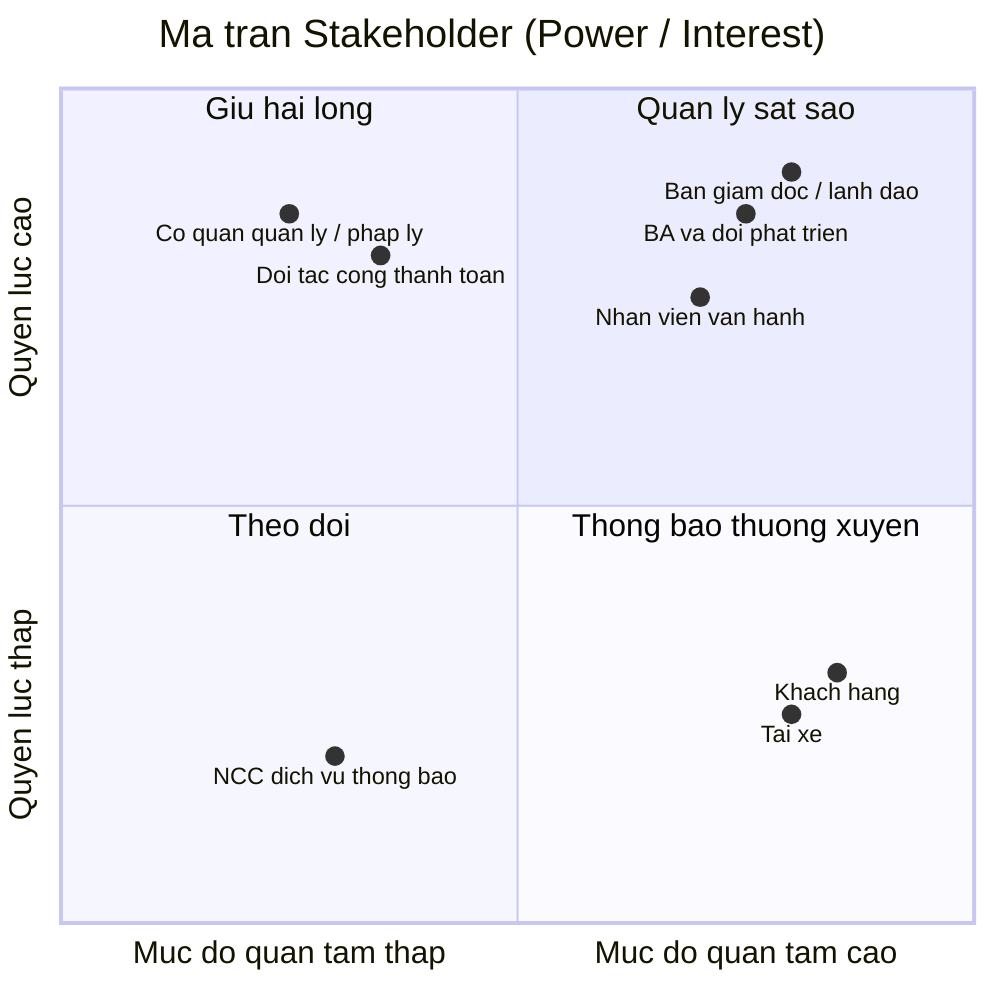
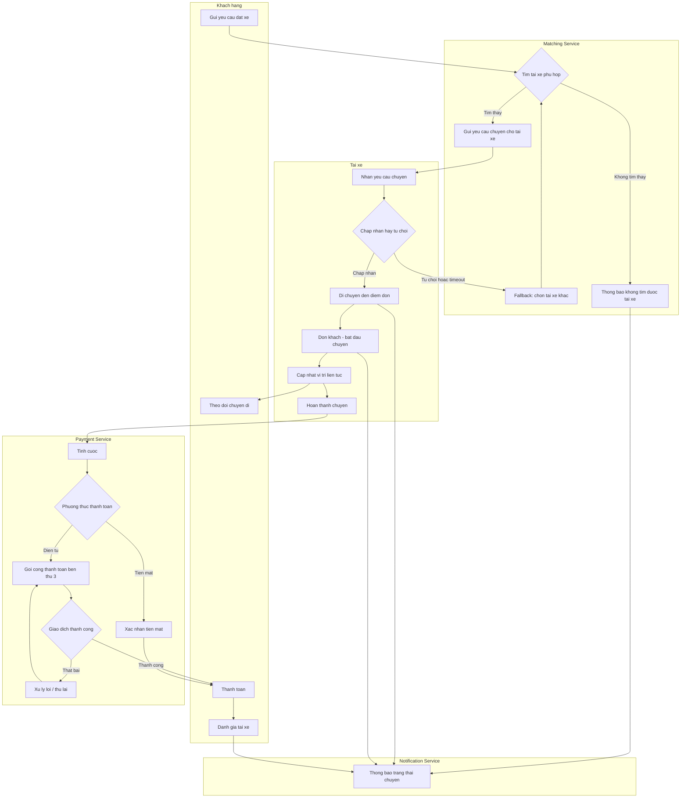
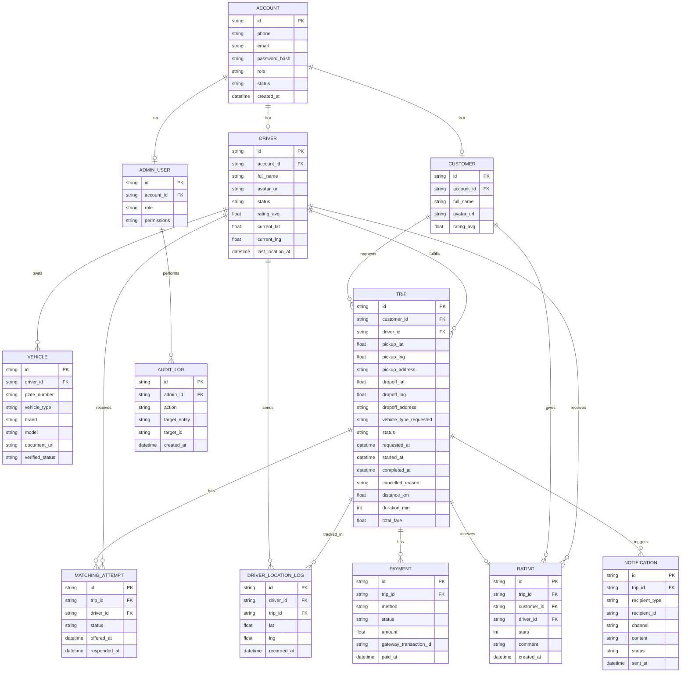
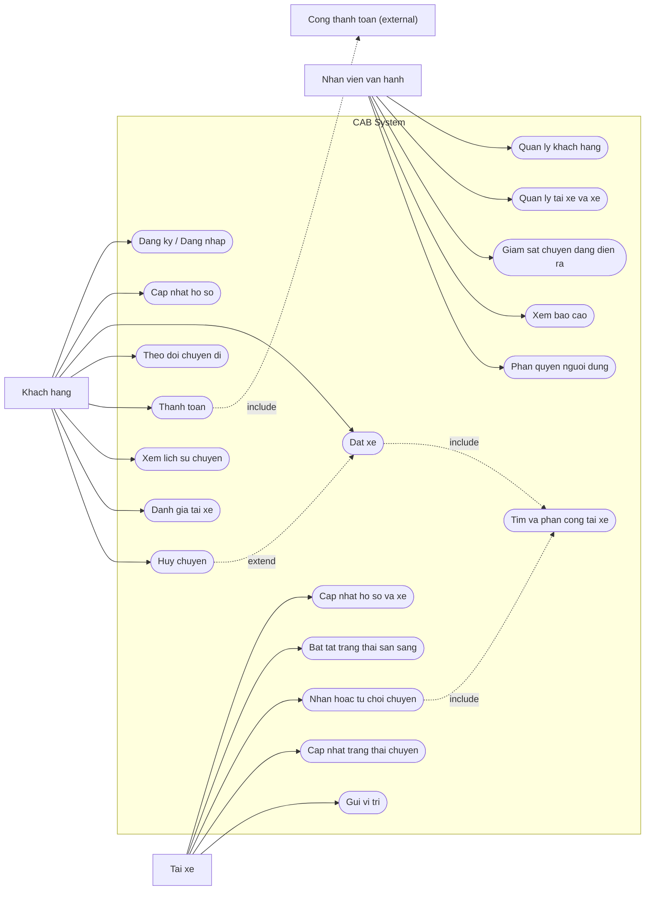
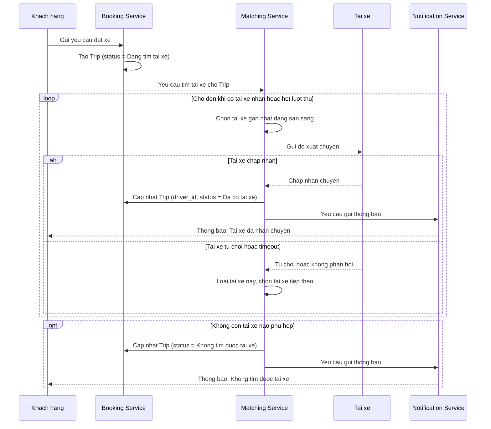
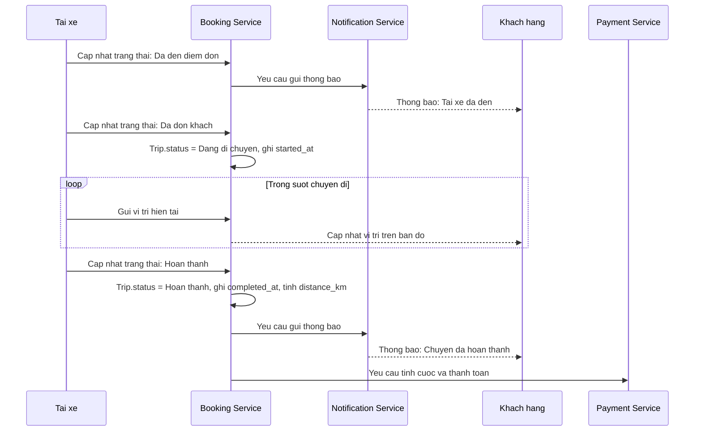
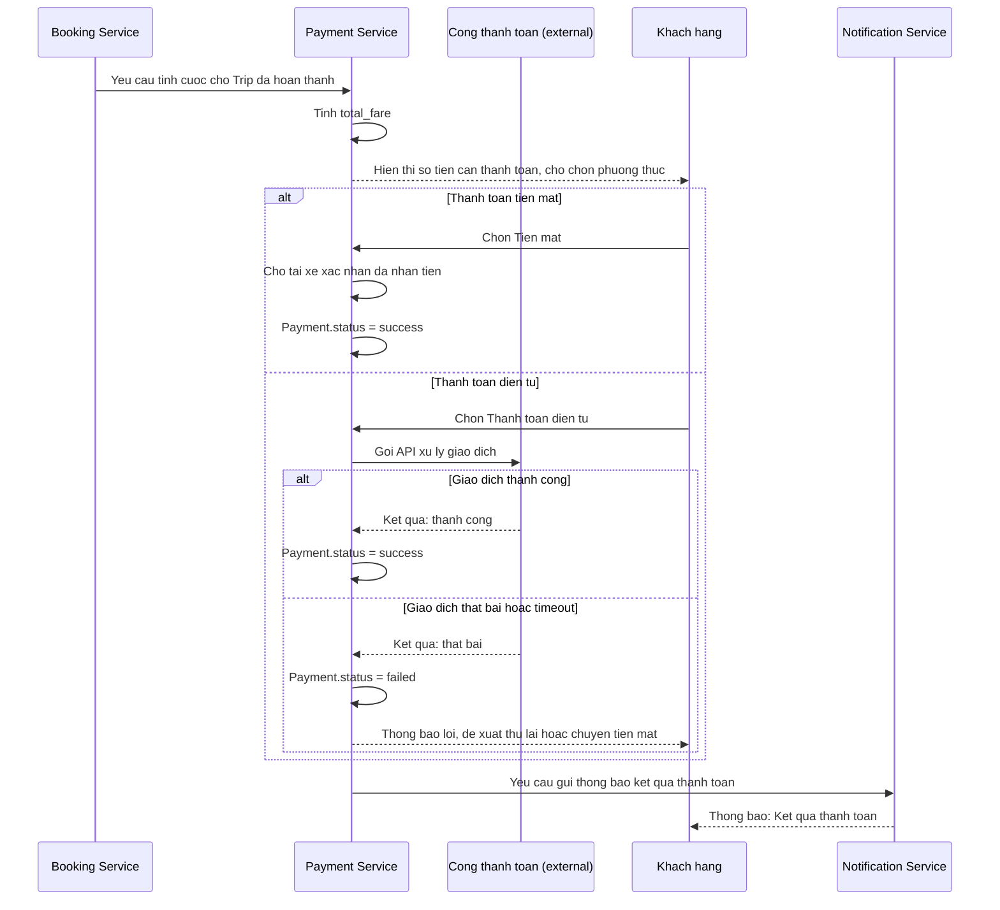
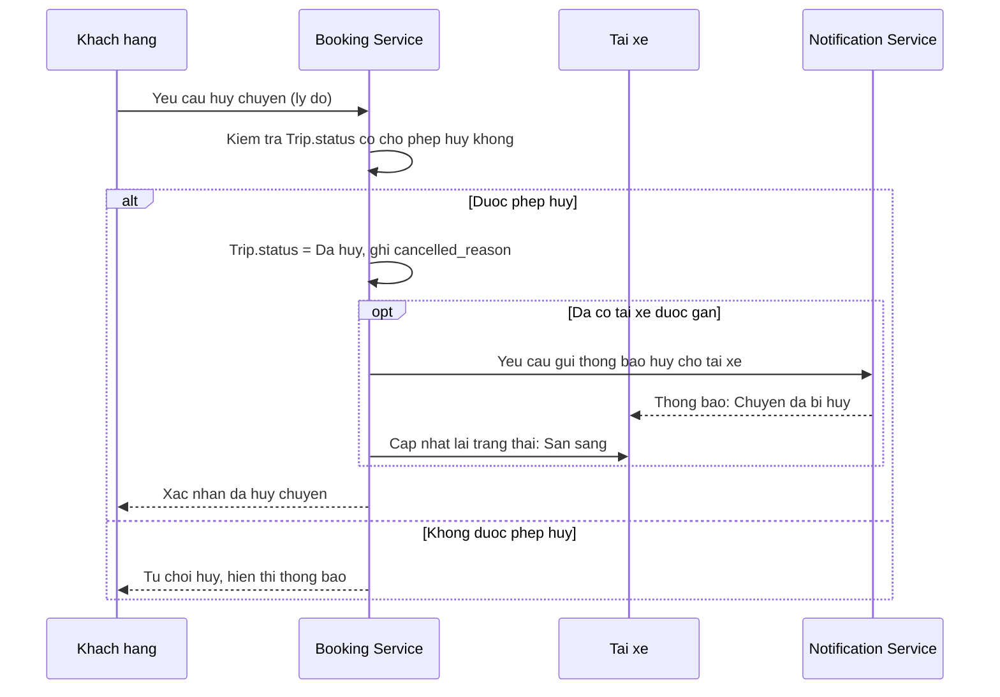

## Bước 1 - Tìm hiểu nghiệp vụ

### 1.1 Vấn đề hiện tại của doanh nghiệp

Theo mô tả của khách hàng, hệ thống hiện tại (tổng đài + app đơn giản) đang gặp các vấn đề sau:

| # | Vấn đề hiện tại |
|---|---|
| 1 | **Phân công tài xế thủ công** — không có cơ chế tự động ghép tài xế phù hợp với khách hàng |
| 2 | **Khách hàng khó theo dõi trạng thái chuyến đi** — thiếu thông tin real-time (đang tìm tài xế, tài xế nhận chuyến, ETA...) |
| 3 | **Thông tin thanh toán không tập trung** — chưa có cơ chế quản lý thanh toán thống nhất, tích hợp |
| 4 | **Khó mở rộng hệ thống** — bộ phận vận hành gặp khó khăn khi muốn scale hoặc thêm tính năng mới |

### 1.2 Mục tiêu của hệ thống mới

- Xây dựng nền tảng CAB có khả năng **phục vụ số lượng lớn khách hàng và tài xế** cùng lúc, đặc biệt ổn định vào giờ cao điểm.
- **Tự động hóa việc tìm và phân công tài xế** dựa trên vị trí, trạng thái sẵn sàng và tiêu chí vận hành, có cơ chế fallback khi tài xế không phản hồi/từ chối.
- Cho khách hàng **theo dõi chuyến đi theo thời gian thực** từ lúc đặt xe đến khi hoàn thành.
- **Tập trung hóa nghiệp vụ thanh toán và tính cước**, hỗ trợ tiền mặt lẫn thanh toán điện tử qua bên thứ ba, không lưu trữ dữ liệu nhạy cảm của thẻ/tài khoản thanh toán trong hệ thống.
- Xây dựng hệ thống **thông báo (notification)** xuyên suốt vòng đời chuyến đi, có khả năng mở rộng thêm kênh thông báo mới sau này.
- Cung cấp **công cụ quản trị & báo cáo** cho vận hành: quản lý khách hàng/tài xế/xe/chuyến đi, phân quyền thao tác nhạy cảm, báo cáo doanh thu/tỷ lệ hoàn thành/hủy/hiệu quả tài xế.
- Đảm bảo **kiến trúc linh hoạt, có thể mở rộng độc lập từng thành phần**: lỗi ở một module (vd. thanh toán, thông báo) không được làm sập toàn bộ hệ thống đặt xe; triển khai tính năng mới từng phần, ít ảnh hưởng phần đang chạy.
- Đảm bảo **bảo mật**: xác thực người dùng, kiểm soát quyền truy cập cho thao tác quản trị, bảo vệ dữ liệu cá nhân/vị trí/giao dịch, lưu vết (audit log) các thao tác quan trọng.

### 1.3 Các nhóm người tham gia sử dụng hệ thống (Actors)

| Actor | Vai trò chính |
|---|---|
| **Khách hàng (Customer)** | Đăng ký/đăng nhập, cập nhật hồ sơ, đặt xe (điểm đón/đến, loại xe), theo dõi trạng thái chuyến, xem lịch sử, thanh toán, đánh giá tài xế sau chuyến |
| **Tài xế (Driver)** | Đăng ký/được vận hành tạo tài khoản, cập nhật hồ sơ & phương tiện, bật trạng thái sẵn sàng, nhận/từ chối chuyến, cập nhật trạng thái chuyến (đến điểm đón, đón khách, di chuyển, hoàn thành), gửi vị trí |
| **Nhân viên vận hành (Operator/Admin)** | Quản lý khách hàng, tài xế, phương tiện, chuyến đi; xử lý sự cố chuyến; tra cứu lịch sử giao dịch; xem báo cáo (số chuyến, doanh thu, tỷ lệ hoàn thành/hủy, hiệu quả tài xế) |
| **Cổng thanh toán bên thứ ba (Payment Gateway)** *(actor hệ thống/bên ngoài)* | Xử lý giao dịch thanh toán điện tử thay cho CAB System, tránh lưu thông tin nhạy cảm trong hệ thống |

> **Lưu ý:** Cổng thanh toán bên thứ ba tuy không phải "người dùng" nhưng đóng vai trò actor hệ thống (external system) vì có tương tác hai chiều với CAB System — đây là điểm cần thể hiện rõ trong sơ đồ Use Case ở bước sau.

### 1.4 Các điểm chưa rõ, cần làm rõ thêm với khách hàng (ghi nhận để xử lý ở bước sau)

Theo yêu cầu, doanh nghiệp **chưa chốt** các nội dung sau — Business Analyst cần làm rõ trước khi đội phát triển thiết kế giải pháp:

- Công thức/cách tính cước
- Tiêu chí ưu tiên tài xế khi matching
- Thời gian tối đa tài xế phải phản hồi một chuyến được đề xuất
- Chính sách hủy chuyến (ai được hủy, khi nào, có phí hủy không...)
- Cách xử lý khi mất kết nối mạng (khách hàng hoặc tài xế)
- Thời gian lưu trữ dữ liệu (lịch sử chuyến, vị trí, giao dịch...)

## Bước 2  - Phân tích các bên liên quan

## 2.1. Bảng Stakeholders

| Stakeholder | Vai trò | Tương tác với hệ thống |
|---|---|---|
| **Ban giám đốc / Ban lãnh đạo công ty ABC** | Người ra quyết định đầu tư, phê duyệt phạm vi & ngân sách dự án | Không thao tác trực tiếp lên hệ thống; nhận báo cáo tổng hợp (doanh thu, tỷ lệ hoàn thành/hủy, hiệu quả tài xế) để ra quyết định chiến lược |
| **Nhân viên vận hành (Operator)** | Vận hành hằng ngày: giám sát chuyến đi, xử lý sự cố, quản lý dữ liệu | Sử dụng giao diện quản trị (admin) trực tiếp: quản lý khách hàng/tài xế/xe/chuyến, tra cứu giao dịch, thao tác theo phân quyền |
| **Khách hàng (Customer)** | Người dùng cuối, tạo nhu cầu đặt xe | Tương tác trực tiếp qua app: đăng ký, đặt xe, theo dõi chuyến, thanh toán, đánh giá tài xế |
| **Tài xế (Driver)** | Người cung cấp dịch vụ vận chuyển | Tương tác trực tiếp qua app tài xế: nhận/từ chối chuyến, cập nhật trạng thái & vị trí, xem thu nhập |
| **Business Analyst & Đội phát triển** | Phân tích, thiết kế, xây dựng hệ thống | Không phải người dùng cuối nhưng quyết định kiến trúc, luồng nghiệp vụ; cần làm rõ các yêu cầu chưa chốt với khách hàng |
| **Đối tác cổng thanh toán (Payment Gateway)** | Bên thứ ba xử lý giao dịch điện tử | Tương tác qua API/tích hợp hệ thống: nhận yêu cầu thanh toán, trả kết quả giao dịch; không có giao diện người dùng trong CAB System |
| **Nhà cung cấp dịch vụ thông báo (SMS/Email/Push provider)** | Bên thứ ba gửi thông báo | Tương tác qua API tích hợp; hệ thống gọi để gửi thông báo cho khách hàng/tài xế |
| **Cơ quan quản lý / pháp lý** (giao thông, bảo vệ dữ liệu cá nhân) | Đặt ra quy định mà hệ thống phải tuân thủ | Không tương tác trực tiếp với hệ thống, nhưng chi phối yêu cầu về bảo mật dữ liệu, xác thực tài xế, lưu trữ dữ liệu |

## 2.2. Ma trận Stakeholder (Mendelow Matrix)



**Cách đọc và áp dụng ma trận:**

- **Quản lý sát sao** (Ban giám đốc, BA & đội phát triển, Nhân viên vận hành): quyền lực và mức quan tâm đều cao → cần thu hút tham gia thường xuyên, thông tin đầy đủ, xin phê duyệt/phản hồi liên tục trong suốt dự án.
- **Giữ hài lòng** (cơ quan quản lý/pháp lý, đối tác cổng thanh toán): quyền lực cao nhưng ít quan tâm chi tiết hằng ngày → cần đảm bảo tuân thủ yêu cầu của họ (quy định pháp lý, chuẩn tích hợp API) nhưng không cần trao đổi quá thường xuyên.
- **Thông báo thường xuyên** (khách hàng, tài xế): quan tâm cao nhưng quyền lực thấp (không quyết định thiết kế hệ thống) → cần cập nhật thông tin, thu thập phản hồi qua khảo sát/UX testing, nhưng họ không phải người phê duyệt yêu cầu.
- **Theo dõi** (nhà cung cấp dịch vụ thông báo bên thứ ba): quyền lực và quan tâm đều thấp → chỉ cần giám sát ở mức tối thiểu, không cần đầu tư nhiều công sức giao tiếp.

## Bước 3 – Mục đích nghiệp vụ

### 3.1. Mục đích tổng quát

Xây dựng **CAB System** — một nền tảng đặt xe trực tuyến hiện đại, thay thế mô hình vận hành thủ công hiện tại (tổng đài + app đơn giản) — nhằm giúp Công ty ABC:

- Tự động hóa toàn bộ quy trình từ đặt xe → tìm/phân công tài xế → thực hiện chuyến → tính cước → thanh toán → thông báo → đánh giá.
- Phục vụ được **quy mô lớn** khách hàng và tài xế cùng lúc, kể cả vào giờ cao điểm, mà không bị gián đoạn dịch vụ.
- Tạo nền tảng có **kiến trúc mở, dễ mở rộng** để doanh nghiệp phát triển thêm dịch vụ, tính năng trong tương lai mà không phải xây lại từ đầu.

Nói ngắn gọn: mục đích không phải là "làm ra một app đặt xe", mà là "xây một **nền tảng dịch vụ (platform)** đủ vững để doanh nghiệp vận hành và tăng trưởng lâu dài".

### 3.2. Các mục đích chính

| # | Mục đích chính | Giải quyết vấn đề gì |
|---|---|---|
| 1 | **Tự động hóa việc tìm và phân công tài xế** | Thay thế việc phân công thủ công, dựa trên vị trí + trạng thái sẵn sàng, có cơ chế fallback khi tài xế từ chối/không phản hồi |
| 2 | **Minh bạch hóa & theo dõi chuyến đi theo thời gian thực** | Khách hàng biết được trạng thái mỗi bước: đang tìm tài xế → tài xế nhận chuyến → ETA → đang di chuyển → hoàn thành |
| 3 | **Tập trung hóa thanh toán & tính cước** | Thống nhất một luồng thanh toán (tiền mặt + điện tử qua bên thứ ba), không lưu dữ liệu thẻ nhạy cảm trong hệ thống nội bộ |
| 4 | **Xây dựng hệ thống thông báo xuyên suốt vòng đời chuyến đi** | Đảm bảo khách hàng & tài xế luôn được cập nhật kịp thời tại mọi mốc quan trọng; kiến trúc mở để thêm kênh thông báo mới |
| 5 | **Cung cấp công cụ quản trị & báo cáo cho vận hành** | Cho nhân viên vận hành khả năng quản lý, xử lý sự cố, và cho ban lãnh đạo dữ liệu ra quyết định (doanh thu, tỷ lệ hoàn thành/hủy, hiệu quả tài xế) |
| 6 | **Đảm bảo hệ thống ổn định & có khả năng mở rộng độc lập** | Lỗi ở một module (thanh toán, thông báo) không được làm sập toàn hệ thống; scale riêng từng thành phần khi tải tăng |
| 7 | **Bảo mật dữ liệu và kiểm soát truy cập** | Xác thực người dùng, phân quyền thao tác nhạy cảm, bảo vệ dữ liệu cá nhân/vị trí/giao dịch, lưu vết thao tác để phục vụ audit |
| 8 | **Tạo kiến trúc linh hoạt cho tăng trưởng dài hạn** | Cho phép thêm loại dịch vụ mới, phương thức thanh toán mới, nhà cung cấp thông báo mới... mà không phải xây lại toàn bộ hệ thống |

> Các mục đích 6, 7, 8 chính là lý do bài toán này phù hợp để triển khai theo hướng **SOA/microservices** — tách các nghiệp vụ (đặt xe, matching, thanh toán, thông báo, quản trị) thành các service độc lập, giao tiếp qua API, để đáp ứng đúng yêu cầu "lỗi cục bộ không sập toàn hệ thống" và "mở rộng từng phần".

## Bước 4 – Xác định phạm vi dự án

### 4.1. Trong phạm vi (In-scope)

**Nhóm chức năng dành cho Khách hàng:**
- Đăng ký, đăng nhập, cập nhật thông tin cá nhân
- Nhập điểm đón/điểm đến, chọn loại xe, gửi yêu cầu đặt xe
- Theo dõi trạng thái chuyến đi theo thời gian thực (đang tìm tài xế, tài xế nhận chuyến, ETA, đang di chuyển, hoàn thành)
- Xem lịch sử chuyến đi, số tiền đã trả
- Thanh toán (tiền mặt + điện tử qua cổng thanh toán bên thứ ba)
- Đánh giá tài xế sau chuyến

**Nhóm chức năng dành cho Tài xế:**
- Đăng ký / được nhân viên vận hành tạo tài khoản
- Cập nhật hồ sơ cá nhân, thông tin phương tiện
- Bật/tắt trạng thái sẵn sàng nhận chuyến
- Nhận thông báo chuyến mới, chấp nhận/từ chối chuyến
- Cập nhật trạng thái chuyến (đến điểm đón, đón khách, đang di chuyển, hoàn thành)
- Gửi vị trí liên tục để hỗ trợ matching & ước tính ETA

**Nhóm chức năng cốt lõi (Core business logic):**
- Thuật toán tìm & phân công tài xế (matching), có cơ chế fallback khi tài xế không phản hồi/từ chối
- Tính cước sau khi hoàn thành chuyến
- Xử lý thanh toán, tích hợp cổng thanh toán bên thứ ba
- Hệ thống thông báo (notification) cho các sự kiện trong vòng đời chuyến đi

**Nhóm chức năng dành cho Nhân viên vận hành (Admin):**
- Quản lý khách hàng, tài xế, phương tiện, chuyến đi
- Giám sát chuyến đang diễn ra, xử lý sự cố chuyến bị lỗi
- Tra cứu lịch sử giao dịch
- Phân quyền cho các thao tác nhạy cảm
- Báo cáo: số lượng chuyến, doanh thu, tỷ lệ hoàn thành/hủy, hiệu quả tài xế

**Yêu cầu phi chức năng cần đáp ứng trong phạm vi:**
- Kiến trúc có khả năng mở rộng độc lập từng thành phần (scale riêng)
- Cô lập lỗi: lỗi ở module thanh toán/thông báo không làm sập toàn hệ thống
- Triển khai (deploy) từng phần, hạn chế ảnh hưởng đến chức năng đang chạy
- Xác thực, phân quyền, bảo vệ dữ liệu cá nhân/vị trí/giao dịch, audit log

### 4.2. Ngoài phạm vi (Out-of-scope)

| # | Nội dung ngoài phạm vi | Lý do |
|---|---|---|
| 1 | Xây dựng hệ thống xử lý thanh toán riêng (lưu trữ thông tin thẻ, tài khoản ngân hàng) | Khách hàng yêu cầu **tích hợp với nhà cung cấp thanh toán bên ngoài**, không tự lưu dữ liệu nhạy cảm |
| 2 | Xác định công thức tính cước cụ thể, chính sách hủy chuyến, tiêu chí ưu tiên tài xế chi tiết | Doanh nghiệp **chưa chốt**, cần BA làm rõ với các bên liên quan ở giai đoạn phân tích trước khi dev xây dựng — đây là input cho scope, không phải scope đã đóng băng |
| 3 | Xây dựng thêm loại dịch vụ mới, phương thức thanh toán mới, kênh thông báo mới (ngoài kênh cơ bản) | Chỉ yêu cầu **kiến trúc phải sẵn sàng cho mở rộng**, chưa yêu cầu triển khai ngay trong 7 tuần |
| 4 | Ứng dụng dành cho các nền tảng ngoài phạm vi đã thống nhất (nếu có, cần xác nhận: web, iOS, Android...) | Chưa được đề cập rõ trong yêu cầu — cần xác nhận thêm với khách hàng |
| 5 | Tích hợp bản đồ/định tuyến chi tiết (bên thứ ba cụ thể nào, thuật toán định tuyến tối ưu) | Yêu cầu chỉ nói đến "vị trí tài xế" và "ước tính thời gian đến", chưa xác định rõ nhà cung cấp bản đồ hay logic định tuyến |
| 6 | Chương trình khuyến mãi, mã giảm giá, chăm sóc khách hàng qua tổng đài | Không được đề cập trong yêu cầu ban đầu |

### 4.3. Ràng buộc (Constraints)

| Loại ràng buộc | Nội dung |
|---|---|
| **Thời gian** | Chỉ có **7 tuần** để xây dựng và triển khai — ảnh hưởng trực tiếp đến việc chọn kiến trúc và mức độ chi tiết có thể làm trong phạm vi |
| **Kỹ thuật** | Không được lưu trữ thông tin nhạy cảm của thẻ/tài khoản thanh toán trong hệ thống CAB (bắt buộc dùng bên thứ ba xử lý) |
| **Kiến trúc** | Phải đảm bảo khả năng mở rộng độc lập và cô lập lỗi giữa các thành phần — định hướng chọn microservices thay vì monolithic |
| **Nghiệp vụ chưa chốt** | Nhiều quy tắc nghiệp vụ quan trọng (cách tính cước, chính sách hủy, thời gian phản hồi...) **chưa được xác nhận**, có thể ảnh hưởng đến scope chi tiết sau khi làm rõ |

### 4.4. Giả định (Assumptions)

*(cần xác nhận lại với khách hàng ở các bước sau — liệt kê ở đây để không bỏ sót)*

- Giả định hệ thống được xây dựng dưới dạng **ứng dụng di động** cho khách hàng và tài xế, kèm **giao diện web** cho nhân viên vận hành (chưa có xác nhận chính thức từ khách hàng).
- Giả định trong 7 tuần chỉ triển khai **một loại dịch vụ đặt xe cơ bản** (chưa phân nhiều hạng xe phức tạp), kiến trúc chừa chỗ mở rộng sau.
- Giả định có tối thiểu **một** cổng thanh toán bên thứ ba được tích hợp trong giai đoạn đầu (không cần multi-gateway ngay).
- Giả định thông báo trong giai đoạn đầu dùng tối thiểu **1-2 kênh cơ bản** (ví dụ: push notification/SMS), kiến trúc phải cho phép thêm kênh sau này.


## Bước 5 – Xác định yêu cầu nghiệp vụ

### 5.1. Danh sách yêu cầu nghiệp vụ (Business Requirements)

**Nhóm Khách hàng**

| Mã | Yêu cầu nghiệp vụ |
|---|---|
| BR-01 | Hệ thống phải cho phép khách hàng đăng ký, đăng nhập, cập nhật hồ sơ cá nhân |
| BR-02 | Hệ thống phải cho phép khách hàng tạo yêu cầu đặt xe (điểm đón, điểm đến, loại xe) |
| BR-03 | Hệ thống phải cho phép khách hàng theo dõi trạng thái chuyến đi theo thời gian thực |
| BR-04 | Hệ thống phải cho phép khách hàng xem lịch sử chuyến đi |
| BR-05 | Hệ thống phải cho phép khách hàng đánh giá tài xế sau khi hoàn thành chuyến |

**Nhóm Tài xế**

| Mã | Yêu cầu nghiệp vụ |
|---|---|
| BR-06 | Hệ thống phải cho phép tài xế đăng ký/được tạo tài khoản, cập nhật hồ sơ & thông tin phương tiện |
| BR-07 | Hệ thống phải cho phép tài xế bật/tắt trạng thái sẵn sàng nhận chuyến |
| BR-08 | Hệ thống phải cho phép tài xế nhận, chấp nhận hoặc từ chối yêu cầu chuyến |
| BR-09 | Hệ thống phải cho phép tài xế cập nhật trạng thái chuyến (đến điểm đón, đón khách, di chuyển, hoàn thành) |
| BR-10 | Hệ thống phải nhận vị trí tài xế được gửi liên tục trong suốt chuyến đi |

**Nhóm Matching (Tìm & phân công tài xế)**

| Mã | Yêu cầu nghiệp vụ |
|---|---|
| BR-11 | Hệ thống phải tự động tìm tài xế phù hợp dựa trên vị trí & trạng thái sẵn sàng |
| BR-12 | Hệ thống phải có cơ chế fallback tìm tài xế khác khi tài xế được đề xuất từ chối/không phản hồi đúng hạn |
| BR-13 | Hệ thống phải thông báo cho khách hàng nếu không tìm được tài xế phù hợp |

**Nhóm Thanh toán**

| Mã | Yêu cầu nghiệp vụ |
|---|---|
| BR-14 | Hệ thống phải tự động tính cước sau khi chuyến đi hoàn thành |
| BR-15 | Hệ thống phải hỗ trợ thanh toán tiền mặt và thanh toán điện tử qua cổng bên thứ ba |
| BR-16 | Hệ thống không được lưu trữ thông tin nhạy cảm của thẻ/tài khoản thanh toán |
| BR-17 | Hệ thống phải xử lý và thông báo khi giao dịch thanh toán thất bại |

**Nhóm Thông báo**

| Mã | Yêu cầu nghiệp vụ |
|---|---|
| BR-18 | Hệ thống phải gửi thông báo cho khách hàng & tài xế tại các mốc quan trọng của chuyến đi |
| BR-19 | Kiến trúc thông báo phải cho phép mở rộng thêm kênh gửi mới trong tương lai mà không ảnh hưởng thành phần khác |

**Nhóm Quản trị vận hành**

| Mã | Yêu cầu nghiệp vụ |
|---|---|
| BR-20 | Hệ thống phải cung cấp giao diện quản trị để quản lý khách hàng, tài xế, phương tiện, chuyến đi |
| BR-21 | Hệ thống phải cho phép phân quyền các thao tác quản trị nhạy cảm |
| BR-22 | Hệ thống phải cung cấp báo cáo: số chuyến, doanh thu, tỷ lệ hoàn thành/hủy, hiệu quả tài xế |

**Nhóm Phi chức năng (Non-functional)**

| Mã | Yêu cầu nghiệp vụ |
|---|---|
| BR-23 | Hệ thống phải chịu được tải lớn vào giờ cao điểm |
| BR-24 | Lỗi ở một thành phần (thanh toán, thông báo...) không được làm sập toàn hệ thống |
| BR-25 | Hệ thống phải cho phép triển khai (deploy) độc lập từng thành phần |
| BR-26 | Hệ thống phải xác thực người dùng và kiểm soát quyền truy cập theo vai trò |
| BR-27 | Hệ thống phải bảo vệ dữ liệu cá nhân, vị trí, giao dịch |
| BR-28 | Hệ thống phải ghi audit log cho các thao tác quan trọng |

### 5.2. Mô hình nghiệp vụ (Business Process Model)



**Giải thích mô hình:**

- Mỗi **subgraph** tương ứng với một actor/service — đúng tinh thần SOA: Khách hàng, Matching Service, Tài xế, Payment Service, Notification Service đều là các khối tách biệt, chỉ trao đổi qua các mũi tên (tương đương gọi API/message giữa các service).
- Vòng lặp `B1 → B2 → C2 → B4 → B1` thể hiện đúng **BR-12** (cơ chế fallback tìm tài xế khác khi bị từ chối/timeout).
- Nhánh `D5 -- That bai --> D6 --> D4` thể hiện **BR-17** (xử lý khi giao dịch thanh toán thất bại, có thể thử lại).
- `Notification Service` (E1) được gọi từ nhiều điểm khác nhau trong flow (khi không tìm được tài xế, khi tài xế đến điểm đón/đón khách, khi đánh giá xong) — thể hiện đúng **BR-18/BR-19**: thông báo xuyên suốt vòng đời chuyến đi và tách biệt thành service riêng để dễ mở rộng kênh sau này.


## Bước 6 – Phân rã Yêu cầu chức năng (Functional Requirements – FR)

Mỗi FR được nhóm theo **service/module** (đúng định hướng SOA đã chọn) và gắn với **BR** tương ứng ở Bước 5 để đảm bảo truy vết được (traceability).

### 6.1. User & Authentication Service

| FR | Mô tả chức năng | BR liên quan |
|---|---|---|
| FR-01 | Cho phép khách hàng đăng ký tài khoản bằng số điện thoại/email | BR-01 |
| FR-02 | Cho phép khách hàng đăng nhập bằng tài khoản đã đăng ký | BR-01 |
| FR-03 | Cho phép khách hàng cập nhật thông tin cá nhân (họ tên, SĐT, ảnh đại diện) | BR-01 |
| FR-04 | Cho phép tài xế đăng ký hoặc được nhân viên vận hành tạo tài khoản | BR-06 |
| FR-05 | Cho phép tài xế cập nhật hồ sơ cá nhân và thông tin phương tiện (biển số, loại xe, giấy tờ) | BR-06 |
| FR-06 | Hệ thống xác thực người dùng và phân quyền theo vai trò (khách hàng / tài xế / nhân viên vận hành) | BR-26 |

### 6.2. Trip / Booking Service

| FR | Mô tả chức năng | BR liên quan |
|---|---|---|
| FR-07 | Cho phép khách hàng nhập điểm đón và điểm đến | BR-02 |
| FR-08 | Cho phép khách hàng chọn loại xe khi đặt | BR-02 |
| FR-09 | Hệ thống tạo yêu cầu chuyến đi và gửi sang Matching Service | BR-02, BR-11 |
| FR-10 | Hệ thống cập nhật & hiển thị trạng thái chuyến theo thời gian thực (đang tìm tài xế → đã nhận → đang đến → đang di chuyển → hoàn thành) | BR-03 |
| FR-11 | Cho phép khách hàng hủy chuyến trước khi tài xế đến *(chính sách hủy cụ thể — cần làm rõ)* | BR-03 |
| FR-12 | Lưu và cho phép khách hàng xem lịch sử các chuyến đã thực hiện | BR-04 |
| FR-13 | Cho phép khách hàng gửi đánh giá (số sao + nhận xét) cho tài xế sau khi hoàn thành chuyến | BR-05 |

### 6.3. Matching Service

| FR | Mô tả chức năng | BR liên quan |
|---|---|---|
| FR-14 | Tìm danh sách tài xế đang ở trạng thái sẵn sàng và gần điểm đón nhất | BR-11 |
| FR-15 | Gửi yêu cầu chuyến đến tài xế được chọn, chờ phản hồi trong thời gian quy định | BR-11, BR-12 |
| FR-16 | Nếu tài xế từ chối/không phản hồi đúng hạn, tự động chọn tài xế tiếp theo (fallback) | BR-12 |
| FR-17 | Nếu không tìm được tài xế phù hợp sau [n] lần thử, gửi thông báo cho khách hàng | BR-13 |

### 6.4. Driver Operations

| FR | Mô tả chức năng | BR liên quan |
|---|---|---|
| FR-18 | Cho phép tài xế bật/tắt trạng thái "sẵn sàng nhận chuyến" | BR-07 |
| FR-19 | Cho phép tài xế xem thông tin yêu cầu chuyến trước khi chấp nhận | BR-08 |
| FR-20 | Cho phép tài xế chấp nhận hoặc từ chối yêu cầu chuyến | BR-08 |
| FR-21 | Cho phép tài xế cập nhật trạng thái chuyến: đến điểm đón, đón khách, đang di chuyển, hoàn thành | BR-09 |
| FR-22 | Hệ thống nhận vị trí GPS của tài xế định kỳ trong suốt chuyến đi | BR-10 |

### 6.5. Payment Service

| FR | Mô tả chức năng | BR liên quan |
|---|---|---|
| FR-23 | Tự động tính cước chuyến khi hoàn thành *(công thức cụ thể — cần làm rõ)* | BR-14 |
| FR-24 | Cho phép khách hàng chọn phương thức thanh toán: tiền mặt hoặc điện tử | BR-15 |
| FR-25 | Nếu chọn thanh toán điện tử, gọi API cổng thanh toán bên thứ ba để xử lý | BR-15, BR-16 |
| FR-26 | Không lưu trữ số thẻ/thông tin tài khoản thanh toán của khách hàng | BR-16 |
| FR-27 | Nếu giao dịch thất bại, thông báo lỗi và cho phép thử lại hoặc chuyển sang tiền mặt | BR-17 |
| FR-28 | Ghi nhận trạng thái thanh toán (thành công/thất bại/đang xử lý) cho từng chuyến | BR-17 |

### 6.6. Notification Service

| FR | Mô tả chức năng | BR liên quan |
|---|---|---|
| FR-29 | Gửi thông báo cho khách hàng tại các mốc: tài xế nhận chuyến, sắp đến, chuyến bắt đầu, hoàn thành, thanh toán thành công/thất bại | BR-18 |
| FR-30 | Gửi thông báo cho tài xế khi: có yêu cầu chuyến mới, khách hàng hủy chuyến | BR-18 |
| FR-31 | Kiến trúc cho phép thêm kênh gửi mới (SMS, email, push...) mà không sửa các service khác | BR-19 |

### 6.7. Admin & Reporting Service

| FR | Mô tả chức năng | BR liên quan |
|---|---|---|
| FR-32 | Cho phép nhân viên vận hành xem/tìm kiếm/chỉnh sửa thông tin khách hàng | BR-20 |
| FR-33 | Cho phép nhân viên vận hành xem/duyệt/khóa tài khoản tài xế và phương tiện | BR-20 |
| FR-34 | Cho phép nhân viên vận hành xem chuyến đang diễn ra và can thiệp khi có sự cố | BR-20 |
| FR-35 | Phân quyền các chức năng quản trị theo vai trò nhân viên | BR-21 |
| FR-36 | Tạo báo cáo: tổng số chuyến, doanh thu, tỷ lệ hoàn thành/hủy, hiệu suất tài xế theo khoảng thời gian | BR-22 |
| FR-37 | Ghi audit log mọi thao tác chỉnh sửa/khóa tài khoản, thay đổi dữ liệu nhạy cảm do nhân viên vận hành thực hiện | BR-28 |

---

**Nhận xét:** Cách nhóm FR theo 7 module ở trên (User/Auth, Trip/Booking, Matching, Driver Operations, Payment, Notification, Admin & Reporting) chính là **7 service ứng viên** cho kiến trúc microservices — mỗi module này sẽ trở thành một service độc lập khi thiết kế kiến trúc ở các bước sau, và tập FR này sẽ là input trực tiếp để vẽ **Use Case Diagram** cho từng actor.


## Bước 7 - Business Rules (Quy tắc nghiệp vụ)

Quy tắc nghiệp vụ mô tả **các ràng buộc, điều kiện, logic quyết định** đứng sau các FR — trả lời câu hỏi "khi nào thì làm gì, theo tiêu chí nào". Mình đánh dấu rõ quy tắc nào **đã có cơ sở từ yêu cầu khách hàng** và quy tắc nào **còn là giả định, cần khách hàng xác nhận** (đúng với các điểm tồn đọng đã ghi ở Bước 1 và Bước 4).

### 7.1. Quy tắc về Đặt xe & Matching

| Mã | Quy tắc nghiệp vụ | Trạng thái |
|---|---|---|
| QT-01 | Chỉ tài xế đang ở trạng thái "sẵn sàng" mới được đưa vào danh sách matching | ✅ Đã xác nhận |
| QT-02 | Tài xế được ưu tiên chọn theo khoảng cách gần điểm đón nhất | ⚠️ Giả định — khách hàng chưa chốt tiêu chí ưu tiên (có thể còn tính đến đánh giá, thời gian rảnh...) |
| QT-03 | Tài xế có thời gian giới hạn để phản hồi (chấp nhận/từ chối) một yêu cầu chuyến, quá hạn coi như từ chối | ⚠️ Giả định — khách hàng chưa chốt con số cụ thể (ví dụ 15s, 30s...) |
| QT-04 | Nếu tài xế từ chối/không phản hồi, hệ thống tự động chuyển yêu cầu sang tài xế tiếp theo trong danh sách | ✅ Đã xác nhận |
| QT-05 | Nếu không tìm được tài xế sau một số lần thử nhất định, hệ thống dừng tìm kiếm và thông báo cho khách hàng | ⚠️ Số lần thử cụ thể — cần xác nhận |
| QT-06 | Một tài xế chỉ được nhận tối đa 1 chuyến tại một thời điểm | ✅ Suy luận hợp lý từ nghiệp vụ, nên xác nhận lại |

### 7.2. Quy tắc về Tài xế

| Mã | Quy tắc nghiệp vụ | Trạng thái |
|---|---|---|
| QT-07 | Tài xế phải cập nhật đầy đủ thông tin phương tiện (biển số, loại xe, giấy tờ) trước khi được phép bật trạng thái sẵn sàng | ⚠️ Giả định hợp lý — cần xác nhận có bước duyệt hồ sơ tài xế hay không |
| QT-08 | Tài xế phải gửi vị trí định kỳ (ví dụ mỗi vài giây) trong suốt chuyến đi để hệ thống theo dõi | ⚠️ Tần suất cụ thể — cần xác nhận |
| QT-09 | Tài xế không thể chuyển trạng thái chuyến "nhảy cóc" (ví dụ không thể báo "hoàn thành" khi chưa "đón khách") | ✅ Ràng buộc logic hợp lý, nên đưa vào validate |

### 7.3. Quy tắc về Tính cước & Thanh toán

| Mã | Quy tắc nghiệp vụ | Trạng thái |
|---|---|---|
| QT-10 | Cước phí được tính sau khi chuyến đi kết thúc, dựa trên quãng đường/thời gian di chuyển | ⚠️ Công thức cụ thể (giá mở cửa, giá/km, phụ phí giờ cao điểm...) — **khách hàng chưa chốt**, cần làm rõ trước khi code |
| QT-11 | Thanh toán điện tử phải qua cổng thanh toán bên thứ ba; hệ thống CAB không lưu số thẻ/tài khoản | ✅ Đã xác nhận (ràng buộc bảo mật) |
| QT-12 | Nếu giao dịch điện tử thất bại, hệ thống phải cho phép thử lại hoặc chuyển sang thanh toán tiền mặt | ✅ Đã xác nhận |
| QT-13 | Một chuyến chỉ được xác nhận là "đã thanh toán" khi có phản hồi thành công từ cổng thanh toán (với thanh toán điện tử) hoặc xác nhận từ tài xế (với tiền mặt) | ⚠️ Giả định hợp lý — cần xác nhận |

### 7.4. Quy tắc về Hủy chuyến

| Mã | Quy tắc nghiệp vụ | Trạng thái |
|---|---|---|
| QT-14 | Khách hàng được phép hủy chuyến trước khi tài xế đón khách | ⚠️ Chưa có chính sách chính thức — **cần khách hàng xác nhận** (có tính phí hủy không, giới hạn số lần hủy...) |
| QT-15 | Tài xế được phép hủy/từ chối chuyến sau khi đã nhận trong một số trường hợp nhất định | ⚠️ Chưa xác nhận điều kiện cụ thể |
| QT-16 | Chuyến bị hủy phải được ghi nhận lý do và tính vào tỷ lệ hủy trong báo cáo vận hành | ✅ Đã xác nhận (phục vụ báo cáo — BR-22) |

### 7.5. Quy tắc về Đánh giá

| Mã | Quy tắc nghiệp vụ | Trạng thái |
|---|---|---|
| QT-17 | Khách hàng chỉ được đánh giá tài xế sau khi chuyến đi ở trạng thái "hoàn thành" | ✅ Đã xác nhận |
| QT-18 | Mỗi chuyến chỉ được đánh giá một lần | ✅ Ràng buộc logic hợp lý |

### 7.6. Quy tắc về Thông báo

| Mã | Quy tắc nghiệp vụ | Trạng thái |
|---|---|---|
| QT-19 | Hệ thống phải gửi thông báo tại các mốc quan trọng: nhận chuyến, tài xế đến, bắt đầu chuyến, hoàn thành, kết quả thanh toán | ✅ Đã xác nhận |
| QT-20 | Nếu một kênh gửi thông báo lỗi (ví dụ SMS provider down), lỗi đó không được làm gián đoạn luồng chính của chuyến đi | ✅ Đã xác nhận (liên hệ trực tiếp đến NFR cô lập lỗi) |

### 7.7. Quy tắc về Bảo mật & Quản trị

| Mã | Quy tắc nghiệp vụ | Trạng thái |
|---|---|---|
| QT-21 | Mỗi vai trò (khách hàng/tài xế/nhân viên vận hành) chỉ được truy cập chức năng thuộc phạm vi quyền hạn của mình | ✅ Đã xác nhận |
| QT-22 | Mọi thao tác chỉnh sửa/khóa tài khoản hoặc dữ liệu nhạy cảm bởi nhân viên vận hành phải được ghi log | ✅ Đã xác nhận |
| QT-23 | Dữ liệu vị trí, thông tin cá nhân và giao dịch phải được lưu trữ và truyền tải có bảo mật (mã hóa khi cần) | ✅ Đã xác nhận |
| QT-24 | Dữ liệu lịch sử chuyến đi/giao dịch phải được lưu trữ tối thiểu trong một khoảng thời gian nhất định | ⚠️ Thời gian lưu trữ cụ thể — **khách hàng chưa chốt** |

### 7.8. Quy tắc phi chức năng liên quan đến kiến trúc

| Mã | Quy tắc nghiệp vụ | Trạng thái |
|---|---|---|
| QT-25 | Mỗi service (matching, thanh toán, thông báo, quản trị...) phải hoạt động độc lập — lỗi ở một service không được lan sang service khác | ✅ Đã xác nhận |
| QT-26 | Hệ thống phải cho phép triển khai cập nhật từng service riêng lẻ mà không cần dừng toàn bộ hệ thống | ✅ Đã xác nhận |

---

## Bước 8 – Yêu cầu phi chức năng (Non-Functional Requirements-NFR)

### 8.1. Performance (Hiệu năng)

| NFR | Mô tả |
|---|---|
| NFR-01 | Hệ thống phải phản hồi yêu cầu đặt xe và tìm tài xế trong thời gian chấp nhận được (ví dụ vài giây) kể cả khi có nhiều yêu cầu đồng thời |
| NFR-02 | Việc cập nhật vị trí tài xế và trạng thái chuyến phải được phản ánh gần như tức thời (real-time/near real-time) trên ứng dụng khách hàng |
| NFR-03 | Thời gian xử lý một giao dịch thanh toán (kể cả gọi cổng bên thứ ba) phải nằm trong ngưỡng chấp nhận được, có cơ chế timeout rõ ràng |

### 8.2. Scalability (Khả năng mở rộng)

| NFR | Mô tả |
|---|---|
| NFR-04 | Hệ thống phải chịu được lượng truy cập tăng đột biến vào giờ cao điểm mà không giảm hiệu năng nghiêm trọng |
| NFR-05 | Mỗi service (matching, thanh toán, thông báo, quản trị...) phải có khả năng scale độc lập theo tải riêng của nó (ví dụ matching cần scale nhiều hơn vào giờ cao điểm, admin thì không) |
| NFR-06 | Kiến trúc phải cho phép thêm loại dịch vụ mới, phương thức thanh toán mới, kênh thông báo mới mà không cần thiết kế lại toàn hệ thống |

### 8.3. Reliability & Availability (Độ tin cậy & khả dụng)

| NFR | Mô tả |
|---|---|
| NFR-07 | Hệ thống phải đảm bảo tính sẵn sàng cao (high availability) cho các luồng nghiệp vụ chính: đặt xe, matching, cập nhật trạng thái chuyến |
| NFR-08 | Lỗi ở một service (đặc biệt là thanh toán, thông báo) không được làm gián đoạn hoặc sập các service khác — cần cơ chế cô lập lỗi (fault isolation), ví dụ circuit breaker, timeout, retry có kiểm soát |
| NFR-09 | Khi một dịch vụ phụ trợ (thông báo, bản đồ...) gặp sự cố, luồng nghiệp vụ chính (đặt xe, chuyến đi) vẫn phải tiếp tục hoạt động ở mức tối thiểu (graceful degradation) |

### 8.4. Maintainability & Deployability (Khả năng bảo trì & triển khai)

| NFR | Mô tả |
|---|---|
| NFR-10 | Hệ thống phải cho phép triển khai (deploy) cập nhật từng service riêng lẻ, không cần dừng toàn bộ hệ thống |
| NFR-11 | Các service phải được thiết kế tách rời (loosely coupled), giao tiếp qua API/message, hạn chế phụ thuộc trực tiếp vào cơ sở dữ liệu của nhau |
| NFR-12 | Hệ thống phải dễ dàng thêm/thay thế một thành phần (ví dụ đổi cổng thanh toán, thêm kênh thông báo) mà ảnh hưởng tối thiểu đến các phần còn lại |

### 8.5. Security (Bảo mật)

| NFR | Mô tả |
|---|---|
| NFR-13 | Hệ thống phải xác thực (authentication) người dùng trước khi cho phép truy cập chức năng |
| NFR-14 | Hệ thống phải phân quyền (authorization) theo vai trò: khách hàng, tài xế, nhân viên vận hành — mỗi vai trò chỉ thấy/thao tác đúng phạm vi của mình |
| NFR-15 | Không được lưu trữ thông tin nhạy cảm của thẻ/tài khoản thanh toán trong hệ thống nội bộ |
| NFR-16 | Dữ liệu cá nhân, vị trí và giao dịch phải được bảo vệ (mã hóa khi truyền tải và/hoặc khi lưu trữ) |
| NFR-17 | Mọi thao tác quản trị nhạy cảm (sửa/khóa tài khoản, thay đổi dữ liệu quan trọng) phải được ghi audit log, có thể truy vết ai làm gì, khi nào |

### 8.6. Usability (Khả năng sử dụng)

| NFR | Mô tả |
|---|---|
| NFR-18 | Giao diện đặt xe cho khách hàng phải đơn giản, tối thiểu số bước để hoàn tất một yêu cầu đặt xe |
| NFR-19 | Giao diện tài xế phải hiển thị rõ ràng thông tin chuyến (điểm đón/đến, thời gian phản hồi còn lại) để tài xế ra quyết định nhanh |
| NFR-20 | Giao diện quản trị phải hỗ trợ tìm kiếm, lọc dữ liệu nhanh (khách hàng, tài xế, chuyến đi) cho nhân viên vận hành |

### 8.7. Compliance & Data Retention (Tuân thủ & lưu trữ dữ liệu)

| NFR | Mô tả | Trạng thái |
|---|---|---|
| NFR-21 | Hệ thống phải tuân thủ quy định bảo vệ dữ liệu cá nhân hiện hành khi thu thập/xử lý dữ liệu vị trí và thông tin người dùng | ✅ Đã xác nhận (yêu cầu chung) |
| NFR-22 | Dữ liệu lịch sử chuyến đi và giao dịch phải được lưu trữ tối thiểu trong một khoảng thời gian xác định để phục vụ tra cứu/khiếu nại/báo cáo | ⚠️ Thời gian cụ thể — khách hàng chưa chốt |

### 8.8. Interoperability (Khả năng tích hợp)

| NFR | Mô tả |
|---|---|
| NFR-23 | Hệ thống phải tích hợp được với cổng thanh toán bên thứ ba thông qua API chuẩn, không phụ thuộc cứng vào một nhà cung cấp duy nhất (để dễ thay thế sau này) |
| NFR-24 | Notification Service phải thiết kế theo kiểu adapter/interface chung để dễ tích hợp thêm nhà cung cấp kênh thông báo mới (SMS, email, push...) |

---

**Ma trận liên kết nhanh NFR ↔ định hướng kiến trúc:**

| Nhóm NFR | Ảnh hưởng đến quyết định kiến trúc |
|---|---|
| Scalability, Reliability (NFR-04 → 09) | → chọn **microservices**, mỗi service scale/fail độc lập |
| Maintainability (NFR-10 → 12) | → dùng **API Gateway + service riêng biệt**, giao tiếp qua REST/message queue thay vì gọi trực tiếp DB |
| Security (NFR-13 → 17) | → cần **Auth Service** riêng (JWT/OAuth), **audit log** tập trung |
| Interoperability (NFR-23, 24) | → thiết kế **Payment Service** và **Notification Service** theo mô hình adapter, dễ cắm thêm provider mới |

## Bước 9 – ERD (Thiết kế thực thể dữ liệu)



**Giải thích các quyết định thiết kế quan trọng** (bám sát BR/FR/Business Rules đã làm ở các bước trước):

| Thực thể | Lý do tồn tại |
|---|---|
| `ACCOUNT` tách riêng khỏi `CUSTOMER`/`DRIVER`/`ADMIN_USER` | Một chỗ xác thực (auth) chung cho 3 loại vai trò — hỗ trợ **NFR-13/14** (authentication & authorization theo vai trò) |
| `MATCHING_ATTEMPT` (không gộp vào `TRIP`) | Lưu lại **từng lần đề xuất** chuyến cho từng tài xế → cần thiết để hiện thực cơ chế fallback (**QT-04, FR-16**): biết tài xế nào đã từ chối/timeout để loại khỏi vòng chọn tiếp theo |
| `DRIVER_LOCATION_LOG` tách khỏi `DRIVER` | `DRIVER.current_lat/lng` chỉ giữ vị trí **mới nhất** (phục vụ matching nhanh), còn log này lưu **lịch sử vị trí theo chuyến** (**BR-10, QT-08**) để phục vụ tính quãng đường thực tế, tra soát khiếu nại |
| `PAYMENT` là quan hệ 1-N với `TRIP` (không phải 1-1) | Một chuyến có thể có **nhiều lần thử thanh toán** (thất bại rồi thử lại — **QT-12, FR-27**), không chỉ 1 bản ghi duy nhất |
| `NOTIFICATION` có `recipient_type` + `channel` dạng string chung | Thiết kế mở để **thêm kênh gửi mới** (SMS/email/push) mà không cần đổi schema (**BR-19, NFR-24**) |
| `AUDIT_LOG` gắn với `ADMIN_USER` | Ghi vết mọi thao tác nhạy cảm (**QT-22, NFR-17**) |
| `total_fare` nằm trong `TRIP` thay vì bảng `FARE` riêng | Đơn giản hóa vì công thức tính cước **chưa được khách hàng chốt** (QT-10) — khi công thức rõ ràng hơn (nhiều thành phần: giá mở cửa, phụ phí giờ cao điểm...) có thể tách thành bảng `FARE_BREAKDOWN` riêng |

## Bước 10 – Use Case Diagram



**Giải thích các quan hệ `include`/`extend`:**

| Quan hệ | Ý nghĩa |
|---|---|
| `Đặt xe -- include --> Tìm và phân công tài xế` | Mọi lần đặt xe **luôn kích hoạt** luồng matching (FR-09, FR-14) |
| `Nhận hoặc từ chối chuyến -- include --> Tìm và phân công tài xế` | Khi tài xế từ chối/timeout, hệ thống **luôn quay lại** bước tìm tài xế khác (QT-04 fallback) |
| `Thanh toán -- include --> Cổng thanh toán (external)` | Thanh toán điện tử **bắt buộc** gọi ra hệ thống bên ngoài (BR-15, QT-11) |
| `Hủy chuyến -- extend --> Đặt xe` | Hủy chuyến là một **nhánh mở rộng tùy chọn** của luồng đặt xe, không phải lúc nào cũng xảy ra (QT-14) |

## Bước 11 – Đặc tả Use Case

---

### UC-03: Đặt xe

| Thuộc tính | Nội dung |
|---|---|
| **Actor chính** | Khách hàng |
| **Actor phụ** | Matching Service (hệ thống) |
| **Mô tả** | Khách hàng tạo yêu cầu đặt xe với điểm đón, điểm đến và loại xe |
| **Điều kiện tiên quyết** | Khách hàng đã đăng nhập; không có chuyến nào đang hoạt động (trạng thái != đang di chuyển) |
| **Điều kiện kết thúc (thành công)** | Yêu cầu chuyến được tạo với trạng thái "Đang tìm tài xế"; use case `Tìm và phân công tài xế` được kích hoạt |
| **Luồng chính** | 1. Khách hàng nhập điểm đón, điểm đến<br>2. Khách hàng chọn loại xe<br>3. Hệ thống hiển thị ước tính cước (nếu có)<br>4. Khách hàng xác nhận đặt xe<br>5. Hệ thống tạo bản ghi Trip với trạng thái "Đang tìm tài xế"<br>6. Hệ thống gọi use case `Tìm và phân công tài xế` |
| **Luồng thay thế** | A1. Nếu khách hàng đang có chuyến chưa hoàn thành → hệ thống từ chối tạo chuyến mới, hiển thị thông báo |
| **Luồng ngoại lệ** | E1. Điểm đón/đến không hợp lệ (ngoài vùng phục vụ) → hệ thống báo lỗi, yêu cầu nhập lại |
| **Quy tắc liên quan** | QT-06 (một tài xế chỉ nhận 1 chuyến — áp dụng gián tiếp), BR-02 |

---

### UC-14: Tìm và phân công tài xế (Matching)

| Thuộc tính | Nội dung |
|---|---|
| **Actor chính** | Hệ thống (Matching Service) |
| **Actor phụ** | Tài xế |
| **Mô tả** | Hệ thống tự động tìm tài xế phù hợp và gửi yêu cầu chuyến |
| **Điều kiện tiên quyết** | Trip đã được tạo với trạng thái "Đang tìm tài xế" |
| **Điều kiện kết thúc (thành công)** | Có tài xế chấp nhận chuyến; Trip chuyển trạng thái "Đã có tài xế" |
| **Luồng chính** | 1. Hệ thống lấy danh sách tài xế đang "sẵn sàng", gần điểm đón nhất<br>2. Hệ thống tạo `MATCHING_ATTEMPT` và gửi yêu cầu đến tài xế đầu danh sách<br>3. Hệ thống chờ phản hồi trong thời gian giới hạn (QT-03)<br>4. Tài xế chấp nhận → cập nhật Trip.driver_id, chuyển trạng thái "Đã có tài xế"<br>5. Hệ thống gửi thông báo cho khách hàng (tài xế đã nhận chuyến) |
| **Luồng thay thế** | A1. Tài xế từ chối hoặc hết thời gian phản hồi → đánh dấu `MATCHING_ATTEMPT` là "rejected/timeout" → quay lại bước 1 với tài xế tiếp theo (QT-04) |
| **Luồng ngoại lệ** | E1. Không còn tài xế nào trong danh sách sau [n] lần thử (QT-05) → Trip chuyển trạng thái "Không tìm được tài xế" → gửi thông báo cho khách hàng (BR-13) |
| **Quy tắc liên quan** | QT-01, QT-02, QT-03, QT-04, QT-05, QT-06 |

---

### UC-11: Nhận / Từ chối chuyến

| Thuộc tính | Nội dung |
|---|---|
| **Actor chính** | Tài xế |
| **Mô tả** | Tài xế xem thông tin chuyến được đề xuất và quyết định chấp nhận hay từ chối |
| **Điều kiện tiên quyết** | Tài xế đang ở trạng thái "sẵn sàng"; có `MATCHING_ATTEMPT` đang chờ phản hồi dành cho tài xế này |
| **Điều kiện kết thúc** | `MATCHING_ATTEMPT` được cập nhật trạng thái accepted/rejected |
| **Luồng chính** | 1. Hệ thống hiển thị thông tin chuyến (điểm đón, khoảng cách ước tính) cho tài xế<br>2. Tài xế nhấn "Chấp nhận" trong thời gian cho phép<br>3. Hệ thống cập nhật `MATCHING_ATTEMPT` = accepted, chuyển tài xế sang trạng thái "đang thực hiện chuyến" |
| **Luồng thay thế** | A1. Tài xế nhấn "Từ chối" → cập nhật `MATCHING_ATTEMPT` = rejected, tài xế vẫn ở trạng thái "sẵn sàng"<br>A2. Hết thời gian phản hồi mà tài xế không thao tác → hệ thống tự động đánh dấu "timeout" (như từ chối) |
| **Quy tắc liên quan** | QT-03, QT-04 |

---

### UC-12: Cập nhật trạng thái chuyến

| Thuộc tính | Nội dung |
|---|---|
| **Actor chính** | Tài xế |
| **Mô tả** | Tài xế cập nhật các mốc trạng thái trong suốt chuyến đi |
| **Điều kiện tiên quyết** | Tài xế đã chấp nhận chuyến (Trip.status = "Đã có tài xế") |
| **Điều kiện kết thúc** | Trip đạt trạng thái "Hoàn thành"; kích hoạt use case Thanh toán |
| **Luồng chính** | 1. Tài xế chọn "Đã đến điểm đón" → hệ thống gửi thông báo cho khách hàng<br>2. Tài xế chọn "Đã đón khách" → Trip chuyển "Đang di chuyển", ghi started_at<br>3. Trong lúc di chuyển, hệ thống ghi nhận vị trí liên tục (UC-13)<br>4. Tài xế chọn "Hoàn thành chuyến" → Trip chuyển "Hoàn thành", ghi completed_at, tính distance_km<br>5. Hệ thống kích hoạt use case Thanh toán |
| **Luồng ngoại lệ** | E1. Tài xế cố chuyển trạng thái không đúng thứ tự (ví dụ "Hoàn thành" khi chưa "Đón khách") → hệ thống từ chối thao tác (QT-09) |
| **Quy tắc liên quan** | QT-09 |

---

### UC-05: Thanh toán

| Thuộc tính | Nội dung |
|---|---|
| **Actor chính** | Khách hàng |
| **Actor phụ** | Cổng thanh toán bên thứ ba (external) |
| **Mô tả** | Xử lý thanh toán sau khi chuyến hoàn thành |
| **Điều kiện tiên quyết** | Trip.status = "Hoàn thành"; cước phí đã được tính |
| **Điều kiện kết thúc (thành công)** | Payment.status = "success"; Trip được đánh dấu đã thanh toán |
| **Luồng chính** | 1. Hệ thống tính cước (total_fare) dựa trên distance_km, duration_min (QT-10 — công thức cần xác nhận)<br>2. Khách hàng chọn phương thức: Tiền mặt hoặc Điện tử<br>3a. Nếu Tiền mặt: tài xế xác nhận đã nhận tiền → Payment.status = "success"<br>3b. Nếu Điện tử: hệ thống gọi API cổng thanh toán bên thứ ba<br>4. Cổng thanh toán trả kết quả → Payment.status cập nhật theo kết quả<br>5. Hệ thống gửi thông báo kết quả thanh toán cho khách hàng |
| **Luồng ngoại lệ** | E1. Giao dịch điện tử thất bại → Payment.status = "failed", hệ thống cho phép thử lại hoặc chuyển sang tiền mặt (QT-12)<br>E2. Cổng thanh toán không phản hồi (timeout) → xử lý như thất bại, ghi log để đối soát sau |
| **Quy tắc liên quan** | QT-10, QT-11, QT-12, QT-13 |

---

### UC-08: Hủy chuyến

| Thuộc tính | Nội dung |
|---|---|
| **Actor chính** | Khách hàng |
| **Actor phụ** | Tài xế (nhận thông báo nếu đã được gán) |
| **Mô tả** | Khách hàng hủy yêu cầu chuyến đã tạo |
| **Điều kiện tiên quyết** | Trip.status thuộc {Đang tìm tài xế, Đã có tài xế} — chưa đến trạng thái "Đang di chuyển" *(ranh giới chính xác cần khách hàng xác nhận — QT-14)* |
| **Điều kiện kết thúc** | Trip.status = "Đã hủy", ghi cancelled_reason |
| **Luồng chính** | 1. Khách hàng chọn "Hủy chuyến" và nêu lý do (tùy chọn)<br>2. Hệ thống kiểm tra điều kiện được phép hủy<br>3. Trip chuyển trạng thái "Đã hủy"<br>4. Nếu đã có tài xế được gán → gửi thông báo hủy cho tài xế, tài xế quay lại trạng thái "sẵn sàng" |
| **Luồng ngoại lệ** | E1. Chuyến đã ở trạng thái "Đang di chuyển" trở đi → không cho phép hủy qua use case này, hiển thị thông báo |
| **Quy tắc liên quan** | QT-14, QT-16 (⚠️ chính sách hủy — điều kiện, phí hủy — chưa chốt, cần xác nhận thêm) |

---

### UC-07: Đánh giá tài xế

| Thuộc tính | Nội dung |
|---|---|
| **Actor chính** | Khách hàng |
| **Mô tả** | Khách hàng đánh giá tài xế sau khi hoàn thành chuyến |
| **Điều kiện tiên quyết** | Trip.status = "Hoàn thành"; chuyến chưa được đánh giá trước đó |
| **Điều kiện kết thúc** | Bản ghi `RATING` được tạo; rating_avg của tài xế được cập nhật |
| **Luồng chính** | 1. Hệ thống hiển thị màn hình đánh giá sau khi chuyến hoàn thành<br>2. Khách hàng chọn số sao (1-5) và nhập nhận xét (tùy chọn)<br>3. Hệ thống lưu `RATING`, tính lại rating_avg của tài xế |
| **Luồng ngoại lệ** | E1. Khách hàng cố đánh giá lại chuyến đã đánh giá → hệ thống từ chối (QT-18) |
| **Quy tắc liên quan** | QT-17, QT-18 |

---

### Tóm tắt các use case còn lại (CRUD/đơn giản, không có nhánh phức tạp)

| Mã | Tên | Actor | Ghi chú ngắn |
|---|---|---|---|
| UC-01 | Đăng ký / Đăng nhập | Khách hàng, Tài xế | Xác thực qua Account Service; điều kiện kết thúc: có session hợp lệ |
| UC-02 | Cập nhật hồ sơ (khách hàng) | Khách hàng | CRUD thông tin cá nhân |
| UC-04 | Theo dõi chuyến đi | Khách hàng | Chỉ đọc dữ liệu (real-time) từ Trip + Driver location |
| UC-06 | Xem lịch sử chuyến | Khách hàng | Chỉ đọc, có thể lọc theo thời gian |
| UC-09 | Cập nhật hồ sơ & xe (tài xế) | Tài xế | CRUD, có validate giấy tờ (QT-07) |
| UC-10 | Bật/tắt trạng thái sẵn sàng | Tài xế | Điều kiện: đã cập nhật đủ hồ sơ (QT-07) |
| UC-13 | Gửi vị trí | Tài xế | Gửi định kỳ (QT-08), ghi vào `DRIVER_LOCATION_LOG` |
| UC-15 | Quản lý khách hàng | Nhân viên vận hành | CRUD + tìm kiếm |
| UC-16 | Quản lý tài xế & xe | Nhân viên vận hành | CRUD + duyệt hồ sơ tài xế |
| UC-17 | Giám sát chuyến đang diễn ra | Nhân viên vận hành | Chỉ đọc, có thể can thiệp khi có sự cố (hủy hộ, gán lại tài xế) |
| UC-18 | Xem báo cáo | Nhân viên vận hành | Tổng hợp từ Trip, Payment, Rating theo khoảng thời gian |
| UC-19 | Phân quyền người dùng | Nhân viên vận hành (cấp cao) | Quản lý vai trò/quyền trong `ADMIN_USER` |

---


## Bước 12 – Phân tích quy trình nghiệp vụ (Sequence Diagram)
## 12.1. Quy trình Đặt xe & Tìm tài xế



## 12.2. Quy trình Thực hiện chuyến đi



## 12.3. Quy trình Thanh toán



## 12.4. Quy trình Hủy chuyến



## Bước 13 – Phân tích các quy tắc nghiệp vụ

### 13.1. Phân loại quy tắc nghiệp vụ theo tính chất

| Loại | Ý nghĩa | Các quy tắc thuộc loại này |
|---|---|---|
| **Ràng buộc (Constraint)** | Giới hạn cái gì được phép/không được phép xảy ra | QT-01, QT-06, QT-09, QT-11, QT-14, QT-15, QT-18, QT-21 |
| **Kích hoạt hành động (Action Enabler)** | "Nếu X xảy ra thì hệ thống phải làm Y" | QT-04, QT-05, QT-12, QT-16, QT-19, QT-20, QT-22, QT-25, QT-26 |
| **Tính toán (Computation)** | Công thức/phép tính ra một giá trị | QT-02 (khoảng cách), QT-03 (đếm thời gian), QT-10 (cước phí), QT-24 (thời hạn lưu trữ) |
| **Suy luận (Inference)** | Suy ra một trạng thái/sự thật từ các dữ kiện khác | QT-08 (tần suất → dữ liệu vị trí hợp lệ), QT-13 (trạng thái thanh toán suy từ phản hồi cổng/tài xế) |
| **Định nghĩa / Điều kiện tiên quyết (Definition)** | Định nghĩa điều kiện để một thực thể được coi là "hợp lệ" | QT-07 (điều kiện để tài xế được bật sẵn sàng), QT-17 (điều kiện được đánh giá), QT-23 (chuẩn bảo mật dữ liệu) |

**Vì sao phân loại này quan trọng:** loại **Constraint** thường code thành validation ở tầng service; loại **Action Enabler** thường code thành event-driven logic (rất hợp với kiến trúc microservices — 1 service publish event, service khác subscribe và hành động); loại **Computation** nên tách thành hàm/module riêng dễ test độc lập vì công thức có thể thay đổi (như QT-10 cước phí — chưa chốt); loại **Inference** cần cẩn thận vì trạng thái bị suy ra từ nhiều nguồn (dễ sinh race condition trong hệ phân tán).

### 13.2. Ánh xạ Quy tắc → Service chịu trách nhiệm thực thi

| Service | Quy tắc thực thi |
|---|---|
| **Matching Service** | QT-01, QT-02, QT-03, QT-04, QT-05, QT-06 |
| **Booking/Trip Service** | QT-09, QT-14, QT-15, QT-16 |
| **Driver Service** | QT-07, QT-08 |
| **Payment Service** | QT-10, QT-11, QT-12, QT-13 |
| **Rating Service** (hoặc module trong Trip Service) | QT-17, QT-18 |
| **Notification Service** | QT-19, QT-20 |
| **Auth/Admin Service** | QT-21, QT-22, QT-23, QT-24 |
| **Toàn bộ kiến trúc (không riêng 1 service)** | QT-25, QT-26 — đây là nguyên tắc thiết kế hệ thống, không phải logic của 1 service cụ thể |

> Nguyên tắc: **mỗi rule chỉ nên được thực thi ở đúng 1 service** (single source of truth). Ví dụ QT-06 ("1 tài xế chỉ nhận 1 chuyến") phải nằm trong Matching Service — nếu Booking Service cũng tự kiểm tra riêng, dễ dẫn đến 2 nơi có logic khác nhau, sai lệch dữ liệu khi 1 trong 2 được sửa mà quên sửa chỗ kia.

### 13.3. Decision Table cho các quy tắc phức tạp nhất

**a) QT-04 + QT-05 — Xử lý phản hồi của tài xế trong matching**

| Điều kiện: Tài xế phản hồi | Điều kiện: Còn tài xế khác trong danh sách? | Hành động |
|---|---|---|
| Chấp nhận | — | Gán tài xế, Trip → "Đã có tài xế", dừng vòng lặp |
| Từ chối / Timeout | Còn | Loại tài xế này, chuyển sang tài xế tiếp theo (QT-04) |
| Từ chối / Timeout | Hết (đã thử đủ số lần — QT-05) | Trip → "Không tìm được tài xế", thông báo khách hàng |

**b) QT-12 + QT-13 — Xử lý kết quả thanh toán điện tử**

| Kết quả từ cổng thanh toán | Hành động |
|---|---|
| Thành công | Payment.status = success; Trip đánh dấu đã thanh toán (QT-13) |
| Thất bại (cổng trả lỗi rõ ràng) | Payment.status = failed; cho khách hàng chọn: thử lại **hoặc** chuyển tiền mặt (QT-12) |
| Timeout (không phản hồi) | Payment.status = failed (xử lý như thất bại); ghi log để đối soát thủ công sau, tránh double-charge nếu thực ra giao dịch đã thành công phía cổng |

**c) QT-14/QT-15 — Điều kiện được phép hủy chuyến**

| Trạng thái Trip hiện tại | Ai muốn hủy | Được phép hủy? |
|---|---|---|
| Đang tìm tài xế | Khách hàng | ✅ Được |
| Đã có tài xế (chưa đón khách) | Khách hàng | ⚠️ Được, nhưng **chính sách phí hủy chưa chốt** — cần xác nhận |
| Đã có tài xế (chưa đón khách) | Tài xế | ⚠️ Được trong "một số trường hợp nhất định" — **điều kiện cụ thể chưa chốt** (QT-15) |
| Đang di chuyển trở đi | Bất kỳ | ❌ Không được hủy qua use case thông thường |

**d) QT-09 — Ràng buộc thứ tự chuyển trạng thái chuyến**

| Trạng thái hiện tại | Trạng thái được phép chuyển tới tiếp theo |
|---|---|
| Đã có tài xế | Đến điểm đón |
| Đến điểm đón | Đã đón khách |
| Đã đón khách | Đang di chuyển |
| Đang di chuyển | Hoàn thành |

→ Bất kỳ yêu cầu chuyển trạng thái nào **không theo đúng thứ tự này** đều bị hệ thống từ chối (validate ở Booking/Trip Service).

---

## Bước 14 – Acceptance Criteria (AC)
### AC cho UC-03: Đặt xe

```gherkin
Feature: Dat xe

Scenario: AC-03-01 - Dat xe thanh cong
  Given khach hang da dang nhap va khong co chuyen nao dang hoat dong
  When khach hang nhap diem don, diem den, chon loai xe va xac nhan dat xe
  Then he thong tao Trip moi voi trang thai "Dang tim tai xe"
  And use case Tim va phan cong tai xe duoc kich hoat trong vong toi da 2 giay

Scenario: AC-03-02 - Tu choi dat xe khi da co chuyen dang hoat dong
  Given khach hang dang co mot chuyen o trang thai khac "Hoan thanh" hoac "Da huy"
  When khach hang co gang tao yeu cau dat xe moi
  Then he thong tu choi tao Trip moi
  And hien thi thong bao "Ban dang co mot chuyen chua hoan thanh"

Scenario: AC-03-03 - Diem don/diem den ngoai vung phuc vu
  Given khach hang nhap toa do nam ngoai vung phuc vu cua he thong
  When khach hang xac nhan dat xe
  Then he thong tu choi tao Trip
  And hien thi thong bao yeu cau chon lai diem don/diem den
```

### AC cho UC-14: Tìm và phân công tài xế (Matching)

```gherkin
Feature: Tim va phan cong tai xe

Scenario: AC-14-01 - Tim thay tai xe ngay lan de xuat dau tien
  Given co it nhat 1 tai xe dang o trang thai "san sang" gan diem don
  When he thong gui de xuat chuyen cho tai xe do
  And tai xe chap nhan trong thoi gian quy dinh
  Then Trip chuyen sang trang thai "Da co tai xe"
  And khach hang nhan duoc thong bao "Tai xe da nhan chuyen"

Scenario: AC-14-02 - Fallback khi tai xe tu choi
  Given he thong da gui de xuat cho tai xe A va tai xe A tu choi
  And van con tai xe B phu hop trong danh sach
  When he thong xu ly phan hoi tu choi cua tai xe A
  Then he thong tu dong gui de xuat chuyen cho tai xe B
  And tai xe A khong nhan duoc de xuat lai cho cung chuyen nay

Scenario: AC-14-03 - Fallback khi tai xe khong phan hoi (timeout)
  Given he thong da gui de xuat cho tai xe A
  When tai xe A khong phan hoi trong thoi gian gioi han quy dinh
  Then he thong tu dong coi nhu tu choi va chuyen sang tai xe tiep theo

Scenario: AC-14-04 - Khong tim duoc tai xe sau so lan thu toi da
  Given he thong da thu de xuat het danh sach tai xe phu hop ma khong ai chap nhan
  When het luot thu cuoi cung
  Then Trip chuyen sang trang thai "Khong tim duoc tai xe"
  And khach hang nhan duoc thong bao tuong ung
```

### AC cho UC-12: Cập nhật trạng thái chuyến

```gherkin
Feature: Cap nhat trang thai chuyen

Scenario: AC-12-01 - Cap nhat trang thai dung thu tu
  Given Trip dang o trang thai "Da co tai xe"
  When tai xe cap nhat trang thai thanh "Da den diem don"
  Then he thong chap nhan cap nhat
  And khach hang nhan duoc thong bao "Tai xe da den"

Scenario: AC-12-02 - Tu choi cap nhat sai thu tu
  Given Trip dang o trang thai "Da co tai xe" (chua "Da don khach")
  When tai xe co gang cap nhat truc tiep thanh "Hoan thanh"
  Then he thong tu choi thao tac
  And hien thi thong bao loi "Khong the chuyen trang thai khong hop le"

Scenario: AC-12-03 - Hoan thanh chuyen ghi nhan du lieu
  Given Trip dang o trang thai "Dang di chuyen"
  When tai xe cap nhat trang thai thanh "Hoan thanh"
  Then Trip chuyen sang trang thai "Hoan thanh"
  And he thong ghi lai completed_at va tinh duoc distance_km
  And use case Thanh toan duoc kich hoat
```

### AC cho UC-05: Thanh toán

```gherkin
Feature: Thanh toan

Scenario: AC-05-01 - Thanh toan tien mat thanh cong
  Given Trip da o trang thai "Hoan thanh" va cuoc phi da duoc tinh
  When khach hang chon phuong thuc "Tien mat" va tai xe xac nhan da nhan tien
  Then Payment.status chuyen thanh "success"
  And Trip duoc danh dau da thanh toan

Scenario: AC-05-02 - Thanh toan dien tu thanh cong
  Given khach hang chon phuong thuc "Thanh toan dien tu"
  When he thong goi cong thanh toan va nhan ket qua thanh cong
  Then Payment.status chuyen thanh "success"
  And khach hang nhan duoc thong bao xac nhan thanh toan thanh cong

Scenario: AC-05-03 - Giao dich dien tu that bai
  Given khach hang chon phuong thuc "Thanh toan dien tu"
  When cong thanh toan tra ve ket qua that bai
  Then Payment.status chuyen thanh "failed"
  And he thong hien thi tuy chon "Thu lai" hoac "Chuyen sang tien mat"

Scenario: AC-05-04 - Khong luu thong tin nhay cam
  Given khach hang thuc hien thanh toan dien tu
  When giao dich duoc xu ly qua cong thanh toan ben thu ba
  Then he thong CAB khong luu so the hoac thong tin tai khoan thanh toan cua khach hang trong co so du lieu noi bo
```

### AC cho UC-08: Hủy chuyến

```gherkin
Feature: Huy chuyen

Scenario: AC-08-01 - Huy thanh cong khi con o trang thai cho phep
  Given Trip dang o trang thai "Dang tim tai xe" hoac "Da co tai xe"
  When khach hang chon "Huy chuyen"
  Then Trip chuyen sang trang thai "Da huy" va ghi ly do huy
  And neu da co tai xe duoc gan, tai xe do nhan duoc thong bao huy va tro lai trang thai "san sang"

Scenario: AC-08-02 - Tu choi huy khi chuyen da bat dau di chuyen
  Given Trip dang o trang thai "Dang di chuyen" hoac sau do
  When khach hang co gang chon "Huy chuyen"
  Then he thong tu choi yeu cau huy
  And hien thi thong bao khong the huy o trang thai hien tai
```

### AC cho UC-07: Đánh giá tài xế

```gherkin
Feature: Danh gia tai xe

Scenario: AC-07-01 - Danh gia thanh cong sau khi hoan thanh
  Given Trip o trang thai "Hoan thanh" va chua duoc danh gia
  When khach hang chon so sao va gui danh gia
  Then he thong luu ban ghi Rating
  And rating_avg cua tai xe duoc cap nhat lai

Scenario: AC-07-02 - Khong the danh gia hai lan
  Given Trip da duoc danh gia truoc do
  When khach hang co gang gui danh gia lan nua cho cung Trip
  Then he thong tu choi va hien thi thong bao "Chuyen nay da duoc danh gia"
```

### AC cho UC-13: Gửi vị trí (Tài xế)

```gherkin
Feature: Gui vi tri tai xe

Scenario: AC-13-01 - Ghi nhan vi tri dinh ky trong chuyen
  Given tai xe dang thuc hien mot chuyen o trang thai "Dang di chuyen"
  When ung dung tai xe gui toa do vi tri hien tai theo chu ky quy dinh
  Then he thong luu ban ghi vao Driver Location Log
  And khach hang thay vi tri tai xe duoc cap nhat gan thoi gian thuc tren ban do
```

### AC cho các use case quản trị (tóm tắt)

```gherkin
Feature: Quan tri he thong

Scenario: AC-19-01 - Phan quyen dung vai tro
  Given mot tai khoan nhan vien van hanh co vai tro "Ho tro khach hang"
  When tai khoan do co gang truy cap chuc nang "Phan quyen nguoi dung" (chi danh cho quan tri cap cao)
  Then he thong tu choi truy cap va hien thi loi khong du quyen

Scenario: AC-18-01 - Bao cao chinh xac theo khoang thoi gian
  Given co du lieu chuyen di va thanh toan trong khoang thoi gian duoc chon
  When nhan vien van hanh xem bao cao voi bo loc khoang thoi gian do
  Then he thong hien thi dung so lieu: tong so chuyen, doanh thu, ty le hoan thanh/huy, hieu suat tai xe khop voi du lieu thuc te

Scenario: AC-22-01 - Ghi audit log cho thao tac nhay cam
  Given nhan vien van hanh thuc hien khoa mot tai khoan tai xe
  When thao tac duoc luu thanh cong
  Then he thong ghi lai audit log gom: ai thuc hien, thao tac gi, doi tuong nao, thoi gian nao
```

---

## Bước 15 – Bảng truy vết (Traceability Matrix)

Bảng này nối chuỗi: **Business Requirement (BR) → Functional Requirement (FR) → Use Case (UC) → Business Rule (QT) → Acceptance Criteria (AC)** — mục đích là chứng minh **không có yêu cầu nào bị "rơi rớt"** qua các bước phân tích, và ngược lại, không có gì được code mà không xuất phát từ một yêu cầu gốc.

### 15.1. Nhóm Khách hàng

| BR | FR | UC | Quy tắc (QT) | AC | Ghi chú |
|---|---|---|---|---|---|
| BR-01 | FR-01, FR-02, FR-03 | UC-01, UC-02 | QT-21 | *(chưa viết — cần bổ sung AC-01, AC-02)* | CRUD đơn giản, ưu tiên thấp hơn |
| BR-02 | FR-07, FR-08, FR-09 | UC-03 | — | AC-03-01, AC-03-02, AC-03-03 | ✅ Đầy đủ |
| BR-03 | FR-10 | UC-04 | — | *(chưa viết — cần bổ sung AC-04)* | |
| BR-04 | FR-12 | UC-06 | — | *(chưa viết — cần bổ sung AC-06)* | |
| BR-05 | FR-13 | UC-07 | QT-17, QT-18 | AC-07-01, AC-07-02 | ✅ Đầy đủ |

### 15.2. Nhóm Tài xế

| BR | FR | UC | Quy tắc (QT) | AC | Ghi chú |
|---|---|---|---|---|---|
| BR-06 | FR-04, FR-05 | UC-09 | QT-07 | *(chưa viết — cần bổ sung AC-09)* | |
| BR-07 | FR-18 | UC-10 | QT-07 | *(chưa viết — cần bổ sung AC-10)* | |
| BR-08 | FR-19, FR-20 | UC-11 | QT-03, QT-04 | *(gián tiếp qua AC-14-02, AC-14-03)* | Nên tách thêm AC riêng cho UC-11 |
| BR-09 | FR-21 | UC-12 | QT-09 | AC-12-01, AC-12-02, AC-12-03 | ✅ Đầy đủ |
| BR-10 | FR-22 | UC-13 | QT-08 | AC-13-01 | ✅ Đầy đủ |

### 15.3. Nhóm Matching

| BR | FR | UC | Quy tắc (QT) | AC | Ghi chú |
|---|---|---|---|---|---|
| BR-11 | FR-09, FR-14, FR-15 | UC-14 | QT-01, QT-02, QT-03 | AC-14-01 | ⚠️ Phụ thuộc tiêu chí ưu tiên & thời gian phản hồi chưa chốt |
| BR-12 | FR-16 | UC-14 | QT-04 | AC-14-02, AC-14-03 | ✅ Đầy đủ |
| BR-13 | FR-17 | UC-14 | QT-05 | AC-14-04 | ⚠️ Số lần thử tối đa chưa chốt |

### 15.4. Nhóm Thanh toán

| BR | FR | UC | Quy tắc (QT) | AC | Ghi chú |
|---|---|---|---|---|---|
| BR-14 | FR-23 | UC-05 | QT-10 | *(chưa viết — công thức cước chưa chốt)* | ⚠️ Ưu tiên làm rõ với khách hàng |
| BR-15 | FR-24, FR-25 | UC-05 | QT-11 | AC-05-01, AC-05-02 | ✅ Đầy đủ |
| BR-16 | FR-26 | UC-05 | QT-11 | AC-05-04 | ✅ Đầy đủ |
| BR-17 | FR-27, FR-28 | UC-05 | QT-12, QT-13 | AC-05-03 | ✅ Đầy đủ |

### 15.5. Nhóm Hủy chuyến

| BR | FR | UC | Quy tắc (QT) | AC | Ghi chú |
|---|---|---|---|---|---|
| *(không có BR riêng — phát sinh từ FR-11)* | FR-11 | UC-08 | QT-14, QT-15, QT-16 | AC-08-01, AC-08-02 | ⚠️ Chính sách phí hủy & điều kiện tài xế hủy chưa chốt |

### 15.6. Nhóm Thông báo

| BR | FR | UC | Quy tắc (QT) | AC | Ghi chú |
|---|---|---|---|---|---|
| BR-18 | FR-29, FR-30 | *(xuyên suốt UC-03, UC-12, UC-05, UC-08)* | QT-19 | *(nằm rải rác trong AC-12-01, AC-05-02...)* | Thông báo không có UC riêng, là hệ quả của các UC khác |
| BR-19 | FR-31 | — | QT-20 | *(không phải AC chức năng — cần test tích hợp khi thêm kênh mới)* | Đây là yêu cầu kiến trúc, không test bằng Gherkin thông thường |

### 15.7. Nhóm Quản trị

| BR | FR | UC | Quy tắc (QT) | AC | Ghi chú |
|---|---|---|---|---|---|
| BR-20 | FR-32, FR-33, FR-34 | UC-15, UC-16, UC-17 | — | *(chưa viết — cần bổ sung AC-15, AC-16, AC-17)* | CRUD + giám sát, ưu tiên thấp hơn nhóm core |
| BR-21 | FR-35 | UC-19 | QT-21 | AC-19-01 | ✅ Đầy đủ |
| BR-22 | FR-36 | UC-18 | — | AC-18-01 | ✅ Đầy đủ |

### 15.8. Nhóm Phi chức năng (NFR) — không đi qua UC/AC dạng Gherkin

| BR | NFR liên quan | Quy tắc (QT) | Cách kiểm chứng |
|---|---|---|---|
| BR-23 (chịu tải cao điểm) | NFR-04 | — | Load testing / stress testing, không phải AC chức năng |
| BR-24 (cô lập lỗi) | NFR-08, NFR-09 | QT-25 | Fault injection / chaos testing (ví dụ tắt Payment Service, kiểm tra Booking vẫn hoạt động) |
| BR-25 (deploy độc lập) | NFR-10, NFR-11 | QT-26 | Kiểm thử CI/CD: deploy 1 service không cần restart service khác |
| BR-26 (xác thực & phân quyền) | NFR-13, NFR-14 | QT-21 | AC-19-01 + penetration test cơ bản |
| BR-27 (bảo vệ dữ liệu) | NFR-16 | QT-23 | Security testing (kiểm tra mã hóa dữ liệu khi truyền/lưu) |
| BR-28 (audit log) | NFR-17 | QT-22 | AC-22-01 |

---

### 15.9. Tổng kết độ phủ (Coverage Summary)

| Chỉ số | Số lượng |
|---|---|
| Tổng số Business Requirements | 28 |
| BR đã có AC đầy đủ (Gherkin) | 13 |
| BR còn thiếu AC cần bổ sung | 8 (chủ yếu CRUD/admin đơn giản — UC-01, 02, 04, 06, 09, 10, 15, 16, 17) |
| BR phụ thuộc điểm nghiệp vụ **chưa chốt** với khách hàng | 5 (BR-11, BR-12→13 một phần, BR-14, và nhóm hủy chuyến) |
| BR thuộc dạng phi chức năng, kiểm chứng bằng phương pháp khác (không phải Gherkin) | 6 (BR-23 → BR-28) |

**Nhận xét:**
1. Các use case **cốt lõi** (đặt xe, matching, thanh toán, cập nhật trạng thái chuyến, đánh giá) đã có traceability đầy đủ từ BR → FR → UC → QT → AC — đây là phần nên ưu tiên code và test trước.
2. Các use case CRUD đơn giản (hồ sơ, lịch sử, quản trị) có độ ưu tiên thấp hơn, có thể viết AC bổ sung sau khi phần lõi ổn định.
3. **5 điểm nghiệp vụ chưa chốt** (đã lặp lại xuyên suốt từ Bước 1 đến giờ: công thức cước, tiêu chí ưu tiên tài xế, thời gian phản hồi, số lần thử matching, chính sách hủy chuyến) là **rủi ro lớn nhất của dự án** — nên đưa thành mục riêng trong báo cáo, đề xuất buổi làm việc với khách hàng để chốt trước khi bắt đầu sprint đầu tiên.

