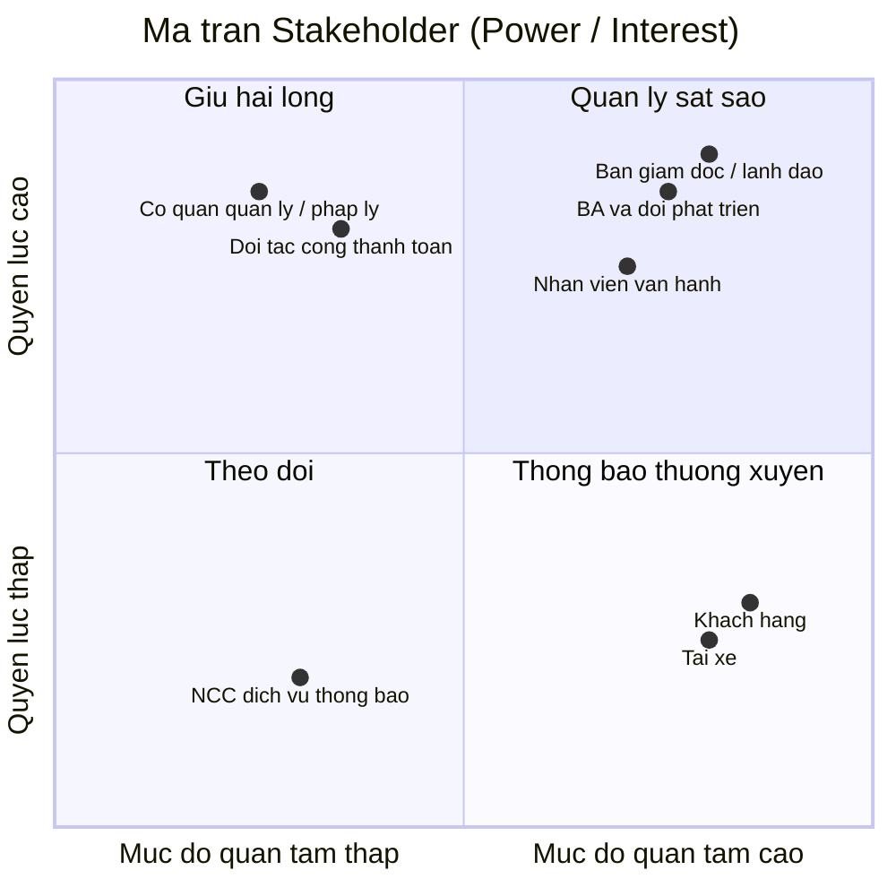

# CAB System — Nền tảng đặt xe

## 0. Tổng quan hệ thống

| Mục | Nội dung |
|---|---|
| **Tên dự án** | CAB System |
| **Loại hệ thống** | Nền tảng đặt xe trực tuyến (ride-hailing platform), tương tự mô hình Grab/Uber |
| **Khách hàng** | Công ty ABC — doanh nghiệp cung cấp dịch vụ đặt xe |
| **Thời gian triển khai** | 7 tuần |
| **Định hướng kiến trúc** | Service-Oriented Architecture / Microservices (do yêu cầu về khả năng mở rộng độc lập, triển khai từng phần, cô lập lỗi giữa các module) |
| **Phạm vi môn học** | Bài tập lớn môn Lập trình hướng dịch vụ (SOA) |

**Ý tưởng cốt lõi:** CAB System kết nối 3 nhóm người dùng — khách hàng, tài xế và nhân viên vận hành — thông qua một chuỗi nghiệp vụ xuyên suốt: *tạo yêu cầu đặt xe → tìm & phân công tài xế → thực hiện chuyến đi → tính cước & thanh toán → thông báo → đánh giá sau chuyến*. Hệ thống không chỉ là một ứng dụng đặt xe đơn thuần mà là một **nền tảng (platform)** có khả năng mở rộng thêm dịch vụ, phương thức thanh toán, kênh thông báo trong tương lai mà không phải xây dựng lại toàn bộ.

Vì hệ thống có nhiều nghiệp vụ độc lập nhưng liên kết chặt (đặt xe, matching, thanh toán, thông báo, quản trị), đây là bài toán rất phù hợp để thiết kế theo hướng **chia nhỏ thành các service riêng biệt**, giao tiếp với nhau qua API/message — đúng tinh thần môn SOA.

---

## Bước 1: Tìm hiểu nghiệp vụ

### 1.1 Vấn đề hiện tại của doanh nghiệp

Theo mô tả của khách hàng, hệ thống hiện tại (tổng đài + app đơn giản) đang gặp các vấn đề sau:

| # | Vấn đề hiện tại |
|---|---|
| 1 | **Phân công tài xế thủ công** — không có cơ chế tự động ghép tài xế phù hợp với khách hàng |
| 2 | **Khách hàng khó theo dõi trạng thái chuyến đi** — thiếu thông tin real-time (đang tìm tài xế, tài xế nhận chuyến, ETA...) |
| 3 | **Thông tin thanh toán không tập trung** — chưa có cơ chế quản lý thanh toán thống nhất, tích hợp |
| 4 | **Khó mở rộng hệ thống** — bộ phận vận hành gặp khó khăn khi muốn scale hoặc thêm tính năng mới |

### 1.2 Mục tiêu của hệ thống mới

- Xây dựng nền tảng CAB có khả năng **phục vụ số lượng lớn khách hàng và tài xế** cùng lúc, đặc biệt ổn định vào giờ cao điểm.
- **Tự động hóa việc tìm và phân công tài xế** dựa trên vị trí, trạng thái sẵn sàng và tiêu chí vận hành, có cơ chế fallback khi tài xế không phản hồi/từ chối.
- Cho khách hàng **theo dõi chuyến đi theo thời gian thực** từ lúc đặt xe đến khi hoàn thành.
- **Tập trung hóa nghiệp vụ thanh toán và tính cước**, hỗ trợ tiền mặt lẫn thanh toán điện tử qua bên thứ ba, không lưu trữ dữ liệu nhạy cảm của thẻ/tài khoản thanh toán trong hệ thống.
- Xây dựng hệ thống **thông báo (notification)** xuyên suốt vòng đời chuyến đi, có khả năng mở rộng thêm kênh thông báo mới sau này.
- Cung cấp **công cụ quản trị & báo cáo** cho vận hành: quản lý khách hàng/tài xế/xe/chuyến đi, phân quyền thao tác nhạy cảm, báo cáo doanh thu/tỷ lệ hoàn thành/hủy/hiệu quả tài xế.
- Đảm bảo **kiến trúc linh hoạt, có thể mở rộng độc lập từng thành phần**: lỗi ở một module (vd. thanh toán, thông báo) không được làm sập toàn bộ hệ thống đặt xe; triển khai tính năng mới từng phần, ít ảnh hưởng phần đang chạy.
- Đảm bảo **bảo mật**: xác thực người dùng, kiểm soát quyền truy cập cho thao tác quản trị, bảo vệ dữ liệu cá nhân/vị trí/giao dịch, lưu vết (audit log) các thao tác quan trọng.

### 1.3 Các nhóm người tham gia sử dụng hệ thống (Actors)

| Actor | Vai trò chính |
|---|---|
| **Khách hàng (Customer)** | Đăng ký/đăng nhập, cập nhật hồ sơ, đặt xe (điểm đón/đến, loại xe), theo dõi trạng thái chuyến, xem lịch sử, thanh toán, đánh giá tài xế sau chuyến |
| **Tài xế (Driver)** | Đăng ký/được vận hành tạo tài khoản, cập nhật hồ sơ & phương tiện, bật trạng thái sẵn sàng, nhận/từ chối chuyến, cập nhật trạng thái chuyến (đến điểm đón, đón khách, di chuyển, hoàn thành), gửi vị trí |
| **Nhân viên vận hành (Operator/Admin)** | Quản lý khách hàng, tài xế, phương tiện, chuyến đi; xử lý sự cố chuyến; tra cứu lịch sử giao dịch; xem báo cáo (số chuyến, doanh thu, tỷ lệ hoàn thành/hủy, hiệu quả tài xế) |
| **Cổng thanh toán bên thứ ba (Payment Gateway)** *(actor hệ thống/bên ngoài)* | Xử lý giao dịch thanh toán điện tử thay cho CAB System, tránh lưu thông tin nhạy cảm trong hệ thống |

> **Lưu ý:** Cổng thanh toán bên thứ ba tuy không phải "người dùng" nhưng đóng vai trò actor hệ thống (external system) vì có tương tác hai chiều với CAB System — đây là điểm cần thể hiện rõ trong sơ đồ Use Case ở bước sau.

### 1.4 Các điểm chưa rõ, cần làm rõ thêm với khách hàng (ghi nhận để xử lý ở bước sau)

Theo yêu cầu, doanh nghiệp **chưa chốt** các nội dung sau — Business Analyst cần làm rõ trước khi đội phát triển thiết kế giải pháp:

- Công thức/cách tính cước
- Tiêu chí ưu tiên tài xế khi matching
- Thời gian tối đa tài xế phải phản hồi một chuyến được đề xuất
- Chính sách hủy chuyến (ai được hủy, khi nào, có phí hủy không...)
- Cách xử lý khi mất kết nối mạng (khách hàng hoặc tài xế)
- Thời gian lưu trữ dữ liệu (lịch sử chuyến, vị trí, giao dịch...)

Trước tiên là bảng stakeholder (2.1), sau đó là ma trận Mendelow dạng sơ đồ (2.2).

## 2.1. Bảng Stakeholders

| Stakeholder | Vai trò | Tương tác với hệ thống |
|---|---|---|
| **Ban giám đốc / Ban lãnh đạo công ty ABC** | Người ra quyết định đầu tư, phê duyệt phạm vi & ngân sách dự án | Không thao tác trực tiếp lên hệ thống; nhận báo cáo tổng hợp (doanh thu, tỷ lệ hoàn thành/hủy, hiệu quả tài xế) để ra quyết định chiến lược |
| **Nhân viên vận hành (Operator)** | Vận hành hằng ngày: giám sát chuyến đi, xử lý sự cố, quản lý dữ liệu | Sử dụng giao diện quản trị (admin) trực tiếp: quản lý khách hàng/tài xế/xe/chuyến, tra cứu giao dịch, thao tác theo phân quyền |
| **Khách hàng (Customer)** | Người dùng cuối, tạo nhu cầu đặt xe | Tương tác trực tiếp qua app: đăng ký, đặt xe, theo dõi chuyến, thanh toán, đánh giá tài xế |
| **Tài xế (Driver)** | Người cung cấp dịch vụ vận chuyển | Tương tác trực tiếp qua app tài xế: nhận/từ chối chuyến, cập nhật trạng thái & vị trí, xem thu nhập |
| **Business Analyst & Đội phát triển** | Phân tích, thiết kế, xây dựng hệ thống | Không phải người dùng cuối nhưng quyết định kiến trúc, luồng nghiệp vụ; cần làm rõ các yêu cầu chưa chốt với khách hàng |
| **Đối tác cổng thanh toán (Payment Gateway)** | Bên thứ ba xử lý giao dịch điện tử | Tương tác qua API/tích hợp hệ thống: nhận yêu cầu thanh toán, trả kết quả giao dịch; không có giao diện người dùng trong CAB System |
| **Nhà cung cấp dịch vụ thông báo (SMS/Email/Push provider)** | Bên thứ ba gửi thông báo | Tương tác qua API tích hợp; hệ thống gọi để gửi thông báo cho khách hàng/tài xế |
| **Cơ quan quản lý / pháp lý** (giao thông, bảo vệ dữ liệu cá nhân) | Đặt ra quy định mà hệ thống phải tuân thủ | Không tương tác trực tiếp với hệ thống, nhưng chi phối yêu cầu về bảo mật dữ liệu, xác thực tài xế, lưu trữ dữ liệu |

## 2.2. Ma trận Stakeholder (Mendelow Matrix)

**Cách đọc và áp dụng ma trận:**

- **Quản lý sát sao** (Ban giám đốc, BA & đội phát triển, Nhân viên vận hành): quyền lực và mức quan tâm đều cao → cần thu hút tham gia thường xuyên, thông tin đầy đủ, xin phê duyệt/phản hồi liên tục trong suốt dự án.
- **Giữ hài lòng** (cơ quan quản lý/pháp lý, đối tác cổng thanh toán): quyền lực cao nhưng ít quan tâm chi tiết hằng ngày → cần đảm bảo tuân thủ yêu cầu của họ (quy định pháp lý, chuẩn tích hợp API) nhưng không cần trao đổi quá thường xuyên.
- **Thông báo thường xuyên** (khách hàng, tài xế): quan tâm cao nhưng quyền lực thấp (không quyết định thiết kế hệ thống) → cần cập nhật thông tin, thu thập phản hồi qua khảo sát/UX testing, nhưng họ không phải người phê duyệt yêu cầu.
- **Theo dõi** (nhà cung cấp dịch vụ thông báo bên thứ ba): quyền lực và quan tâm đều thấp → chỉ cần giám sát ở mức tối thiểu, không cần đầu tư nhiều công sức giao tiếp.

Bạn muốn mình tiếp tục sang phần nào của bước 2, hay đã có bước 3 cần làm tiếp?
