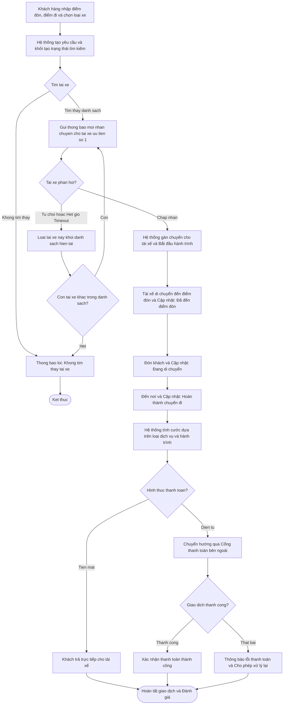
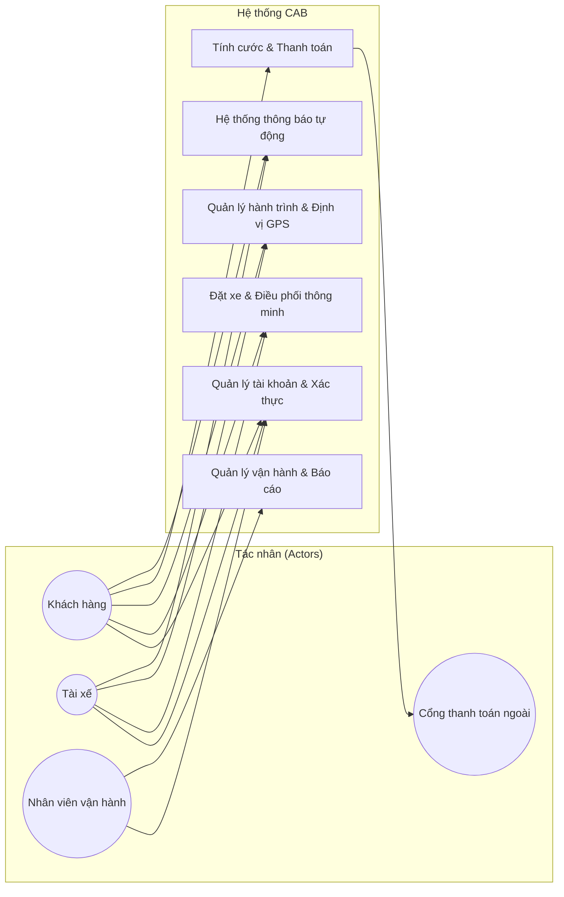

Bước 1: Tìm hiểu nghiệp vụ, hệ thống hiện tại có những vấn đề gì, mục tiêu, vấn đề hiện tại là gì, ai là người sử dụng hệ thống 

### 1. Tổng quan nghiệp vụ & Vấn đề của hệ thống hiện tại

**Thực trạng hệ thống hiện tại:**
Doanh nghiệp hiện tại tiếp nhận nhu cầu đặt xe thông qua tổng đài hoặc một ứng dụng đơn giản.

**Các vấn đề tồn đọng:**

* **Phân công tài xế thủ công:** Việc gán chuyến chủ yếu làm bằng tay, tốn thời gian và không tối ưu theo vị trí.

* **Trải nghiệm khách hàng kém:** Khách hàng khó theo dõi trạng thái chuyến đi, tài xế đang ở đâu hay thời gian dự kiến đến (ETA).

* **Quản lý dữ liệu phân tán:** Thông tin thanh toán chưa được quản lý tập trung, gây khó khăn cho việc tra cứu và đối soát.

* **Khả năng mở rộng hạn chế:** Bộ phận vận hành gặp nhiều khó khăn khi số lượng người dùng tăng lên hoặc khi muốn mở rộng quy mô hệ thống.

---

### 2. Mục tiêu của hệ thống CAB mới

* **Tự động hóa quy trình:** Tự động hóa hoàn toàn luồng nghiệp vụ từ tạo chuyến, tìm/phân công tài xế theo vị trí thực tế, tính cước, thanh toán đến đánh giá sau chuyến.

* **Tối ưu khả năng mở rộng & Chịu tải:** Phục vụ số lượng lớn khách hàng và tài xế đồng thời; các thành phần có thể mở rộng độc lập khi tải tăng cao.

* **Cô lập sự cố (Fault Tolerance):** Đảm bảo tính sẵn sàng cao, lỗi ở dịch vụ thanh toán hoặc thông báo không làm ngưng trệ toàn bộ hệ thống đặt xe.

* **Linh hoạt cải tiến:** Kiến trúc đủ linh hoạt để bổ sung loại hình dịch vụ mới, phương thức thanh toán mới, nhà cung cấp thông báo mới mà không phải xây dựng lại toàn bộ ứng dụng.

* **Cam kết thời gian:** Phân tích, xây dựng và triển khai sản phẩm hoàn chỉnh trong vòng **7 tuần**.

---

### 3. Người sử dụng hệ thống (Tác nhân - Actors)

#### Tác nhân chính (Primary Actors)

* **Khách hàng (Customer):**
* Đăng ký, đăng nhập, cập nhật thông tin cá nhân.

* Nhập điểm đón/điểm đến, chọn loại xe và gửi yêu cầu đặt xe.

* Theo dõi trạng thái chuyến đi, vị trí tài xế và thời gian dự kiến tài xế đến.

* Xem lịch sử chuyến đi, số tiền cước, thực hiện thanh toán và đánh giá tài xế.

* **Tài xế (Driver):**
* Đăng ký/nhận tài khoản, cập nhật hồ sơ, thông tin phương tiện và trạng thái sẵn sàng nhận chuyến.

* Nhận thông báo chuyến đi phù hợp, chấp nhận hoặc từ chối chuyến.

* Cập nhật tiến trình chuyến đi (*Đã đến điểm đón*, *Đã đón khách*, *Đang di chuyển*, *Hoàn thành*).

* Chia sẻ dữ liệu vị trí theo thời gian thực về hệ thống.

* **Nhân viên vận hành (Operations / Admin Staff):**
* Quản lý tài khoản khách hàng, tài xế, phương tiện và thông tin chuyến đi.

* Theo dõi các chuyến đi đang diễn ra, trạng thái tài xế và hỗ trợ xử lý các chuyến đi bị lỗi.

* Tra cứu lịch sử giao dịch và xem báo cáo thống kê (doanh thu, tỷ lệ hoàn thành/hủy, hiệu quả hoạt động).

* Được phân quyền quản trị theo vai trò để đảm bảo an toàn cho các thao tác nhạy cảm.

#### Tác nhân bên ngoài (External Systems)

* **Nhà cung cấp thanh toán (Payment Provider):** Xử lý giao dịch thanh toán điện tử bên ngoài mà không lưu trực tiếp thông tin thẻ/tài khoản nhạy cảm vào hệ thống CAB.

* **Nhà cung cấp dịch vụ thông báo (Notification Provider):** Gửi thông báo Push Notification/SMS/Email đến khách hàng và tài xế.

Bước 2: Xác định các stakeholder và vai trò

| STT | Bên liên quan (Stakeholder) | Phân loại | Vai trò và Trách nhiệm |
| :--- | :--- | :--- | :--- |
| 1 | **Ban lãnh đạo / Ban giám đốc** | Nội bộ | Khởi xướng và định hướng xây dựng nền tảng CAB mới để thay thế hệ thống cũ, với yêu cầu có khả năng mở rộng và phục vụ lượng lớn người dùng. Yêu cầu hệ thống cung cấp các báo cáo quản trị như doanh thu, số lượng chuyến, tỷ lệ hoàn thành/hủy chuyến và hiệu quả hoạt động của tài xế. |
| 2 | **Khách hàng** | Bên ngoài (Người dùng) | Đăng ký, đăng nhập và quản lý thông tin cá nhân trên ứng dụng. Gửi yêu cầu đặt xe, theo dõi vị trí tài xế và trạng thái chuyến đi. Trả tiền cước bằng tiền mặt hoặc thanh toán điện tử, xem lịch sử chuyến đi và đánh giá tài xế sau khi hoàn thành. |
| 3 | **Tài xế** | Bên ngoài (Người cung cấp dịch vụ) | Tạo tài khoản (hoặc được tạo hộ), cập nhật hồ sơ cá nhân và thông tin phương tiện. Bật trạng thái sẵn sàng, nhận thông báo chuyến mới, đưa ra quyết định chấp nhận hoặc từ chối chuyến đi. Cập nhật trạng thái trong suốt hành trình (đã đến điểm đón, đã đón khách, đang di chuyển, hoàn thành) và chia sẻ dữ liệu vị trí liên tục. |
| 4 | **Nhân viên vận hành** | Nội bộ | Sử dụng giao diện quản trị có phân quyền để quản lý dữ liệu khách hàng, tài xế, phương tiện và chuyến đi. Giám sát tiến trình các chuyến đang diễn ra, tra cứu lịch sử giao dịch và hỗ trợ xử lý khi có chuyến bị lỗi. |
| 5 | **Business Analyst (BA)** | Nội bộ (Đội dự án) | Phân tích và xác định rõ phạm vi, quy trình, yêu cầu chức năng/phi chức năng, quy tắc nghiệp vụ và các tác nhân của hệ thống. Chịu trách nhiệm làm việc với các bên liên quan để làm rõ các chi tiết chưa chốt (cách tính cước, tiêu chí tìm tài xế, chính sách hủy chuyến, v.v.) trước khi đội phát triển bắt tay vào làm. |
| 6 | **Nhóm phát triển** | Nội bộ (Đội dự án) | Chịu trách nhiệm xây dựng các giải pháp và phát triển hệ thống nền tảng CAB dựa trên những vấn đề đã được Business Analyst làm rõ. Đảm bảo kiến trúc linh hoạt để sau này có thể bổ sung dịch vụ, cổng thanh toán hoặc thông báo mà không cần xây dựng lại từ đầu. |
| 7 | **Nhà cung cấp thanh toán bên ngoài** | Đối tác thứ ba | Tích hợp vào hệ thống CAB để xử lý giao dịch điện tử và tính cước. Đảm bảo việc thanh toán diễn ra an toàn mà không yêu cầu hệ thống CAB phải lưu trữ trực tiếp các thông tin nhạy cảm của thẻ hoặc tài khoản người dùng. |
| 8 | **Nhà cung cấp thông báo** | Đối tác thứ ba | Cung cấp kênh gửi thông báo đến khách hàng và tài xế trong các cột mốc quan trọng (nhận chuyến, đến điểm đón, hoàn thành chuyến, kết quả thanh toán). Được tích hợp theo kiến trúc mở rộng để doanh nghiệp có thể thêm kênh thông báo mới trong tương lai. |

### 3. Yêu cầu nghiệp vụ (Business Requirements)

#### 3.1. Mục tiêu kinh doanh (Business Objectives)
* **BO-01:** Tự động hóa hoàn toàn quy trình phân công tài xế, thay thế phương pháp thủ công hiện tại nhằm tối ưu hóa thời gian và chi phí vận hành[cite: 1].
* **BO-02:** Nâng cao trải nghiệm khách hàng thông qua việc cung cấp khả năng theo dõi trạng thái chuyến đi, dự kiến thời gian đến (ETA) và quản lý thanh toán tập trung[cite: 1].
* **BO-03:** Xây dựng nền tảng có kiến trúc linh hoạt, khả năng mở rộng cao để phục vụ số lượng lớn người dùng và dễ dàng tích hợp thêm dịch vụ mới trong tương lai[cite: 1].
* **BO-04:** Hoàn thành xây dựng và triển khai sản phẩm trong thời gian giới hạn là 7 tuần[cite: 1].

#### 3.2. Yêu cầu nghiệp vụ cốt lõi (Core Business Rules)
* **BR-01 (Điều phối & Tìm tài xế):** Khi có yêu cầu đặt xe, hệ thống phải tự động tìm và ưu tiên tài xế phù hợp, gần khách hàng nhất dựa trên vị trí và trạng thái sẵn sàng[cite: 1].
* **BR-02 (Cơ chế chuyển tiếp chuyến):** Nếu tài xế đầu tiên từ chối hoặc không phản hồi, hệ thống phải tự động tìm tài xế khác thay thế mà không yêu cầu khách hàng tạo lại chuyến[cite: 1]. Nếu hoàn toàn không tìm được tài xế, phải thông báo rõ ràng cho khách hàng[cite: 1].
* **BR-03 (Quản lý trạng thái chuyến đi):** Tài xế bắt buộc phải cập nhật tuần tự các trạng thái của chuyến đi (đã đến điểm đón, đã đón khách, đang di chuyển, hoàn thành chuyến) và liên tục gửi vị trí về hệ thống[cite: 1].
* **BR-04 (Thanh toán & Cước phí):** Hệ thống tự động tính cước dựa trên loại dịch vụ và thông tin chuyến đi sau khi hoàn thành[cite: 1]. Quá trình thanh toán điện tử phải được thực hiện qua bên thứ 3, tuyệt đối không lưu thông tin thẻ/tài khoản ngân hàng của khách hàng vào hệ thống CAB[cite: 1].
* **BR-05 (Xử lý giao dịch lỗi):** Trong trường hợp thanh toán điện tử thất bại, hệ thống phải thông báo ngay cho khách hàng và cung cấp cơ chế xử lý lại giao dịch[cite: 1].
* **BR-06 (Thông báo):** Hệ thống phải tự động kích hoạt thông báo (Push/SMS) tại các cột mốc: tiếp nhận yêu cầu, có tài xế nhận chuyến, tài xế đến điểm đón, hoàn thành chuyến và có kết quả thanh toán[cite: 1].
* **BR-07 (Bảo mật & Lưu vết):** Mọi thao tác quản trị phải được kiểm soát quyền truy cập (RBAC)[cite: 1]. Hệ thống phải lưu vết (log) các thao tác quan trọng để phục vụ đối soát, kiểm tra khi có sự cố[cite: 1].

#### 3.3. Các quy tắc nghiệp vụ cần làm rõ thêm (Pending Business Rules)
*(Lưu ý: Các mục dưới đây là những điểm BA cần chốt lại với doanh nghiệp trước khi phát triển)*
* **PR-01:** Công thức và chi tiết cách tính cước phí chuyến đi[cite: 1].
* **PR-02:** Bộ tiêu chí cụ thể để ưu tiên tài xế và thời gian tối đa (timeout) để tài xế phản hồi yêu cầu nhận chuyến[cite: 1].
* **PR-03:** Chính sách hủy chuyến (phí phạt, điều kiện hủy) của khách hàng và tài xế[cite: 1].
* **PR-04:** Kịch bản xử lý nghiệp vụ khi thiết bị của tài xế hoặc khách hàng mất kết nối mạng giữa chuyến đi[cite: 1].
* **PR-05:** Quy định về thời gian lưu trữ dữ liệu (Data Retention) của hệ thống[cite: 1].

### 4. Quy trình nghiệp vụ cốt lõi (Core Business Processes)

#### 4.1. Quy trình Đặt xe & Điều phối (Booking & Matching Process)
1. **Khách hàng** đăng nhập vào ứng dụng, nhập điểm đón, điểm đến và lựa chọn loại xe mong muốn[cite: 1].
2. Hệ thống tiếp nhận yêu cầu đặt xe và khởi tạo trạng thái tìm kiếm[cite: 1].
3. Dịch vụ điều phối (**Matching Service**) tự động tìm kiếm các tài xế phù hợp đang ở trạng thái sẵn sàng và ở gần khu vực đón khách nhất dựa trên tọa độ vị trí[cite: 1].
4. Hệ thống gửi thông báo mời nhận chuyến đến tài xế ưu tiên đầu tiên[cite: 1].
    * *Trường hợp 1:* Tài xế bấm **Chấp nhận** $\rightarrow$ Hệ thống gán chuyến cho tài xế đó và cập nhật thông tin cho khách hàng.
    * *Trường hợp 2:* Tài xế **Từ chối** hoặc **Không phản hồi** trong thời gian quy định $\rightarrow$ Hệ thống tự động chuyển sang đề xuất tài xế phù hợp tiếp theo mà không làm gián đoạn yêu cầu của khách[cite: 1].
    * *Trường hợp 3:* Đã quét hết danh sách nhưng hoàn toàn không tìm thấy tài xế $\rightarrow$ Hệ thống thông báo rõ ràng cho khách hàng[cite: 1].

#### 4.2. Quy trình Thực hiện chuyến đi (Trip Execution Process)
1. Sau khi nhận chuyến, tài xế di chuyển đến điểm đón của khách và cập nhật trạng thái **"Đã đến điểm đón"** (hệ thống gửi thông báo cho khách)[cite: 1].
2. Khi khách lên xe, tài xế cập nhật trạng thái **"Đã đón khách / Đang di chuyển"**[cite: 1].
3. Trong suốt quá trình di chuyển, ứng dụng của tài xế liên tục gửi dữ liệu vị trí (GPS) về hệ thống để khách hàng theo dõi hành trình và cập nhật thời gian dự kiến đến (ETA)[cite: 1].
4. Khi đến nơi, tài xế cập nhật trạng thái **"Hoàn thành chuyến"**[cite: 1].

#### 4.3. Quy trình Tính cước & Thanh toán (Billing & Payment Process)
1. Ngay khi chuyến đi hoàn thành, hệ thống tính toán số tiền cước dựa trên loại dịch vụ và thông tin hành trình[cite: 1].
2. Khách hàng lựa chọn hình thức thanh toán:
    * **Tiền mặt:** Thanh toán trực tiếp cho tài xế.
    * **Thanh toán điện tử:** Hệ thống chuyển hướng yêu cầu qua **Cổng thanh toán bên ngoài (Third-party Payment Provider)**. Thông tin nhạy cảm của thẻ/tài khoản được xử lý bảo mật bên ngoài, không lưu trực tiếp trên hệ thống CAB[cite: 1].
3. *Xử lý ngoại lệ:* Nếu giao dịch điện tử thất bại, hệ thống gửi thông báo lỗi ngay cho khách hàng và cung cấp tuỳ chọn thanh toán lại theo chính sách của doanh nghiệp[cite: 1].

#### 4.4. Quy trình Đánh giá & Hậu kỳ (Rating & Operations Process)
1. Sau khi hoàn tất thanh toán, khách hàng thực hiện đánh giá (rating) chất lượng tài xế[cite: 1].
2. Bộ phận **Vận hành (Operations)** sử dụng giao diện quản trị để theo dõi các chuyến đi đang diễn ra, kiểm tra trạng thái tài xế, xử lý các sự cố phát sinh (như khiếu nại, lỗi chuyến) và tra cứu lịch sử giao dịch[cite: 1].
3. Hệ thống tổng hợp dữ liệu để trích xuất các báo cáo quản trị phục vụ Ban lãnh đạo (gồm tổng số chuyến, doanh thu, tỷ lệ hoàn thành chuyến, tỷ lệ hủy và hiệu quả hoạt động của tài xế)[cite: 1].

### 5. Mô hình hóa nghiệp vụ (Business Modeling)

#### 5.1. Biểu đồ Use Case tổng quan (System Use Case Diagram)
Biểu đồ Use Case mô tả mối quan hệ giữa các tác nhân (Actors) và các chức năng (Use Cases) mà hệ thống CAB cung cấp:

* **Tác nhân Khách hàng (Customer):**
  * `UC01`: Đăng ký / Đăng nhập / Quản lý tài khoản
  * `UC02`: Nhập điểm đón / điểm đi & Chọn loại xe
  * `UC03`: Gửi yêu cầu đặt xe
  * `UC04`: Theo dõi trạng thái chuyến đi & Vị trí tài xế (Real-time tracking)
  * `UC05`: Thanh toán cước phí (Tiền mặt / Điện tử)
  * `UC06`: Đánh giá tài xế sau chuyến đi

* **Tác nhân Tài xế (Driver):**
  * `UC07`: Quản lý hồ sơ & Thông tin phương tiện
  * `UC08`: Cập nhật trạng thái sẵn sàng (Online/Offline)
  * `UC09`: Nhận thông báo & Chấp nhận/Từ chối chuyến đi
  * `UC10`: Cập nhật tiến trình chuyến đi (Đến điểm đón, Đón khách, Hoàn thành)
  * `UC11`: Gửi tọa độ vị trí định kỳ về hệ thống

* **Tác nhân Nhân viên vận hành (Operations Staff):**
  * `UC12`: Quản lý người dùng (Khách hàng, Tài xế, Phương tiện)
  * `UC13`: Giám sát chuyến đi đang diễn ra & Xử lý lỗi chuyến
  * `UC14`: Tra cứu lịch sử giao dịch
  * `UC15`: Xem báo cáo thống kê (Doanh thu, Tỷ lệ hoàn thành/hủy, Hiệu suất tài xế)

* **Tác nhân Hệ thống thanh toán bên ngoài (Third-party Payment Gateway):**
  * `UC16`: Xử lý giao dịch thanh toán điện tử (Bảo mật thông tin thẻ)

---

#### 5.2. Biểu đồ hoạt động: Luồng Đặt xe & Điều phối tài xế (Activity Diagram - Booking & Matching)
Mô tả chi tiết các bước xử lý khi một khách hàng tiến hành đặt xe trên nền tảng CAB:

1. **Bắt đầu:** Khách hàng nhập điểm đón, điểm đến, chọn loại xe và xác nhận tạo yêu cầu đặt xe.
2. **Khởi tạo:** Hệ thống tiếp nhận yêu cầu, sinh mã chuyến đi và chuyển sang trạng thái tìm kiếm tài xế (`Searching`).
3. **Thuật toán Matching:** 
   * Hệ thống quét danh sách tài xế đang ở trạng thái `Ready` (Sẵn sàng) và nằm trong bán kính/khu vực phù hợp.
   * Sắp xếp danh sách ưu tiên theo khoảng cách gần khách hàng nhất.
4. **Gửi đề xuất:** Hệ thống gửi thông báo mời nhận chuyến đến tài xế đứng đầu danh sách ưu tiên.
5. **Kiểm tra phản hồi của tài xế:**
   * *Trường hợp A (Chấp nhận):* Tài xế bấm nhận chuyến trong thời gian quy định $\rightarrow$ Hệ thống gán chuyến cho tài xế, cập nhật trạng thái chuyến đi thành `Driver Assigned` và thông báo cho khách hàng. Chuyển sang giai đoạn thực hiện chuyến.
   * *Trường hợp B (Từ chối / Hết giờ - Timeout):* Tài xế từ chối hoặc không phản hồi $\rightarrow$ Hệ thống loại bỏ tài xế này khỏi danh sách hiện tại và chuyển sang đề xuất tài xế ưu tiên tiếp theo (Lặp lại bước 4).
   * *Trường hợp C (Hết toàn bộ danh sách mà không ai nhận):* Hệ thống thông báo lỗi không tìm được tài xế cho khách hàng (`No Driver Found`) và kết thúc quy trình.
  

### 1. Phân nhóm Yêu cầu chức năng hệ thống CAB

#### 1.1. Nhóm Quản lý tài khoản & Xác thực (Authentication & User Management)

* **FR-01:** Hệ thống phải cho phép khách hàng thực hiện đăng ký tài khoản mới, đăng nhập và cập nhật thông tin cá nhân.

* **FR-02:** Hệ thống phải cho phép tài xế đăng ký tài khoản hoặc được nhân viên vận hành tạo tài khoản, đồng thời cập nhật hồ sơ cá nhân và thông tin phương tiện.

* **FR-03:** Hệ thống phải thực hiện xác thực (Authentication) đối với khách hàng và tài xế trước khi cho phép sử dụng các chức năng yêu cầu tài khoản.

#### 1.2. Nhóm Đặt xe & Điều phối thông minh (Booking & Matching)

* **FR-04:** Khách hàng phải có khả năng nhập điểm đón, điểm đến, lựa chọn loại xe và gửi yêu cầu đặt xe lên hệ thống.

* **FR-05:** Hệ thống phải có chức năng tự động tìm kiếm và xác định các tài xế phù hợp dựa trên vị trí, trạng thái sẵn sàng (`Ready`) và các tiêu chí vận hành.

* **FR-06:** Hệ thống phải tự động gửi thông báo mời nhận chuyến đến tài xế được ưu tiên gần nhất.

* **FR-07:** Hệ thống phải cung cấp cơ chế xử lý khi tài xế từ chối hoặc không phản hồi: tự động chuyển sang tìm tài xế tiếp theo mà không yêu cầu khách hàng tạo lại yêu cầu.

* **FR-08:** Hệ thống phải hiển thị thông báo rõ ràng cho khách hàng trong trường hợp hoàn toàn không tìm thấy tài xế phù hợp.

#### 1.3. Nhóm Quản lý hành trình & Định vị (Trip Management & Location Tracking)

* **FR-09:** Tài xế phải có khả năng chuyển đổi trạng thái hoạt động sang sẵn sàng nhận chuyến (`Ready`).

* **FR-10:** Hệ thống phải cho phép tài xế cập nhật các mốc trạng thái của chuyến đi bao gồm: *đã đến điểm đón*, *đã đón khách*, *đang di chuyển*, và *hoàn thành chuyến*.

* **FR-11:** Hệ thống phải liên tục thu thập và lưu trữ thông tin vị trí (tọa độ GPS) của tài xế để hỗ trợ việc tìm tài xế gần nhất và tính toán thời gian dự kiến đến (ETA).

* **FR-12:** Khách hàng phải có khả năng theo dõi trạng thái chuyến đi theo thời gian thực: biết hệ thống đang tìm tài xế, tài xế nào nhận chuyến, thời gian dự kiến tài xế đến và trạng thái hành trình.

* **FR-13:** Khách hàng phải có thể xem lại lịch sử chuyến đi và thực hiện đánh giá tài xế sau khi hoàn thành chuyến.

#### 1.4. Nhóm Tính cước & Thanh toán (Billing & Payment)

* **FR-14:** Hệ thống phải tự động tính toán số tiền cước khách hàng phải trả dựa trên loại dịch vụ và thông tin chi tiết của chuyến đi sau khi hoàn thành.

* **FR-15:** Hệ thống phải hỗ trợ phương thức thanh toán bằng tiền mặt hoặc tích hợp với nhà cung cấp thanh toán điện tử bên ngoài.

* **FR-16:** Hệ thống phải đảm bảo không lưu trữ trực tiếp các thông tin nhạy cảm về thẻ hoặc tài khoản thanh toán điện tử của khách hàng trong cơ sở dữ liệu nội bộ.

* **FR-17:** Hệ thống phải tự động thông báo cho khách hàng và cung cấp cơ chế xử lý lại (retry) nếu giao dịch thanh toán điện tử gặp sự cố thất bại.

#### 1.5. Nhóm Thông báo (Notification System)

* **FR-18:** Hệ thống phải tự động gửi thông báo đến khách hàng khi: yêu cầu được tiếp nhận, có tài xế nhận chuyến, tài xế đến điểm đón, chuyến đi hoàn thành và có kết quả thanh toán.

* **FR-19:** Hệ thống phải gửi thông báo về chuyến đi mới hoặc các thay đổi liên quan đến chuyến đang thực hiện cho tài xế.

* **FR-20:** Hệ thống phải được thiết kế theo kiến trúc mở để dễ dàng tích hợp thêm các kênh thông báo mới trong tương lai mà không ảnh hưởng toàn bộ hệ thống.

#### 1.6. Nhóm Quản trị vận hành & Báo cáo (Operations & Reporting)

* **FR-21:** Hệ thống phải cung cấp giao diện quản trị phân quyền (RBAC) cho nhân viên vận hành để quản lý thông tin khách hàng, tài xế, phương tiện và chuyến đi.

* **FR-22:** Nhân viên vận hành phải có khả năng theo dõi các chuyến đang diễn ra, kiểm tra trạng thái tài xế, hỗ trợ xử lý khi chuyến đi gặp lỗi và tra cứu lịch sử giao dịch.

* **FR-23:** Hệ thống phải cung cấp tính năng trích xuất báo cáo tổng hợp phục vụ Ban lãnh đạo bao gồm: số lượng chuyến, doanh thu, tỷ lệ chuyến hoàn thành, tỷ lệ hủy chuyến và hiệu quả hoạt động của tài xế.

#### 1.7. Nhóm Bảo mật & Kiểm soát (Security & Auditing)

* **FR-24:** Hệ thống phải kiểm soát chặt chẽ quyền truy cập vào các chức năng quản trị, ngăn chặn nhân viên thông thường thực hiện thao tác nhạy cảm.

* **FR-25:** Hệ thống phải thực hiện lưu vết (Audit Log) đối với các thao tác quan trọng để phục vụ công tác kiểm tra, đối soát khi xảy ra sự cố.

## 7. Quy tắc nghiệp vụ (Business Rules)

Dựa trên tài liệu yêu cầu của hệ thống CAB, các quy tắc nghiệp vụ (Business Rules) được thiết lập để ràng buộc logic vận hành như sau:

### 7.1. Quy tắc điều phối và tìm kiếm tài xế (Matching Rules)
* **BR-01 (Tiêu chí tìm tài xế):** Khi khách hàng tạo yêu cầu đặt xe, hệ thống phải tự động xác định các tài xế phù hợp dựa trên vị trí, trạng thái sẵn sàng và các tiêu chí vận hành khác[cite: 1].
* **BR-02 (Cơ chế ưu tiên và chuyển tiếp):** Hệ thống ưu tiên đề xuất tài xế phù hợp và ở gần khách hàng nhất[cite: 1]. Nếu tài xế đầu tiên từ chối hoặc không phản hồi, hệ thống phải tiếp tục tìm tài xế khác mà không yêu cầu khách hàng phải tạo lại yêu cầu[cite: 1].
* **BR-03 (Xử lý khi không tìm thấy tài xế):** Trong trường hợp không tìm được tài xế phù hợp, khách hàng phải được thông báo rõ ràng về trạng thái của yêu cầu[cite: 1].

### 7.2. Quy tắc quản lý trạng thái chuyến đi (Trip Lifecycle Rules)
* **BR-04 (Trạng thái sẵn sàng):** Tài xế chỉ có thể nhận thông báo chuyến mới khi đã chủ động chuyển sang trạng thái sẵn sàng nhận chuyến trong quá trình làm việc[cite: 1].
* **BR-05 (Cập nhật tiến trình tuần tự):** Trong quá trình thực hiện chuyến đi, tài xế bắt buộc phải cập nhật tuần tự các mốc trạng thái gồm: đã đến điểm đón, đã đón khách, đang di chuyển và hoàn thành chuyến[cite: 1].
* **BR-06 (Lưu vết định vị):** Hệ thống phải lưu trữ thông tin vị trí của tài xế để hỗ trợ tìm tài xế gần nhất và cải thiện khả năng dự kiến thời gian đến (ETA)[cite: 1].

### 7.3. Quy tắc tính cước và thanh toán (Billing & Payment Rules)
* **BR-07 (Tính cước tự động):** Ngay sau khi chuyến đi hoàn thành, hệ thống phải xác định số tiền khách hàng phải trả dựa trên loại dịch vụ và thông tin chuyến đi[cite: 1].
* **BR-08 (Bảo mật dữ liệu thanh toán):** Hệ thống CAB tuyệt đối không được lưu trữ trực tiếp thông tin nhạy cảm của thẻ hoặc tài khoản thanh toán mà phải tích hợp với nhà cung cấp thanh toán bên ngoài[cite: 1].
* **BR-09 (Xử lý giao dịch lỗi):** Nếu giao dịch thanh toán điện tử thất bại, hệ thống phải thông báo cho khách hàng và cho phép xử lý lại theo chính sách doanh nghiệp[cite: 1].

### 7.4. Quy tắc phân quyền và bảo mật (Security & Access Rules)
* **BR-10 (Xác thực người dùng):** Khách hàng và tài xế phải được xác thực trước khi sử dụng các chức năng yêu cầu tài khoản[cite: 1].
* **BR-11 (Kiểm soát quyền quản trị):** Các thao tác quản trị phải được kiểm soát quyền truy cập chặt chẽ để nhân viên thông thường không thể thực hiện các thao tác nhạy cảm[cite: 1].
* **BR-12 (Lưu vết hệ thống):** Hệ thống phải lưu vết các thao tác quan trọng để phục vụ công tác kiểm tra khi có sự cố xảy ra[cite: 1].

### 7.5. Các quy tắc nghiệp vụ mở cần làm rõ (Open Business Rules / Pending Clarifications)
* *Các nội dung sau đây hiện chưa được doanh nghiệp chốt toàn bộ chi tiết và cần Business Analyst làm rõ với các bên liên quan trước khi triển khai giải pháp:*
  * Cách thức và công thức cụ thể để tính cước phí chuyến đi[cite: 1].
  * Các tiêu chí cụ thể để ưu tiên tài xế và thời gian giới hạn tài xế phải phản hồi[cite: 1].
  * Chính sách cụ thể khi hủy chuyến đi[cite: 1].
  * Kịch bản và phương án xử lý khi mất kết nối mạng[cite: 1].
  * Quy định về thời gian lưu trữ dữ liệu của hệ thống[cite: 1].
 

## 8. Yêu cầu phi chức năng (Non-Functional Requirements)

Dựa trên các định hướng và ràng buộc của dự án, các yêu cầu phi chức năng đối với hệ thống CAB bao gồm:

### 8.1. Tính sẵn sàng và Ổn định (Availability & Stability)
* **NFR-01 (Hoạt động trong giờ cao điểm):** Hệ thống phải duy trì hoạt động ổn định ngay cả vào các thời điểm nhu cầu đặt xe tăng cao[cite: 1].
* **NFR-02 (Cô lập lỗi - Fault Isolation):** Lỗi phát sinh ở chức năng thanh toán hoặc chức năng thông báo tuyệt đối không được làm cho toàn bộ hệ thống đặt xe ngừng hoạt động[cite: 1].

### 8.2. Khả năng mở rộng (Scalability)
* **NFR-03 (Mở rộng thành phần độc lập):** Các thành phần của hệ thống cần được thiết kế để có khả năng mở rộng độc lập khi tải hệ thống tăng lên[cite: 1].
* **NFR-04 (Triển khai từng phần):** Cho phép triển khai các chức năng mới theo từng phần mà hạn chế tối đa việc ảnh hưởng đến các chức năng đang hoạt động ổn định[cite: 1].

### 8.3. Bảo mật và Kiểm soát (Security)
* **NFR-05 (Xác thực tài khoản):** Khách hàng và tài xế bắt buộc phải được xác thực định danh trước khi sử dụng các chức năng yêu cầu tài khoản[cite: 1].
* **NFR-06 (Phân quyền quản trị):** Các thao tác trên giao diện quản trị phải được kiểm soát quyền truy cập chặt chẽ để đảm bảo an toàn[cite: 1].
* **NFR-07 (Bảo vệ dữ liệu):** Thông tin cá nhân, thông tin phương tiện, dữ liệu vị trí GPS và dữ liệu giao dịch phải được bảo mật an toàn[cite: 1].
* **NFR-08 (Lưu vết hệ thống):** Hệ thống phải thực hiện lưu vết (Audit Log) các thao tác quan trọng để phục vụ công tác kiểm tra, đối soát khi xảy ra sự cố[cite: 1].

### 8.4. Tính linh hoạt kiến trúc (Maintainability & Extensibility)
* **NFR-09 (Kiến trúc mở rộng dài hạn):** Hệ thống phải sở hữu kiến trúc linh hoạt để trong tương lai có thể dễ dàng bổ sung các loại dịch vụ mới, thêm phương thức thanh toán, tích hợp thêm nhà cung cấp thông báo hoặc thay đổi thành phần kỹ thuật mà không cần xây dựng lại toàn bộ ứng dụng[cite: 1].

### 8.5. Ràng buộc về thời gian (Time Constraint)
* **NFR-10 (Tiến độ triển khai):** Toàn bộ sản phẩm phải được xây dựng và hoàn tất triển khai trong khoảng thời gian giới hạn là 7 tuần[cite: 1].

## 9. Thiết kế thực thể dữ liệu & Sơ đồ ERD (Entity-Relationship Diagram)

Dựa trên các yêu cầu nghiệp vụ của hệ thống CAB, mô hình dữ liệu được cấu trúc để quản lý thông tin người dùng, phương tiện, tiến trình chuyến đi, giao dịch thanh toán, hệ thống thông báo và lưu vết kiểm tra.

### 9.1. Sơ đồ thực thể mối quan hệ (ERD)

```mermaid
erDiagram
    CUSTOMER ||--o{ TRIP : "tạo yêu cầu"
    DRIVER ||--o{ TRIP : "thực hiện"
    DRIVER ||--|{ VEHICLE : "sở hữu"
    TRIP ||--o| PAYMENT : "thanh toán"
    CUSTOMER ||--o{ NOTIFICATION : "nhận"
    DRIVER ||--o{ NOTIFICATION : "nhận"
    STAFF ||--o{ AUDIT_LOG : "sinh ra"

    CUSTOMER {
        string customer_id PK
        string name
        string phone
        string email
        string password_hash
    }
    
    DRIVER {
        string driver_id PK
        string name
        string phone
        string status "Ready, Busy, Offline"
        float current_latitude
        float current_longitude
    }
    
    VEHICLE {
        string vehicle_id PK
        string driver_id FK
        string vehicle_type
        string license_plate
    }
    
    TRIP {
        string trip_id PK
        string customer_id FK
        string driver_id FK
        string pickup_location
        string dropoff_location
        string service_type
        string status "Searching, Assigned, Arrived, InProgress, Completed"
        float fare
        datetime created_at
    }
    
    PAYMENT {
        string payment_id PK
        string trip_id FK
        float amount
        string method "Cash, Electronic"
        string status "Success, Failed, Pending"
    }
    
    NOTIFICATION {
        string notification_id PK
        string recipient_id
        string content
        string channel
        string status
    }
    
    STAFF {
        string staff_id PK
        string username
        string role "Admin, Operator"
    }
    
    AUDIT_LOG {
        string log_id PK
        string staff_id FK
        string action
        datetime timestamp
        string details
    }

```

### 9.2. Mô tả chi tiết các thực thể chính

* **Thực thể Customer (Khách hàng):** Lưu trữ thông tin định danh và tài khoản đăng nhập của khách hàng sử dụng dịch vụ đặt xe.

* **Thực thể Driver (Tài xế):** Lưu trữ thông tin cá nhân, trạng thái hoạt động hiện tại (*Ready/Busy*) và tọa độ vị trí thực tế (`lat`, `lng`) phục vụ cho thuật toán tìm kiếm tài xế gần nhất.

* **Thực thể Vehicle (Phương tiện):** Quản lý thông tin chi tiết về xe của tài xế (loại xe, biển số xe).

* **Thực thể Trip (Chuyến đi):** Thực thể trung tâm lưu vết toàn bộ vòng đời của một chuyến đi: điểm đón, điểm đến, loại dịch vụ, trạng thái chuyến đi và cước phí.

* **Thực thể Payment (Thanh toán):** Lưu trữ kết quả giao dịch cước phí (tiền mặt hoặc điện tử) và trạng thái thanh toán mà không lưu thông tin thẻ nhạy cảm.

* **Thực thể Notification (Thông báo):** Quản lý nội dung và trạng thái gửi thông báo đến khách hàng và tài xế qua các cột mốc hành trình.

* **Thực thể Staff & Audit Log (Nhân viên vận hành & Lưu vết):** Quản lý quyền hạn truy cập của nhân viên quản trị (RBAC) và lưu vết các thao tác quan trọng để phục vụ kiểm tra sự cố.

## 10. Sơ đồ Use Case (Use Case Diagram)

Sơ đồ Use Case thể hiện tổng quan các tác nhân (Actors) tương tác với hệ thống CAB và các chức năng chính (Use Cases) mà hệ thống cung cấp.

### 10.1. Sơ đồ Use Case tổng quát

### 10.2. Mô tả các Tác nhân (Actors)

* **Khách hàng (Customer):** Người sử dụng dịch vụ có nhu cầu đặt xe, theo dõi hành trình di chuyển, thanh toán cước phí và nhận thông báo từ hệ thống.
* **Tài xế (Driver):** Người cung cấp dịch vụ vận chuyển, thực hiện cập nhật trạng thái sẵn sàng, tiếp nhận yêu cầu chuyến đi, cập nhật các mốc hành trình.
* **Nhân viên vận hành (Operator/Admin):** Quản lý thông tin hệ thống, theo dõi tình trạng chuyến đi, hỗ trợ xử lý sự cố và trích xuất báo cáo kinh doanh.
* **Cổng thanh toán ngoài (External Payment Gateway):** Hệ thống thanh toán điện tử bên thứ ba tích hợp để xử lý các giao dịch trực tuyến của khách hàng.
