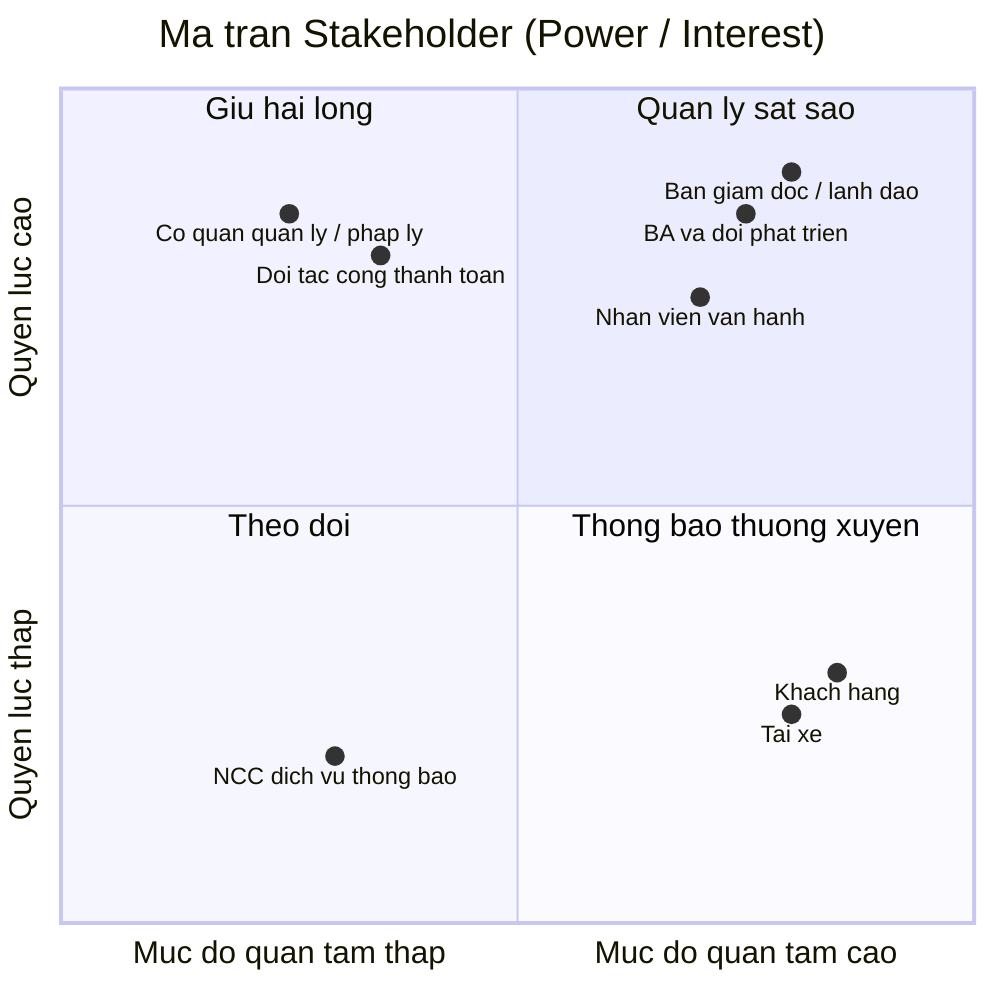
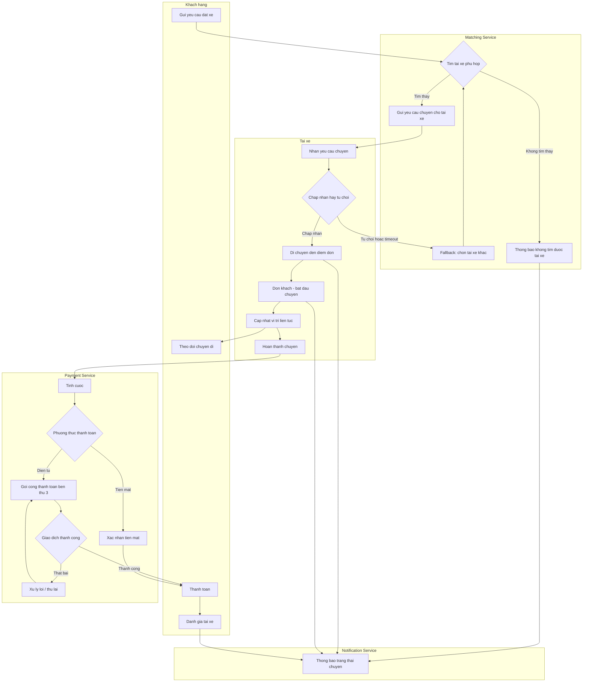
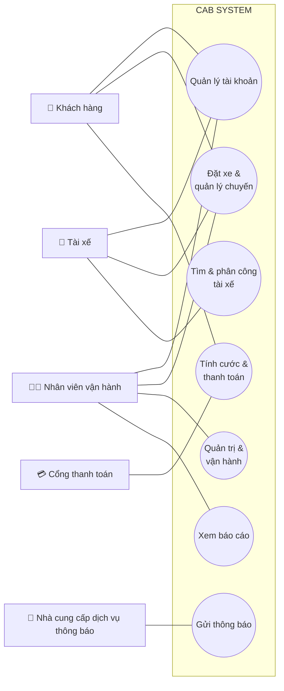
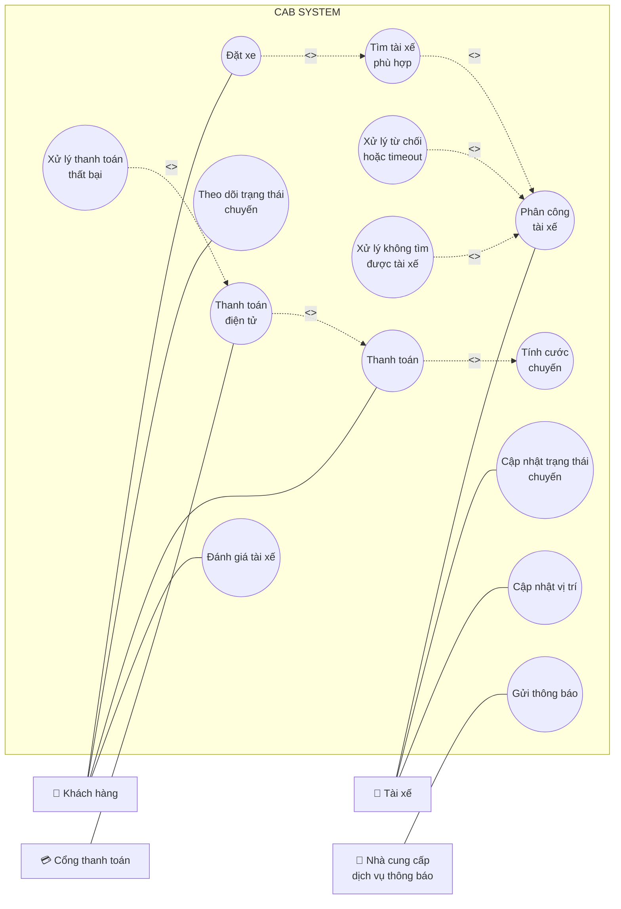

## Bước 1 - Tìm hiểu nghiệp vụ

### 1.1 Vấn đề hiện tại của doanh nghiệp

Theo mô tả của khách hàng, hệ thống hiện tại (tổng đài + app đơn giản) đang gặp các vấn đề sau:

| # | Vấn đề hiện tại |
|---|---|
| 1 | **Phân công tài xế thủ công** — không có cơ chế tự động ghép tài xế phù hợp với khách hàng |
| 2 | **Khách hàng khó theo dõi trạng thái chuyến đi** — thiếu thông tin real-time (đang tìm tài xế, tài xế nhận chuyến, ETA...) |
| 3 | **Thông tin thanh toán không tập trung** — chưa có cơ chế quản lý thanh toán thống nhất, tích hợp |
| 4 | **Khó mở rộng hệ thống** — bộ phận vận hành gặp khó khăn khi muốn scale hoặc thêm tính năng mới |

### 1.2 Mục tiêu của hệ thống mới

- Xây dựng nền tảng CAB có khả năng **phục vụ số lượng lớn khách hàng và tài xế** cùng lúc, đặc biệt ổn định vào giờ cao điểm.
- **Tự động hóa việc tìm và phân công tài xế** dựa trên vị trí, trạng thái sẵn sàng và tiêu chí vận hành, có cơ chế fallback khi tài xế không phản hồi/từ chối.
- Cho khách hàng **theo dõi chuyến đi theo thời gian thực** từ lúc đặt xe đến khi hoàn thành.
- **Tập trung hóa nghiệp vụ thanh toán và tính cước**, hỗ trợ tiền mặt lẫn thanh toán điện tử qua bên thứ ba, không lưu trữ dữ liệu nhạy cảm của thẻ/tài khoản thanh toán trong hệ thống.
- Xây dựng hệ thống **thông báo (notification)** xuyên suốt vòng đời chuyến đi, có khả năng mở rộng thêm kênh thông báo mới sau này.
- Cung cấp **công cụ quản trị & báo cáo** cho vận hành: quản lý khách hàng/tài xế/xe/chuyến đi, phân quyền thao tác nhạy cảm, báo cáo doanh thu/tỷ lệ hoàn thành/hủy/hiệu quả tài xế.
- Đảm bảo **kiến trúc linh hoạt, có thể mở rộng độc lập từng thành phần**: lỗi ở một module (vd. thanh toán, thông báo) không được làm sập toàn bộ hệ thống đặt xe; triển khai tính năng mới từng phần, ít ảnh hưởng phần đang chạy.
- Đảm bảo **bảo mật**: xác thực người dùng, kiểm soát quyền truy cập cho thao tác quản trị, bảo vệ dữ liệu cá nhân/vị trí/giao dịch, lưu vết (audit log) các thao tác quan trọng.

### 1.3 Các nhóm người tham gia sử dụng hệ thống (Actors)

| Actor | Vai trò chính |
|---|---|
| **Khách hàng (Customer)** | Đăng ký/đăng nhập, cập nhật hồ sơ, đặt xe (điểm đón/đến, loại xe), theo dõi trạng thái chuyến, xem lịch sử, thanh toán, đánh giá tài xế sau chuyến |
| **Tài xế (Driver)** | Đăng ký/được vận hành tạo tài khoản, cập nhật hồ sơ & phương tiện, bật trạng thái sẵn sàng, nhận/từ chối chuyến, cập nhật trạng thái chuyến (đến điểm đón, đón khách, di chuyển, hoàn thành), gửi vị trí |
| **Nhân viên vận hành (Operator/Admin)** | Quản lý khách hàng, tài xế, phương tiện, chuyến đi; xử lý sự cố chuyến; tra cứu lịch sử giao dịch; xem báo cáo (số chuyến, doanh thu, tỷ lệ hoàn thành/hủy, hiệu quả tài xế) |
| **Cổng thanh toán bên thứ ba (Payment Gateway)** *(actor hệ thống/bên ngoài)* | Xử lý giao dịch thanh toán điện tử thay cho CAB System, tránh lưu thông tin nhạy cảm trong hệ thống |

> **Lưu ý:** Cổng thanh toán bên thứ ba tuy không phải "người dùng" nhưng đóng vai trò actor hệ thống (external system) vì có tương tác hai chiều với CAB System — đây là điểm cần thể hiện rõ trong sơ đồ Use Case ở bước sau.

### 1.4 Các điểm chưa rõ, cần làm rõ thêm với khách hàng (ghi nhận để xử lý ở bước sau)

Theo yêu cầu, doanh nghiệp **chưa chốt** các nội dung sau — Business Analyst cần làm rõ trước khi đội phát triển thiết kế giải pháp:

- Công thức/cách tính cước
- Tiêu chí ưu tiên tài xế khi matching
- Thời gian tối đa tài xế phải phản hồi một chuyến được đề xuất
- Chính sách hủy chuyến (ai được hủy, khi nào, có phí hủy không...)
- Cách xử lý khi mất kết nối mạng (khách hàng hoặc tài xế)
- Thời gian lưu trữ dữ liệu (lịch sử chuyến, vị trí, giao dịch...)

## Bước 2  - Phân tích các bên liên quan

## 2.1. Bảng Stakeholders

| Stakeholder | Vai trò | Tương tác với hệ thống |
|---|---|---|
| **Ban giám đốc / Ban lãnh đạo công ty ABC** | Người ra quyết định đầu tư, phê duyệt phạm vi & ngân sách dự án | Không thao tác trực tiếp lên hệ thống; nhận báo cáo tổng hợp (doanh thu, tỷ lệ hoàn thành/hủy, hiệu quả tài xế) để ra quyết định chiến lược |
| **Nhân viên vận hành (Operator)** | Vận hành hằng ngày: giám sát chuyến đi, xử lý sự cố, quản lý dữ liệu | Sử dụng giao diện quản trị (admin) trực tiếp: quản lý khách hàng/tài xế/xe/chuyến, tra cứu giao dịch, thao tác theo phân quyền |
| **Khách hàng (Customer)** | Người dùng cuối, tạo nhu cầu đặt xe | Tương tác trực tiếp qua app: đăng ký, đặt xe, theo dõi chuyến, thanh toán, đánh giá tài xế |
| **Tài xế (Driver)** | Người cung cấp dịch vụ vận chuyển | Tương tác trực tiếp qua app tài xế: nhận/từ chối chuyến, cập nhật trạng thái & vị trí, xem thu nhập |
| **Business Analyst & Đội phát triển** | Phân tích, thiết kế, xây dựng hệ thống | Không phải người dùng cuối nhưng quyết định kiến trúc, luồng nghiệp vụ; cần làm rõ các yêu cầu chưa chốt với khách hàng |
| **Đối tác cổng thanh toán (Payment Gateway)** | Bên thứ ba xử lý giao dịch điện tử | Tương tác qua API/tích hợp hệ thống: nhận yêu cầu thanh toán, trả kết quả giao dịch; không có giao diện người dùng trong CAB System |
| **Nhà cung cấp dịch vụ thông báo (SMS/Email/Push provider)** | Bên thứ ba gửi thông báo | Tương tác qua API tích hợp; hệ thống gọi để gửi thông báo cho khách hàng/tài xế |
| **Cơ quan quản lý / pháp lý** (giao thông, bảo vệ dữ liệu cá nhân) | Đặt ra quy định mà hệ thống phải tuân thủ | Không tương tác trực tiếp với hệ thống, nhưng chi phối yêu cầu về bảo mật dữ liệu, xác thực tài xế, lưu trữ dữ liệu |

## 2.2. Ma trận Stakeholder (Mendelow Matrix)



**Cách đọc và áp dụng ma trận:**

- **Quản lý sát sao** (Ban giám đốc, BA & đội phát triển, Nhân viên vận hành): quyền lực và mức quan tâm đều cao → cần thu hút tham gia thường xuyên, thông tin đầy đủ, xin phê duyệt/phản hồi liên tục trong suốt dự án.
- **Giữ hài lòng** (cơ quan quản lý/pháp lý, đối tác cổng thanh toán): quyền lực cao nhưng ít quan tâm chi tiết hằng ngày → cần đảm bảo tuân thủ yêu cầu của họ (quy định pháp lý, chuẩn tích hợp API) nhưng không cần trao đổi quá thường xuyên.
- **Thông báo thường xuyên** (khách hàng, tài xế): quan tâm cao nhưng quyền lực thấp (không quyết định thiết kế hệ thống) → cần cập nhật thông tin, thu thập phản hồi qua khảo sát/UX testing, nhưng họ không phải người phê duyệt yêu cầu.
- **Theo dõi** (nhà cung cấp dịch vụ thông báo bên thứ ba): quyền lực và quan tâm đều thấp → chỉ cần giám sát ở mức tối thiểu, không cần đầu tư nhiều công sức giao tiếp.

## Bước 3 – Mục đích nghiệp vụ

### 3.1. Mục đích tổng quát

Xây dựng **CAB System** — một nền tảng đặt xe trực tuyến hiện đại, thay thế mô hình vận hành thủ công hiện tại (tổng đài + app đơn giản) — nhằm giúp Công ty ABC:

- Tự động hóa toàn bộ quy trình từ đặt xe → tìm/phân công tài xế → thực hiện chuyến → tính cước → thanh toán → thông báo → đánh giá.
- Phục vụ được **quy mô lớn** khách hàng và tài xế cùng lúc, kể cả vào giờ cao điểm, mà không bị gián đoạn dịch vụ.
- Tạo nền tảng có **kiến trúc mở, dễ mở rộng** để doanh nghiệp phát triển thêm dịch vụ, tính năng trong tương lai mà không phải xây lại từ đầu.

Nói ngắn gọn: mục đích không phải là "làm ra một app đặt xe", mà là "xây một **nền tảng dịch vụ (platform)** đủ vững để doanh nghiệp vận hành và tăng trưởng lâu dài".

### 3.2. Các mục đích chính

| # | Mục đích chính | Giải quyết vấn đề gì |
|---|---|---|
| 1 | **Tự động hóa việc tìm và phân công tài xế** | Thay thế việc phân công thủ công, dựa trên vị trí + trạng thái sẵn sàng, có cơ chế fallback khi tài xế từ chối/không phản hồi |
| 2 | **Minh bạch hóa & theo dõi chuyến đi theo thời gian thực** | Khách hàng biết được trạng thái mỗi bước: đang tìm tài xế → tài xế nhận chuyến → ETA → đang di chuyển → hoàn thành |
| 3 | **Tập trung hóa thanh toán & tính cước** | Thống nhất một luồng thanh toán (tiền mặt + điện tử qua bên thứ ba), không lưu dữ liệu thẻ nhạy cảm trong hệ thống nội bộ |
| 4 | **Xây dựng hệ thống thông báo xuyên suốt vòng đời chuyến đi** | Đảm bảo khách hàng & tài xế luôn được cập nhật kịp thời tại mọi mốc quan trọng; kiến trúc mở để thêm kênh thông báo mới |
| 5 | **Cung cấp công cụ quản trị & báo cáo cho vận hành** | Cho nhân viên vận hành khả năng quản lý, xử lý sự cố, và cho ban lãnh đạo dữ liệu ra quyết định (doanh thu, tỷ lệ hoàn thành/hủy, hiệu quả tài xế) |
| 6 | **Đảm bảo hệ thống ổn định & có khả năng mở rộng độc lập** | Lỗi ở một module (thanh toán, thông báo) không được làm sập toàn hệ thống; scale riêng từng thành phần khi tải tăng |
| 7 | **Bảo mật dữ liệu và kiểm soát truy cập** | Xác thực người dùng, phân quyền thao tác nhạy cảm, bảo vệ dữ liệu cá nhân/vị trí/giao dịch, lưu vết thao tác để phục vụ audit |
| 8 | **Tạo kiến trúc linh hoạt cho tăng trưởng dài hạn** | Cho phép thêm loại dịch vụ mới, phương thức thanh toán mới, nhà cung cấp thông báo mới... mà không phải xây lại toàn bộ hệ thống |

> Các mục đích 6, 7, 8 chính là lý do bài toán này phù hợp để triển khai theo hướng **SOA/microservices** — tách các nghiệp vụ (đặt xe, matching, thanh toán, thông báo, quản trị) thành các service độc lập, giao tiếp qua API, để đáp ứng đúng yêu cầu "lỗi cục bộ không sập toàn hệ thống" và "mở rộng từng phần".

## Bước 4 – Xác định phạm vi dự án

### 4.1. Trong phạm vi (In-scope)

**Nhóm chức năng dành cho Khách hàng:**
- Đăng ký, đăng nhập, cập nhật thông tin cá nhân
- Nhập điểm đón/điểm đến, chọn loại xe, gửi yêu cầu đặt xe
- Theo dõi trạng thái chuyến đi theo thời gian thực (đang tìm tài xế, tài xế nhận chuyến, ETA, đang di chuyển, hoàn thành)
- Xem lịch sử chuyến đi, số tiền đã trả
- Thanh toán (tiền mặt + điện tử qua cổng thanh toán bên thứ ba)
- Đánh giá tài xế sau chuyến

**Nhóm chức năng dành cho Tài xế:**
- Đăng ký / được nhân viên vận hành tạo tài khoản
- Cập nhật hồ sơ cá nhân, thông tin phương tiện
- Bật/tắt trạng thái sẵn sàng nhận chuyến
- Nhận thông báo chuyến mới, chấp nhận/từ chối chuyến
- Cập nhật trạng thái chuyến (đến điểm đón, đón khách, đang di chuyển, hoàn thành)
- Gửi vị trí liên tục để hỗ trợ matching & ước tính ETA

**Nhóm chức năng cốt lõi (Core business logic):**
- Thuật toán tìm & phân công tài xế (matching), có cơ chế fallback khi tài xế không phản hồi/từ chối
- Tính cước sau khi hoàn thành chuyến
- Xử lý thanh toán, tích hợp cổng thanh toán bên thứ ba
- Hệ thống thông báo (notification) cho các sự kiện trong vòng đời chuyến đi

**Nhóm chức năng dành cho Nhân viên vận hành (Admin):**
- Quản lý khách hàng, tài xế, phương tiện, chuyến đi
- Giám sát chuyến đang diễn ra, xử lý sự cố chuyến bị lỗi
- Tra cứu lịch sử giao dịch
- Phân quyền cho các thao tác nhạy cảm
- Báo cáo: số lượng chuyến, doanh thu, tỷ lệ hoàn thành/hủy, hiệu quả tài xế

**Yêu cầu phi chức năng cần đáp ứng trong phạm vi:**
- Kiến trúc có khả năng mở rộng độc lập từng thành phần (scale riêng)
- Cô lập lỗi: lỗi ở module thanh toán/thông báo không làm sập toàn hệ thống
- Triển khai (deploy) từng phần, hạn chế ảnh hưởng đến chức năng đang chạy
- Xác thực, phân quyền, bảo vệ dữ liệu cá nhân/vị trí/giao dịch, audit log

### 4.2. Ngoài phạm vi (Out-of-scope)

| # | Nội dung ngoài phạm vi | Lý do |
|---|---|---|
| 1 | Xây dựng hệ thống xử lý thanh toán riêng (lưu trữ thông tin thẻ, tài khoản ngân hàng) | Khách hàng yêu cầu **tích hợp với nhà cung cấp thanh toán bên ngoài**, không tự lưu dữ liệu nhạy cảm |
| 2 | Xác định công thức tính cước cụ thể, chính sách hủy chuyến, tiêu chí ưu tiên tài xế chi tiết | Doanh nghiệp **chưa chốt**, cần BA làm rõ với các bên liên quan ở giai đoạn phân tích trước khi dev xây dựng — đây là input cho scope, không phải scope đã đóng băng |
| 3 | Xây dựng thêm loại dịch vụ mới, phương thức thanh toán mới, kênh thông báo mới (ngoài kênh cơ bản) | Chỉ yêu cầu **kiến trúc phải sẵn sàng cho mở rộng**, chưa yêu cầu triển khai ngay trong 7 tuần |
| 4 | Ứng dụng dành cho các nền tảng ngoài phạm vi đã thống nhất (nếu có, cần xác nhận: web, iOS, Android...) | Chưa được đề cập rõ trong yêu cầu — cần xác nhận thêm với khách hàng |
| 5 | Tích hợp bản đồ/định tuyến chi tiết (bên thứ ba cụ thể nào, thuật toán định tuyến tối ưu) | Yêu cầu chỉ nói đến "vị trí tài xế" và "ước tính thời gian đến", chưa xác định rõ nhà cung cấp bản đồ hay logic định tuyến |
| 6 | Chương trình khuyến mãi, mã giảm giá, chăm sóc khách hàng qua tổng đài | Không được đề cập trong yêu cầu ban đầu |

### 4.3. Ràng buộc (Constraints)

| Loại ràng buộc | Nội dung |
|---|---|
| **Thời gian** | Chỉ có **7 tuần** để xây dựng và triển khai — ảnh hưởng trực tiếp đến việc chọn kiến trúc và mức độ chi tiết có thể làm trong phạm vi |
| **Kỹ thuật** | Không được lưu trữ thông tin nhạy cảm của thẻ/tài khoản thanh toán trong hệ thống CAB (bắt buộc dùng bên thứ ba xử lý) |
| **Kiến trúc** | Phải đảm bảo khả năng mở rộng độc lập và cô lập lỗi giữa các thành phần — định hướng chọn microservices thay vì monolithic |
| **Nghiệp vụ chưa chốt** | Nhiều quy tắc nghiệp vụ quan trọng (cách tính cước, chính sách hủy, thời gian phản hồi...) **chưa được xác nhận**, có thể ảnh hưởng đến scope chi tiết sau khi làm rõ |

### 4.4. Giả định (Assumptions)

*(cần xác nhận lại với khách hàng ở các bước sau — liệt kê ở đây để không bỏ sót)*

- Giả định hệ thống được xây dựng dưới dạng **ứng dụng di động** cho khách hàng và tài xế, kèm **giao diện web** cho nhân viên vận hành (chưa có xác nhận chính thức từ khách hàng).
- Giả định trong 7 tuần chỉ triển khai **một loại dịch vụ đặt xe cơ bản** (chưa phân nhiều hạng xe phức tạp), kiến trúc chừa chỗ mở rộng sau.
- Giả định có tối thiểu **một** cổng thanh toán bên thứ ba được tích hợp trong giai đoạn đầu (không cần multi-gateway ngay).
- Giả định thông báo trong giai đoạn đầu dùng tối thiểu **1-2 kênh cơ bản** (ví dụ: push notification/SMS), kiến trúc phải cho phép thêm kênh sau này.


## Bước 5 – Xác định yêu cầu nghiệp vụ

### 5.1. Danh sách yêu cầu nghiệp vụ (Business Requirements)

**Nhóm Khách hàng**

| Mã | Yêu cầu nghiệp vụ |
|---|---|
| BR-01 | Hệ thống phải cho phép khách hàng đăng ký, đăng nhập, cập nhật hồ sơ cá nhân |
| BR-02 | Hệ thống phải cho phép khách hàng tạo yêu cầu đặt xe (điểm đón, điểm đến, loại xe) |
| BR-03 | Hệ thống phải cho phép khách hàng theo dõi trạng thái chuyến đi theo thời gian thực |
| BR-04 | Hệ thống phải cho phép khách hàng xem lịch sử chuyến đi |
| BR-05 | Hệ thống phải cho phép khách hàng đánh giá tài xế sau khi hoàn thành chuyến |

**Nhóm Tài xế**

| Mã | Yêu cầu nghiệp vụ |
|---|---|
| BR-06 | Hệ thống phải cho phép tài xế đăng ký/được tạo tài khoản, cập nhật hồ sơ & thông tin phương tiện |
| BR-07 | Hệ thống phải cho phép tài xế bật/tắt trạng thái sẵn sàng nhận chuyến |
| BR-08 | Hệ thống phải cho phép tài xế nhận, chấp nhận hoặc từ chối yêu cầu chuyến |
| BR-09 | Hệ thống phải cho phép tài xế cập nhật trạng thái chuyến (đến điểm đón, đón khách, di chuyển, hoàn thành) |
| BR-10 | Hệ thống phải nhận vị trí tài xế được gửi liên tục trong suốt chuyến đi |

**Nhóm Matching (Tìm & phân công tài xế)**

| Mã | Yêu cầu nghiệp vụ |
|---|---|
| BR-11 | Hệ thống phải tự động tìm tài xế phù hợp dựa trên vị trí & trạng thái sẵn sàng |
| BR-12 | Hệ thống phải có cơ chế fallback tìm tài xế khác khi tài xế được đề xuất từ chối/không phản hồi đúng hạn |
| BR-13 | Hệ thống phải thông báo cho khách hàng nếu không tìm được tài xế phù hợp |

**Nhóm Thanh toán**

| Mã | Yêu cầu nghiệp vụ |
|---|---|
| BR-14 | Hệ thống phải tự động tính cước sau khi chuyến đi hoàn thành |
| BR-15 | Hệ thống phải hỗ trợ thanh toán tiền mặt và thanh toán điện tử qua cổng bên thứ ba |
| BR-16 | Hệ thống không được lưu trữ thông tin nhạy cảm của thẻ/tài khoản thanh toán |
| BR-17 | Hệ thống phải xử lý và thông báo khi giao dịch thanh toán thất bại |

**Nhóm Thông báo**

| Mã | Yêu cầu nghiệp vụ |
|---|---|
| BR-18 | Hệ thống phải gửi thông báo cho khách hàng & tài xế tại các mốc quan trọng của chuyến đi |
| BR-19 | Kiến trúc thông báo phải cho phép mở rộng thêm kênh gửi mới trong tương lai mà không ảnh hưởng thành phần khác |

**Nhóm Quản trị vận hành**

| Mã | Yêu cầu nghiệp vụ |
|---|---|
| BR-20 | Hệ thống phải cung cấp giao diện quản trị để quản lý khách hàng, tài xế, phương tiện, chuyến đi |
| BR-21 | Hệ thống phải cho phép phân quyền các thao tác quản trị nhạy cảm |
| BR-22 | Hệ thống phải cung cấp báo cáo: số chuyến, doanh thu, tỷ lệ hoàn thành/hủy, hiệu quả tài xế |

**Nhóm Phi chức năng (Non-functional)**

| Mã | Yêu cầu nghiệp vụ |
|---|---|
| BR-23 | Hệ thống phải chịu được tải lớn vào giờ cao điểm |
| BR-24 | Lỗi ở một thành phần (thanh toán, thông báo...) không được làm sập toàn hệ thống |
| BR-25 | Hệ thống phải cho phép triển khai (deploy) độc lập từng thành phần |
| BR-26 | Hệ thống phải xác thực người dùng và kiểm soát quyền truy cập theo vai trò |
| BR-27 | Hệ thống phải bảo vệ dữ liệu cá nhân, vị trí, giao dịch |
| BR-28 | Hệ thống phải ghi audit log cho các thao tác quan trọng |

### 5.2. Mô hình nghiệp vụ (Business Process Model)



**Giải thích mô hình:**

- Mỗi **subgraph** tương ứng với một actor/service — đúng tinh thần SOA: Khách hàng, Matching Service, Tài xế, Payment Service, Notification Service đều là các khối tách biệt, chỉ trao đổi qua các mũi tên (tương đương gọi API/message giữa các service).
- Vòng lặp `B1 → B2 → C2 → B4 → B1` thể hiện đúng **BR-12** (cơ chế fallback tìm tài xế khác khi bị từ chối/timeout).
- Nhánh `D5 -- That bai --> D6 --> D4` thể hiện **BR-17** (xử lý khi giao dịch thanh toán thất bại, có thể thử lại).
- `Notification Service` (E1) được gọi từ nhiều điểm khác nhau trong flow (khi không tìm được tài xế, khi tài xế đến điểm đón/đón khách, khi đánh giá xong) — thể hiện đúng **BR-18/BR-19**: thông báo xuyên suốt vòng đời chuyến đi và tách biệt thành service riêng để dễ mở rộng kênh sau này.


## Bước 6 – Phân rã Yêu cầu chức năng (Functional Requirements – FR)

Mỗi FR được nhóm theo **service/module** (đúng định hướng SOA đã chọn) và gắn với **BR** tương ứng ở Bước 5 để đảm bảo truy vết được (traceability).

### 6.1. User & Authentication Service

| FR | Mô tả chức năng | BR liên quan |
|---|---|---|
| FR-01 | Cho phép khách hàng đăng ký tài khoản bằng số điện thoại/email | BR-01 |
| FR-02 | Cho phép khách hàng đăng nhập bằng tài khoản đã đăng ký | BR-01 |
| FR-03 | Cho phép khách hàng cập nhật thông tin cá nhân (họ tên, SĐT, ảnh đại diện) | BR-01 |
| FR-04 | Cho phép tài xế đăng ký hoặc được nhân viên vận hành tạo tài khoản | BR-06 |
| FR-05 | Cho phép tài xế cập nhật hồ sơ cá nhân và thông tin phương tiện (biển số, loại xe, giấy tờ) | BR-06 |
| FR-06 | Hệ thống xác thực người dùng và phân quyền theo vai trò (khách hàng / tài xế / nhân viên vận hành) | BR-26 |

### 6.2. Trip / Booking Service

| FR | Mô tả chức năng | BR liên quan |
|---|---|---|
| FR-07 | Cho phép khách hàng nhập điểm đón và điểm đến | BR-02 |
| FR-08 | Cho phép khách hàng chọn loại xe khi đặt | BR-02 |
| FR-09 | Hệ thống tạo yêu cầu chuyến đi và gửi sang Matching Service | BR-02, BR-11 |
| FR-10 | Hệ thống cập nhật & hiển thị trạng thái chuyến theo thời gian thực (đang tìm tài xế → đã nhận → đang đến → đang di chuyển → hoàn thành) | BR-03 |
| FR-11 | Cho phép khách hàng hủy chuyến trước khi tài xế đến *(chính sách hủy cụ thể — cần làm rõ)* | BR-03 |
| FR-12 | Lưu và cho phép khách hàng xem lịch sử các chuyến đã thực hiện | BR-04 |
| FR-13 | Cho phép khách hàng gửi đánh giá (số sao + nhận xét) cho tài xế sau khi hoàn thành chuyến | BR-05 |

### 6.3. Matching Service

| FR | Mô tả chức năng | BR liên quan |
|---|---|---|
| FR-14 | Tìm danh sách tài xế đang ở trạng thái sẵn sàng và gần điểm đón nhất | BR-11 |
| FR-15 | Gửi yêu cầu chuyến đến tài xế được chọn, chờ phản hồi trong thời gian quy định | BR-11, BR-12 |
| FR-16 | Nếu tài xế từ chối/không phản hồi đúng hạn, tự động chọn tài xế tiếp theo (fallback) | BR-12 |
| FR-17 | Nếu không tìm được tài xế phù hợp sau [n] lần thử, gửi thông báo cho khách hàng | BR-13 |

### 6.4. Driver Operations

| FR | Mô tả chức năng | BR liên quan |
|---|---|---|
| FR-18 | Cho phép tài xế bật/tắt trạng thái "sẵn sàng nhận chuyến" | BR-07 |
| FR-19 | Cho phép tài xế xem thông tin yêu cầu chuyến trước khi chấp nhận | BR-08 |
| FR-20 | Cho phép tài xế chấp nhận hoặc từ chối yêu cầu chuyến | BR-08 |
| FR-21 | Cho phép tài xế cập nhật trạng thái chuyến: đến điểm đón, đón khách, đang di chuyển, hoàn thành | BR-09 |
| FR-22 | Hệ thống nhận vị trí GPS của tài xế định kỳ trong suốt chuyến đi | BR-10 |

### 6.5. Payment Service

| FR | Mô tả chức năng | BR liên quan |
|---|---|---|
| FR-23 | Tự động tính cước chuyến khi hoàn thành *(công thức cụ thể — cần làm rõ)* | BR-14 |
| FR-24 | Cho phép khách hàng chọn phương thức thanh toán: tiền mặt hoặc điện tử | BR-15 |
| FR-25 | Nếu chọn thanh toán điện tử, gọi API cổng thanh toán bên thứ ba để xử lý | BR-15, BR-16 |
| FR-26 | Không lưu trữ số thẻ/thông tin tài khoản thanh toán của khách hàng | BR-16 |
| FR-27 | Nếu giao dịch thất bại, thông báo lỗi và cho phép thử lại hoặc chuyển sang tiền mặt | BR-17 |
| FR-28 | Ghi nhận trạng thái thanh toán (thành công/thất bại/đang xử lý) cho từng chuyến | BR-17 |

### 6.6. Notification Service

| FR | Mô tả chức năng | BR liên quan |
|---|---|---|
| FR-29 | Gửi thông báo cho khách hàng tại các mốc: tài xế nhận chuyến, sắp đến, chuyến bắt đầu, hoàn thành, thanh toán thành công/thất bại | BR-18 |
| FR-30 | Gửi thông báo cho tài xế khi: có yêu cầu chuyến mới, khách hàng hủy chuyến | BR-18 |
| FR-31 | Kiến trúc cho phép thêm kênh gửi mới (SMS, email, push...) mà không sửa các service khác | BR-19 |

### 6.7. Admin & Reporting Service

| FR | Mô tả chức năng | BR liên quan |
|---|---|---|
| FR-32 | Cho phép nhân viên vận hành xem/tìm kiếm/chỉnh sửa thông tin khách hàng | BR-20 |
| FR-33 | Cho phép nhân viên vận hành xem/duyệt/khóa tài khoản tài xế và phương tiện | BR-20 |
| FR-34 | Cho phép nhân viên vận hành xem chuyến đang diễn ra và can thiệp khi có sự cố | BR-20 |
| FR-35 | Phân quyền các chức năng quản trị theo vai trò nhân viên | BR-21 |
| FR-36 | Tạo báo cáo: tổng số chuyến, doanh thu, tỷ lệ hoàn thành/hủy, hiệu suất tài xế theo khoảng thời gian | BR-22 |
| FR-37 | Ghi audit log mọi thao tác chỉnh sửa/khóa tài khoản, thay đổi dữ liệu nhạy cảm do nhân viên vận hành thực hiện | BR-28 |

---

**Nhận xét:** Cách nhóm FR theo 7 module ở trên (User/Auth, Trip/Booking, Matching, Driver Operations, Payment, Notification, Admin & Reporting) chính là **7 service ứng viên** cho kiến trúc microservices — mỗi module này sẽ trở thành một service độc lập khi thiết kế kiến trúc ở các bước sau, và tập FR này sẽ là input trực tiếp để vẽ **Use Case Diagram** cho từng actor.


## Bước 7 - Business Rules (Quy tắc nghiệp vụ)

Quy tắc nghiệp vụ mô tả **các ràng buộc, điều kiện, logic quyết định** đứng sau các FR — trả lời câu hỏi "khi nào thì làm gì, theo tiêu chí nào". Mình đánh dấu rõ quy tắc nào **đã có cơ sở từ yêu cầu khách hàng** và quy tắc nào **còn là giả định, cần khách hàng xác nhận** (đúng với các điểm tồn đọng đã ghi ở Bước 1 và Bước 4).

### 7.1. Quy tắc về Đặt xe & Matching

| Mã | Quy tắc nghiệp vụ | Trạng thái |
|---|---|---|
| QT-01 | Chỉ tài xế đang ở trạng thái "sẵn sàng" mới được đưa vào danh sách matching | ✅ Đã xác nhận |
| QT-02 | Tài xế được ưu tiên chọn theo khoảng cách gần điểm đón nhất | ⚠️ Giả định — khách hàng chưa chốt tiêu chí ưu tiên (có thể còn tính đến đánh giá, thời gian rảnh...) |
| QT-03 | Tài xế có thời gian giới hạn để phản hồi (chấp nhận/từ chối) một yêu cầu chuyến, quá hạn coi như từ chối | ⚠️ Giả định — khách hàng chưa chốt con số cụ thể (ví dụ 15s, 30s...) |
| QT-04 | Nếu tài xế từ chối/không phản hồi, hệ thống tự động chuyển yêu cầu sang tài xế tiếp theo trong danh sách | ✅ Đã xác nhận |
| QT-05 | Nếu không tìm được tài xế sau một số lần thử nhất định, hệ thống dừng tìm kiếm và thông báo cho khách hàng | ⚠️ Số lần thử cụ thể — cần xác nhận |
| QT-06 | Một tài xế chỉ được nhận tối đa 1 chuyến tại một thời điểm | ✅ Suy luận hợp lý từ nghiệp vụ, nên xác nhận lại |

### 7.2. Quy tắc về Tài xế

| Mã | Quy tắc nghiệp vụ | Trạng thái |
|---|---|---|
| QT-07 | Tài xế phải cập nhật đầy đủ thông tin phương tiện (biển số, loại xe, giấy tờ) trước khi được phép bật trạng thái sẵn sàng | ⚠️ Giả định hợp lý — cần xác nhận có bước duyệt hồ sơ tài xế hay không |
| QT-08 | Tài xế phải gửi vị trí định kỳ (ví dụ mỗi vài giây) trong suốt chuyến đi để hệ thống theo dõi | ⚠️ Tần suất cụ thể — cần xác nhận |
| QT-09 | Tài xế không thể chuyển trạng thái chuyến "nhảy cóc" (ví dụ không thể báo "hoàn thành" khi chưa "đón khách") | ✅ Ràng buộc logic hợp lý, nên đưa vào validate |

### 7.3. Quy tắc về Tính cước & Thanh toán

| Mã | Quy tắc nghiệp vụ | Trạng thái |
|---|---|---|
| QT-10 | Cước phí được tính sau khi chuyến đi kết thúc, dựa trên quãng đường/thời gian di chuyển | ⚠️ Công thức cụ thể (giá mở cửa, giá/km, phụ phí giờ cao điểm...) — **khách hàng chưa chốt**, cần làm rõ trước khi code |
| QT-11 | Thanh toán điện tử phải qua cổng thanh toán bên thứ ba; hệ thống CAB không lưu số thẻ/tài khoản | ✅ Đã xác nhận (ràng buộc bảo mật) |
| QT-12 | Nếu giao dịch điện tử thất bại, hệ thống phải cho phép thử lại hoặc chuyển sang thanh toán tiền mặt | ✅ Đã xác nhận |
| QT-13 | Một chuyến chỉ được xác nhận là "đã thanh toán" khi có phản hồi thành công từ cổng thanh toán (với thanh toán điện tử) hoặc xác nhận từ tài xế (với tiền mặt) | ⚠️ Giả định hợp lý — cần xác nhận |

### 7.4. Quy tắc về Hủy chuyến

| Mã | Quy tắc nghiệp vụ | Trạng thái |
|---|---|---|
| QT-14 | Khách hàng được phép hủy chuyến trước khi tài xế đón khách | ⚠️ Chưa có chính sách chính thức — **cần khách hàng xác nhận** (có tính phí hủy không, giới hạn số lần hủy...) |
| QT-15 | Tài xế được phép hủy/từ chối chuyến sau khi đã nhận trong một số trường hợp nhất định | ⚠️ Chưa xác nhận điều kiện cụ thể |
| QT-16 | Chuyến bị hủy phải được ghi nhận lý do và tính vào tỷ lệ hủy trong báo cáo vận hành | ✅ Đã xác nhận (phục vụ báo cáo — BR-22) |

### 7.5. Quy tắc về Đánh giá

| Mã | Quy tắc nghiệp vụ | Trạng thái |
|---|---|---|
| QT-17 | Khách hàng chỉ được đánh giá tài xế sau khi chuyến đi ở trạng thái "hoàn thành" | ✅ Đã xác nhận |
| QT-18 | Mỗi chuyến chỉ được đánh giá một lần | ✅ Ràng buộc logic hợp lý |

### 7.6. Quy tắc về Thông báo

| Mã | Quy tắc nghiệp vụ | Trạng thái |
|---|---|---|
| QT-19 | Hệ thống phải gửi thông báo tại các mốc quan trọng: nhận chuyến, tài xế đến, bắt đầu chuyến, hoàn thành, kết quả thanh toán | ✅ Đã xác nhận |
| QT-20 | Nếu một kênh gửi thông báo lỗi (ví dụ SMS provider down), lỗi đó không được làm gián đoạn luồng chính của chuyến đi | ✅ Đã xác nhận (liên hệ trực tiếp đến NFR cô lập lỗi) |

### 7.7. Quy tắc về Bảo mật & Quản trị

| Mã | Quy tắc nghiệp vụ | Trạng thái |
|---|---|---|
| QT-21 | Mỗi vai trò (khách hàng/tài xế/nhân viên vận hành) chỉ được truy cập chức năng thuộc phạm vi quyền hạn của mình | ✅ Đã xác nhận |
| QT-22 | Mọi thao tác chỉnh sửa/khóa tài khoản hoặc dữ liệu nhạy cảm bởi nhân viên vận hành phải được ghi log | ✅ Đã xác nhận |
| QT-23 | Dữ liệu vị trí, thông tin cá nhân và giao dịch phải được lưu trữ và truyền tải có bảo mật (mã hóa khi cần) | ✅ Đã xác nhận |
| QT-24 | Dữ liệu lịch sử chuyến đi/giao dịch phải được lưu trữ tối thiểu trong một khoảng thời gian nhất định | ⚠️ Thời gian lưu trữ cụ thể — **khách hàng chưa chốt** |

### 7.8. Quy tắc phi chức năng liên quan đến kiến trúc

| Mã | Quy tắc nghiệp vụ | Trạng thái |
|---|---|---|
| QT-25 | Mỗi service (matching, thanh toán, thông báo, quản trị...) phải hoạt động độc lập — lỗi ở một service không được lan sang service khác | ✅ Đã xác nhận |
| QT-26 | Hệ thống phải cho phép triển khai cập nhật từng service riêng lẻ mà không cần dừng toàn bộ hệ thống | ✅ Đã xác nhận |

---

## Bước 8 – Yêu cầu phi chức năng (Non-Functional Requirements-NFR)

### 8.1. Performance (Hiệu năng)

| NFR | Mô tả |
|---|---|
| NFR-01 | Hệ thống phải phản hồi yêu cầu đặt xe và tìm tài xế trong thời gian chấp nhận được (ví dụ vài giây) kể cả khi có nhiều yêu cầu đồng thời |
| NFR-02 | Việc cập nhật vị trí tài xế và trạng thái chuyến phải được phản ánh gần như tức thời (real-time/near real-time) trên ứng dụng khách hàng |
| NFR-03 | Thời gian xử lý một giao dịch thanh toán (kể cả gọi cổng bên thứ ba) phải nằm trong ngưỡng chấp nhận được, có cơ chế timeout rõ ràng |

### 8.2. Scalability (Khả năng mở rộng)

| NFR | Mô tả |
|---|---|
| NFR-04 | Hệ thống phải chịu được lượng truy cập tăng đột biến vào giờ cao điểm mà không giảm hiệu năng nghiêm trọng |
| NFR-05 | Mỗi service (matching, thanh toán, thông báo, quản trị...) phải có khả năng scale độc lập theo tải riêng của nó (ví dụ matching cần scale nhiều hơn vào giờ cao điểm, admin thì không) |
| NFR-06 | Kiến trúc phải cho phép thêm loại dịch vụ mới, phương thức thanh toán mới, kênh thông báo mới mà không cần thiết kế lại toàn hệ thống |

### 8.3. Reliability & Availability (Độ tin cậy & khả dụng)

| NFR | Mô tả |
|---|---|
| NFR-07 | Hệ thống phải đảm bảo tính sẵn sàng cao (high availability) cho các luồng nghiệp vụ chính: đặt xe, matching, cập nhật trạng thái chuyến |
| NFR-08 | Lỗi ở một service (đặc biệt là thanh toán, thông báo) không được làm gián đoạn hoặc sập các service khác — cần cơ chế cô lập lỗi (fault isolation), ví dụ circuit breaker, timeout, retry có kiểm soát |
| NFR-09 | Khi một dịch vụ phụ trợ (thông báo, bản đồ...) gặp sự cố, luồng nghiệp vụ chính (đặt xe, chuyến đi) vẫn phải tiếp tục hoạt động ở mức tối thiểu (graceful degradation) |

### 8.4. Maintainability & Deployability (Khả năng bảo trì & triển khai)

| NFR | Mô tả |
|---|---|
| NFR-10 | Hệ thống phải cho phép triển khai (deploy) cập nhật từng service riêng lẻ, không cần dừng toàn bộ hệ thống |
| NFR-11 | Các service phải được thiết kế tách rời (loosely coupled), giao tiếp qua API/message, hạn chế phụ thuộc trực tiếp vào cơ sở dữ liệu của nhau |
| NFR-12 | Hệ thống phải dễ dàng thêm/thay thế một thành phần (ví dụ đổi cổng thanh toán, thêm kênh thông báo) mà ảnh hưởng tối thiểu đến các phần còn lại |

### 8.5. Security (Bảo mật)

| NFR | Mô tả |
|---|---|
| NFR-13 | Hệ thống phải xác thực (authentication) người dùng trước khi cho phép truy cập chức năng |
| NFR-14 | Hệ thống phải phân quyền (authorization) theo vai trò: khách hàng, tài xế, nhân viên vận hành — mỗi vai trò chỉ thấy/thao tác đúng phạm vi của mình |
| NFR-15 | Không được lưu trữ thông tin nhạy cảm của thẻ/tài khoản thanh toán trong hệ thống nội bộ |
| NFR-16 | Dữ liệu cá nhân, vị trí và giao dịch phải được bảo vệ (mã hóa khi truyền tải và/hoặc khi lưu trữ) |
| NFR-17 | Mọi thao tác quản trị nhạy cảm (sửa/khóa tài khoản, thay đổi dữ liệu quan trọng) phải được ghi audit log, có thể truy vết ai làm gì, khi nào |

### 8.6. Usability (Khả năng sử dụng)

| NFR | Mô tả |
|---|---|
| NFR-18 | Giao diện đặt xe cho khách hàng phải đơn giản, tối thiểu số bước để hoàn tất một yêu cầu đặt xe |
| NFR-19 | Giao diện tài xế phải hiển thị rõ ràng thông tin chuyến (điểm đón/đến, thời gian phản hồi còn lại) để tài xế ra quyết định nhanh |
| NFR-20 | Giao diện quản trị phải hỗ trợ tìm kiếm, lọc dữ liệu nhanh (khách hàng, tài xế, chuyến đi) cho nhân viên vận hành |

### 8.7. Compliance & Data Retention (Tuân thủ & lưu trữ dữ liệu)

| NFR | Mô tả | Trạng thái |
|---|---|---|
| NFR-21 | Hệ thống phải tuân thủ quy định bảo vệ dữ liệu cá nhân hiện hành khi thu thập/xử lý dữ liệu vị trí và thông tin người dùng | ✅ Đã xác nhận (yêu cầu chung) |
| NFR-22 | Dữ liệu lịch sử chuyến đi và giao dịch phải được lưu trữ tối thiểu trong một khoảng thời gian xác định để phục vụ tra cứu/khiếu nại/báo cáo | ⚠️ Thời gian cụ thể — khách hàng chưa chốt |

### 8.8. Interoperability (Khả năng tích hợp)

| NFR | Mô tả |
|---|---|
| NFR-23 | Hệ thống phải tích hợp được với cổng thanh toán bên thứ ba thông qua API chuẩn, không phụ thuộc cứng vào một nhà cung cấp duy nhất (để dễ thay thế sau này) |
| NFR-24 | Notification Service phải thiết kế theo kiểu adapter/interface chung để dễ tích hợp thêm nhà cung cấp kênh thông báo mới (SMS, email, push...) |

---

**Ma trận liên kết nhanh NFR ↔ định hướng kiến trúc:**

| Nhóm NFR | Ảnh hưởng đến quyết định kiến trúc |
|---|---|
| Scalability, Reliability (NFR-04 → 09) | → chọn **microservices**, mỗi service scale/fail độc lập |
| Maintainability (NFR-10 → 12) | → dùng **API Gateway + service riêng biệt**, giao tiếp qua REST/message queue thay vì gọi trực tiếp DB |
| Security (NFR-13 → 17) | → cần **Auth Service** riêng (JWT/OAuth), **audit log** tập trung |
| Interoperability (NFR-23, 24) | → thiết kế **Payment Service** và **Notification Service** theo mô hình adapter, dễ cắm thêm provider mới |

Bạn muốn qua Bước 9 (Use Case: actor, use case diagram, đặc tả use case) tiếp không?


# BƯỚC 7 – USE CASE DIAGRAM

## 7.1. Use Case tổng quát

### 7.1.1. Xác định Actor

Dựa trên phạm vi và yêu cầu của hệ thống, CAB System có các Actor chính sau:

| Actor                                                      | Vai trò                                                                                                    |
| ---------------------------------------------------------- | ---------------------------------------------------------------------------------------------------------- |
| **Khách hàng (Customer)**                                  | Sử dụng hệ thống để đăng ký, đăng nhập, đặt xe, theo dõi chuyến đi, thanh toán và đánh giá tài xế          |
| **Tài xế (Driver)**                                        | Quản lý thông tin cá nhân và phương tiện, cập nhật trạng thái sẵn sàng, nhận và thực hiện chuyến đi        |
| **Nhân viên vận hành (Operator/Admin)**                    | Quản lý khách hàng, tài xế, phương tiện, giám sát chuyến đi, xử lý sự cố, tra cứu giao dịch và xem báo cáo |
| **Cổng thanh toán (Payment Gateway)**                      | Hệ thống bên ngoài hỗ trợ xử lý các giao dịch thanh toán điện tử                                           |
| **Nhà cung cấp dịch vụ thông báo (Notification Provider)** | Hệ thống bên ngoài hỗ trợ gửi thông báo đến khách hàng và tài xế                                           |

> **Lưu ý:** Ban giám đốc, Business Analyst & đội phát triển và cơ quan quản lý/pháp lý là các **Stakeholder** của dự án nhưng không được biểu diễn là Actor trong Use Case Diagram vì không trực tiếp khởi tạo hoặc tương tác với các chức năng của CAB System trong phạm vi hệ thống đã xác định.

### 7.1.2. Các nhóm Use Case chính

Các yêu cầu chức năng được nhóm thành các Use Case ở mức tổng quát như sau:

| Nhóm chức năng              | Use Case tổng quát      |
| --------------------------- | ----------------------- |
| Quản lý tài khoản           | Quản lý tài khoản       |
| Đặt xe và quản lý chuyến đi | Đặt xe & quản lý chuyến |
| Matching                    | Tìm & phân công tài xế  |
| Thanh toán                  | Tính cước & thanh toán  |
| Notification                | Gửi thông báo           |
| Quản trị                    | Quản trị & vận hành     |
| Reporting                   | Xem báo cáo             |

### 7.1.3. Sơ đồ Use Case tổng quát



### 7.1.4. Mô tả sơ đồ

Sơ đồ Use Case tổng quát cho thấy CAB System được chia thành các nhóm nghiệp vụ chính.

**Khách hàng** tương tác với hệ thống để quản lý tài khoản, đặt xe và theo dõi chuyến đi, đồng thời thực hiện thanh toán sau khi chuyến đi hoàn thành.

**Tài xế** sử dụng hệ thống để quản lý tài khoản, cập nhật trạng thái sẵn sàng, thực hiện chuyến đi và tham gia vào quá trình tìm và phân công chuyến.

**Nhân viên vận hành** sử dụng các chức năng quản trị để quản lý dữ liệu hệ thống, giám sát chuyến đi, xử lý sự cố và theo dõi các báo cáo vận hành.

**Cổng thanh toán** và **Nhà cung cấp dịch vụ thông báo** là các hệ thống bên ngoài được tích hợp với CAB System để xử lý thanh toán điện tử và gửi thông báo.

Sơ đồ tổng quát chỉ thể hiện các nhóm chức năng ở mức cao. Các chức năng chi tiết và quan hệ giữa chúng được làm rõ trong Use Case trung tâm ở phần tiếp theo.

---

## 7.2. Use Case trung tâm

### 7.2.1. Xác định Use Case trung tâm

Use Case trung tâm của CAB System được lựa chọn là **Đặt xe**.

Đây là nghiệp vụ cốt lõi của toàn bộ hệ thống vì nó kích hoạt chuỗi nghiệp vụ chính:

**Khách hàng đặt xe → hệ thống tìm tài xế → phân công tài xế → tài xế thực hiện chuyến → cập nhật trạng thái → tính cước → thanh toán → thông báo → khách hàng đánh giá tài xế.**

Use Case này có liên kết trực tiếp với nhiều nhóm chức năng khác như:

* Matching Service;
* Trip Management;
* Payment;
* Notification;
* Driver Management.

### 7.2.2. Actor tham gia

| Actor                              | Vai trò trong Use Case trung tâm                                      |
| ---------------------------------- | --------------------------------------------------------------------- |
| **Khách hàng**                     | Tạo yêu cầu đặt xe, theo dõi chuyến đi, thanh toán và đánh giá tài xế |
| **Tài xế**                         | Nhận hoặc từ chối chuyến, cập nhật vị trí và trạng thái chuyến đi     |
| **Cổng thanh toán**                | Xử lý thanh toán điện tử khi khách hàng lựa chọn phương thức này      |
| **Nhà cung cấp dịch vụ thông báo** | Gửi thông báo liên quan đến các sự kiện trong vòng đời chuyến đi      |

### 7.2.3. Các Use Case liên quan

| Use Case                        | Loại quan hệ                        | Ý nghĩa                                                         |
| ------------------------------- | ----------------------------------- | --------------------------------------------------------------- |
| **Tìm tài xế phù hợp**          | `<<include>>` từ Đặt xe             | Sau khi khách hàng tạo yêu cầu, hệ thống cần tìm tài xế phù hợp |
| **Phân công tài xế**            | `<<include>>` từ Tìm tài xế phù hợp | Hệ thống gửi đề xuất chuyến cho tài xế phù hợp                  |
| **Xử lý từ chối/timeout**       | `<<extend>>` Phân công tài xế       | Chỉ xảy ra khi tài xế từ chối hoặc không phản hồi               |
| **Xử lý không tìm được tài xế** | `<<extend>>` Phân công tài xế       | Xảy ra khi không còn tài xế phù hợp                             |
| **Cập nhật trạng thái chuyến**  | Nghiệp vụ liên quan                 | Tài xế cập nhật các mốc của chuyến đi                           |
| **Theo dõi trạng thái chuyến**  | Nghiệp vụ liên quan                 | Khách hàng theo dõi trạng thái chuyến theo thời gian thực       |
| **Tính cước chuyến**            | `<<include>>` từ Thanh toán         | Hệ thống xác định số tiền cần thanh toán                        |
| **Thanh toán điện tử**          | `<<extend>>` Thanh toán             | Chỉ thực hiện khi khách hàng chọn phương thức điện tử           |
| **Xử lý thanh toán thất bại**   | `<<extend>>` Thanh toán điện tử     | Chỉ xảy ra khi giao dịch không thành công                       |
| **Gửi thông báo**               | Chức năng hỗ trợ                    | Được kích hoạt tại các sự kiện quan trọng                       |
| **Đánh giá tài xế**             | Nghiệp vụ sau chuyến                | Khách hàng thực hiện sau khi chuyến đi hoàn thành               |

### 7.2.4. Sơ đồ Use Case trung tâm



### 7.2.5. Luồng nghiệp vụ tổng quát của Use Case trung tâm

Quy trình bắt đầu khi **Khách hàng tạo yêu cầu đặt xe** bằng cách cung cấp điểm đón, điểm đến và loại xe.

Sau khi yêu cầu được tiếp nhận, CAB System thực hiện chức năng **Tìm tài xế phù hợp** dựa trên vị trí và trạng thái sẵn sàng của tài xế. Sau đó, hệ thống thực hiện **Phân công tài xế** bằng cách gửi đề xuất chuyến đến tài xế phù hợp.

Trong trường hợp tài xế **từ chối hoặc không phản hồi trong thời gian quy định**, Use Case **Xử lý từ chối hoặc timeout** được kích hoạt và hệ thống tiếp tục tìm tài xế khác. Nếu không tìm được tài xế phù hợp, Use Case **Xử lý không tìm được tài xế** được kích hoạt và khách hàng được thông báo.

Khi tài xế chấp nhận chuyến, khách hàng có thể **Theo dõi trạng thái chuyến**, trong khi tài xế thực hiện **Cập nhật vị trí** và **Cập nhật trạng thái chuyến** theo từng giai đoạn của hành trình.

Sau khi chuyến đi hoàn thành, hệ thống thực hiện **Tính cước chuyến** và khách hàng thực hiện **Thanh toán**. Nếu khách hàng lựa chọn phương thức thanh toán điện tử, hệ thống sẽ tương tác với **Cổng thanh toán bên ngoài**. Trường hợp giao dịch thất bại, Use Case **Xử lý thanh toán thất bại** được kích hoạt theo chính sách của hệ thống.

Trong toàn bộ vòng đời chuyến đi, CAB System có thể kích hoạt chức năng **Gửi thông báo** tại các sự kiện quan trọng như tiếp nhận yêu cầu, tìm được tài xế, tài xế đến điểm đón, hoàn thành chuyến và kết quả thanh toán.

Cuối cùng, sau khi chuyến đi hoàn thành, khách hàng có thể thực hiện Use Case **Đánh giá tài xế**.

### 7.2.6. Ý nghĩa quan hệ `<<include>>` và `<<extend>>`

| Quan hệ       | Ý nghĩa trong CAB System                                                                    |
| ------------- | ------------------------------------------------------------------------------------------- |
| `<<include>>` | Một Use Case luôn cần thực hiện một Use Case khác như một phần bắt buộc của luồng nghiệp vụ |
| `<<extend>>`  | Một Use Case chỉ được kích hoạt trong điều kiện hoặc tình huống cụ thể                      |

Trong sơ đồ:

* **Đặt xe** `<<include>>` **Tìm tài xế phù hợp** vì sau khi khách hàng gửi yêu cầu, hệ thống phải thực hiện quá trình tìm tài xế.
* **Tìm tài xế phù hợp** `<<include>>` **Phân công tài xế** để gửi đề xuất chuyến cho tài xế được lựa chọn.
* **Xử lý từ chối hoặc timeout** `<<extend>>` **Phân công tài xế** vì chỉ xảy ra khi tài xế không chấp nhận chuyến hoặc không phản hồi.
* **Xử lý không tìm được tài xế** `<<extend>>` **Phân công tài xế** khi hệ thống không còn tài xế phù hợp.
* **Thanh toán** `<<include>>` **Tính cước chuyến** vì hệ thống cần xác định số tiền cần thanh toán.
* **Thanh toán điện tử** `<<extend>>` **Thanh toán** vì chỉ xảy ra khi khách hàng chọn phương thức thanh toán điện tử.
* **Xử lý thanh toán thất bại** `<<extend>>` **Thanh toán điện tử** vì chỉ xảy ra khi giao dịch không thành công.

### 7.2.7. Kết luận

Use Case Diagram cho thấy CAB System được tổ chức xoay quanh nghiệp vụ cốt lõi **Đặt xe**. Từ Use Case này, hệ thống kích hoạt và phối hợp nhiều chức năng khác như tìm tài xế, phân công tài xế, quản lý trạng thái chuyến đi, tính cước, thanh toán và thông báo.

Việc xác định Use Case trung tâm giúp làm rõ các nghiệp vụ có mức độ liên kết cao trong hệ thống. Đây cũng là cơ sở cho bước tiếp theo là phân tích chi tiết luồng xử lý và xác định ranh giới giữa các dịch vụ trong kiến trúc Service-Oriented Architecture/Microservices.

# BƯỚC 8 – ĐẶC TẢ USE CASE

## 8.1. Danh sách Use Case cần đặc tả

Dựa trên Use Case Diagram ở Bước 7 và các yêu cầu chức năng đã xác định, các Use Case nghiệp vụ chính của CAB System được lựa chọn để đặc tả chi tiết như sau:

| Mã    | Tên Use Case                 | Actor chính       | Actor phụ             |
| ----- | ---------------------------- | ----------------- | --------------------- |
| UC-01 | Đặt xe                       | Khách hàng        | Hệ thống              |
| UC-02 | Tìm & phân công tài xế       | Hệ thống          | Tài xế                |
| UC-03 | Theo dõi trạng thái chuyến   | Khách hàng        | Hệ thống              |
| UC-04 | Cập nhật trạng thái chuyến   | Tài xế            | Hệ thống              |
| UC-05 | Thanh toán                   | Khách hàng        | Payment Gateway       |
| UC-06 | Đánh giá tài xế              | Khách hàng        | Hệ thống              |
| UC-07 | Gửi thông báo                | Hệ thống          | Notification Provider |
| UC-08 | Quản lý tài khoản khách hàng | Khách hàng        | Hệ thống              |
| UC-09 | Quản lý tài khoản tài xế     | Tài xế / Operator | Hệ thống              |
| UC-10 | Quản trị & vận hành          | Operator/Admin    | Hệ thống              |
| UC-11 | Xem báo cáo                  | Operator/Admin    | Hệ thống              |

> **Lưu ý:** Các quy tắc nghiệp vụ chưa được xác định chính thức như công thức tính cước, tiêu chí ưu tiên tài xế, thời gian phản hồi của tài xế, chính sách hủy chuyến... chưa được gán giá trị cụ thể trong đặc tả. Khi có quyết định chính thức từ phía doanh nghiệp, các nội dung này sẽ được cập nhật.

---

# 8.2. Đặc tả Use Case "Đặt xe"

| **Thuộc tính**     | **Nội dung**                                                                                                           |
| ------------------ | ---------------------------------------------------------------------------------------------------------------------- |
| **Mã Use Case**    | UC-01                                                                                                                  |
| **Tên Use Case**   | Đặt xe                                                                                                                 |
| **Mô tả sơ lược**  | Cho phép khách hàng nhập thông tin chuyến đi và tạo yêu cầu đặt xe trên CAB System.                                    |
| **Actor chính**    | Khách hàng                                                                                                             |
| **Actor phụ**      | Hệ thống                                                                                                               |
| **Tiền điều kiện** | Khách hàng đã đăng nhập; thông tin điểm đón và điểm đến hợp lệ.                                                        |
| **Hậu điều kiện**  | Yêu cầu đặt xe được tạo và chuyển sang quá trình tìm, phân công tài xế; khách hàng nhận được trạng thái xử lý yêu cầu. |
| **Kích hoạt**      | Khách hàng chọn chức năng đặt xe.                                                                                      |

### Luồng sự kiện chính

1. Khách hàng chọn chức năng **Đặt xe**.
2. Hệ thống hiển thị biểu mẫu đặt xe.
3. Khách hàng nhập điểm đón, điểm đến và loại xe/dịch vụ.
4. Khách hàng xác nhận yêu cầu đặt xe.
5. Hệ thống kiểm tra tính hợp lệ của thông tin.
6. Hệ thống tạo yêu cầu đặt xe với trạng thái đang tìm tài xế.
7. Hệ thống thực hiện tìm tài xế phù hợp.
8. Khi tìm được tài xế, hệ thống chuyển yêu cầu sang quá trình phân công.
9. Hệ thống cập nhật thông tin tài xế cho chuyến đi.
10. Hệ thống gửi thông báo cho khách hàng về kết quả phân công.
11. Use Case kết thúc.

### Luồng thay thế / ngoại lệ

**A1. Thông tin đặt xe không hợp lệ**

1. Hệ thống phát hiện thông tin điểm đón, điểm đến hoặc loại xe không hợp lệ.
2. Hệ thống thông báo lỗi.
3. Khách hàng điều chỉnh thông tin.
4. Quay lại bước 3 của luồng chính.

**A2. Không tìm được tài xế**

1. Hệ thống không tìm được tài xế phù hợp.
2. Hệ thống cập nhật trạng thái yêu cầu.
3. Hệ thống thông báo cho khách hàng rằng chưa tìm được tài xế.
4. Use Case kết thúc.

**A3. Tài xế từ chối hoặc không phản hồi**

1. Tài xế được phân công từ chối hoặc không phản hồi yêu cầu.
2. Hệ thống tiếp tục tìm tài xế phù hợp khác.
3. Nếu tìm được tài xế khác, hệ thống tiếp tục quá trình phân công.
4. Nếu không còn tài xế phù hợp, thực hiện luồng A2.

### Quy tắc nghiệp vụ

* Chỉ khách hàng đã đăng nhập mới được tạo yêu cầu đặt xe.
* Yêu cầu phải có tối thiểu thông tin điểm đón, điểm đến và loại xe/dịch vụ.
* Một yêu cầu chỉ được chuyển sang thực hiện chuyến khi có tài xế được phân công.
* Việc lựa chọn và phân công tài xế được thực hiện tự động bởi hệ thống.

### Dữ liệu vào

* Mã khách hàng.
* Điểm đón.
* Điểm đến.
* Loại xe/dịch vụ.
* Thông tin thời điểm đặt xe.

### Dữ liệu ra

* Mã yêu cầu/chuyến.
* Trạng thái yêu cầu.
* Thông tin tài xế nếu được phân công.
* Thông báo kết quả xử lý.

---

# 8.3. Đặc tả Use Case "Tìm & phân công tài xế"

| **Thuộc tính**     | **Nội dung**                                                                                     |
| ------------------ | ------------------------------------------------------------------------------------------------ |
| **Mã Use Case**    | UC-02                                                                                            |
| **Tên Use Case**   | Tìm & phân công tài xế                                                                           |
| **Mô tả sơ lược**  | Hệ thống tìm các tài xế phù hợp với yêu cầu đặt xe và thực hiện phân công tài xế cho chuyến đi.  |
| **Actor chính**    | Hệ thống                                                                                         |
| **Actor phụ**      | Tài xế                                                                                           |
| **Tiền điều kiện** | Có yêu cầu đặt xe hợp lệ đang chờ tìm tài xế; hệ thống có thông tin vị trí và trạng thái tài xế. |
| **Hậu điều kiện**  | Tài xế được phân công cho chuyến hoặc hệ thống xác định không tìm được tài xế phù hợp.           |
| **Kích hoạt**      | Một yêu cầu đặt xe mới được tạo.                                                                 |

### Luồng sự kiện chính

1. Hệ thống tiếp nhận yêu cầu đặt xe.
2. Hệ thống xác định các tài xế đang sẵn sàng phục vụ.
3. Hệ thống lọc các tài xế phù hợp dựa trên vị trí và các tiêu chí nghiệp vụ đã được cấu hình.
4. Hệ thống sắp xếp các tài xế theo mức độ phù hợp.
5. Hệ thống gửi đề nghị nhận chuyến đến tài xế phù hợp theo thứ tự.
6. Tài xế chấp nhận chuyến.
7. Hệ thống ghi nhận tài xế được phân công.
8. Hệ thống cập nhật trạng thái chuyến.
9. Hệ thống thông báo cho khách hàng và tài xế.
10. Use Case kết thúc.

### Luồng thay thế / ngoại lệ

**A1. Tài xế từ chối chuyến**

1. Tài xế từ chối yêu cầu.
2. Hệ thống ghi nhận kết quả.
3. Hệ thống chuyển sang tài xế phù hợp tiếp theo.
4. Tiếp tục từ bước 5 của luồng chính.

**A2. Tài xế không phản hồi**

1. Hệ thống xác định tài xế không phản hồi trong khoảng thời gian được cấu hình.
2. Hệ thống ghi nhận trạng thái không phản hồi.
3. Hệ thống chuyển sang tài xế phù hợp tiếp theo.

> Thời gian timeout cụ thể chưa được xác định trong phạm vi yêu cầu hiện tại.

**A3. Không có tài xế phù hợp**

1. Hệ thống không tìm thấy tài xế đáp ứng điều kiện.
2. Hệ thống cập nhật trạng thái yêu cầu.
3. Hệ thống gửi thông báo cho khách hàng.
4. Use Case kết thúc.

### Quy tắc nghiệp vụ

* Chỉ xem xét các tài xế đang ở trạng thái sẵn sàng phục vụ.
* Tài xế phải đáp ứng các tiêu chí phù hợp với yêu cầu chuyến.
* Hệ thống có cơ chế chuyển sang tài xế khác khi tài xế hiện tại từ chối hoặc không phản hồi.
* Tiêu chí ưu tiên cụ thể của tài xế sẽ được cấu hình theo quy định nghiệp vụ chính thức.

### Dữ liệu vào

* Mã yêu cầu đặt xe.
* Điểm đón.
* Điểm đến.
* Loại xe/dịch vụ.
* Vị trí và trạng thái tài xế.

### Dữ liệu ra

* Danh sách tài xế phù hợp.
* Tài xế được phân công.
* Trạng thái phân công.
* Thông báo kết quả.

---

# 8.4. Đặc tả Use Case "Theo dõi trạng thái chuyến"

| **Thuộc tính**     | **Nội dung**                                                                                            |
| ------------------ | ------------------------------------------------------------------------------------------------------- |
| **Mã Use Case**    | UC-03                                                                                                   |
| **Tên Use Case**   | Theo dõi trạng thái chuyến                                                                              |
| **Mô tả sơ lược**  | Cho phép khách hàng theo dõi trạng thái chuyến và thông tin liên quan trong quá trình thực hiện chuyến. |
| **Actor chính**    | Khách hàng                                                                                              |
| **Actor phụ**      | Hệ thống                                                                                                |
| **Tiền điều kiện** | Khách hàng đã đăng nhập và có chuyến đang được xử lý hoặc đang thực hiện.                               |
| **Hậu điều kiện**  | Khách hàng nhận được trạng thái chuyến mới nhất và thông tin tài xế/vị trí khi có dữ liệu.              |
| **Kích hoạt**      | Khách hàng mở màn hình theo dõi chuyến.                                                                 |

### Luồng sự kiện chính

1. Khách hàng chọn chuyến cần theo dõi.
2. Hệ thống xác thực quyền truy cập của khách hàng.
3. Hệ thống lấy trạng thái hiện tại của chuyến.
4. Hệ thống lấy thông tin tài xế được phân công.
5. Hệ thống hiển thị trạng thái chuyến cho khách hàng.
6. Hệ thống cập nhật thông tin vị trí tài xế khi có dữ liệu mới.
7. Khách hàng tiếp tục theo dõi cho đến khi chuyến kết thúc.
8. Use Case kết thúc khi chuyến hoàn thành hoặc không còn cần theo dõi.

### Luồng thay thế / ngoại lệ

**A1. Chưa có tài xế**

1. Hệ thống hiển thị trạng thái đang tìm tài xế.
2. Hệ thống tiếp tục cập nhật trạng thái khi có kết quả mới.

**A2. Không nhận được dữ liệu vị trí mới**

1. Hệ thống giữ lại thông tin vị trí gần nhất.
2. Hệ thống hiển thị trạng thái dữ liệu vị trí không được cập nhật.
3. Khi có dữ liệu mới, hệ thống tiếp tục cập nhật.

**A3. Khách hàng không có quyền xem chuyến**

1. Hệ thống từ chối yêu cầu truy cập.
2. Hệ thống thông báo lỗi.
3. Use Case kết thúc.

### Dữ liệu vào

* Mã khách hàng.
* Mã chuyến.

### Dữ liệu ra

* Trạng thái chuyến.
* Thông tin tài xế.
* Thông tin phương tiện.
* Vị trí tài xế khi có dữ liệu.
* Thông tin liên quan đến quá trình thực hiện chuyến.

---

# 8.5. Đặc tả Use Case "Cập nhật trạng thái chuyến"

| **Thuộc tính**     | **Nội dung**                                                              |
| ------------------ | ------------------------------------------------------------------------- |
| **Mã Use Case**    | UC-04                                                                     |
| **Tên Use Case**   | Cập nhật trạng thái chuyến                                                |
| **Mô tả sơ lược**  | Cho phép tài xế cập nhật trạng thái chuyến theo từng giai đoạn thực hiện. |
| **Actor chính**    | Tài xế                                                                    |
| **Actor phụ**      | Hệ thống                                                                  |
| **Tiền điều kiện** | Tài xế đã đăng nhập và được phân công cho chuyến.                         |
| **Hậu điều kiện**  | Trạng thái chuyến được cập nhật và hệ thống ghi nhận thay đổi.            |
| **Kích hoạt**      | Tài xế thực hiện hành động làm thay đổi trạng thái chuyến.                |

### Luồng sự kiện chính

1. Tài xế mở thông tin chuyến được phân công.
2. Hệ thống hiển thị trạng thái hiện tại.
3. Tài xế thực hiện hành động tương ứng với giai đoạn của chuyến.
4. Tài xế gửi trạng thái mới.
5. Hệ thống kiểm tra tính hợp lệ của trạng thái.
6. Hệ thống cập nhật trạng thái chuyến.
7. Hệ thống ghi nhận thời điểm thay đổi.
8. Hệ thống gửi thông tin cập nhật đến các bên liên quan.
9. Use Case kết thúc.

### Các trạng thái chính

* Đã phân công.
* Tài xế đang đến.
* Tài xế đã đến điểm đón.
* Đã đón khách.
* Đang thực hiện chuyến.
* Hoàn thành.

### Luồng thay thế / ngoại lệ

**A1. Trạng thái không hợp lệ**

1. Hệ thống phát hiện trạng thái mới không phù hợp với trạng thái hiện tại.
2. Hệ thống từ chối cập nhật.
3. Hệ thống thông báo lỗi cho tài xế.
4. Use Case kết thúc.

**A2. Tài xế không phải tài xế được phân công**

1. Hệ thống kiểm tra quyền cập nhật.
2. Hệ thống phát hiện tài xế không được phân công cho chuyến.
3. Hệ thống từ chối thao tác.

### Quy tắc nghiệp vụ

* Chỉ tài xế được phân công mới được cập nhật trạng thái chuyến.
* Trạng thái phải tuân theo trình tự nghiệp vụ của chuyến.
* Mỗi thay đổi trạng thái cần được ghi nhận để phục vụ theo dõi và kiểm tra.

### Dữ liệu vào

* Mã chuyến.
* Mã tài xế.
* Trạng thái mới.
* Thời điểm cập nhật.

### Dữ liệu ra

* Trạng thái chuyến mới.
* Thời điểm cập nhật.
* Thông báo trạng thái đến các bên liên quan.

---

# 8.6. Đặc tả Use Case "Thanh toán"

| **Thuộc tính**     | **Nội dung**                                                                                                         |
| ------------------ | -------------------------------------------------------------------------------------------------------------------- |
| **Mã Use Case**    | UC-05                                                                                                                |
| **Tên Use Case**   | Thanh toán                                                                                                           |
| **Mô tả sơ lược**  | Thực hiện xác định số tiền phải thanh toán và xử lý thanh toán cho chuyến đi bằng tiền mặt hoặc phương thức điện tử. |
| **Actor chính**    | Khách hàng                                                                                                           |
| **Actor phụ**      | Payment Gateway                                                                                                      |
| **Tiền điều kiện** | Chuyến đã hoàn thành hoặc đạt điều kiện thực hiện thanh toán; thông tin chuyến cần thiết để tính cước đã có.         |
| **Hậu điều kiện**  | Giao dịch được ghi nhận với trạng thái thanh toán tương ứng.                                                         |
| **Kích hoạt**      | Chuyến hoàn thành và hệ thống bắt đầu xử lý thanh toán.                                                              |

### Luồng sự kiện chính

1. Hệ thống nhận thông tin chuyến đã hoàn thành.
2. Hệ thống xác định số tiền phải thanh toán dựa trên thông tin chuyến và loại dịch vụ.
3. Hệ thống hiển thị số tiền cần thanh toán.
4. Khách hàng lựa chọn phương thức thanh toán.
5. Nếu chọn tiền mặt, hệ thống ghi nhận trạng thái thanh toán tiền mặt.
6. Nếu chọn thanh toán điện tử, hệ thống gửi yêu cầu đến Payment Gateway.
7. Payment Gateway xử lý giao dịch.
8. Payment Gateway trả kết quả giao dịch cho hệ thống.
9. Hệ thống ghi nhận kết quả thanh toán.
10. Hệ thống gửi thông báo kết quả cho khách hàng.
11. Use Case kết thúc.

### Luồng thay thế / ngoại lệ

**A1. Thanh toán điện tử thất bại**

1. Payment Gateway trả về kết quả giao dịch thất bại.
2. Hệ thống ghi nhận trạng thái thanh toán thất bại.
3. Hệ thống thông báo cho khách hàng.
4. Hệ thống cho phép thực hiện lại theo chính sách thanh toán được cấu hình.

**A2. Payment Gateway không phản hồi**

1. Hệ thống không nhận được kết quả giao dịch.
2. Hệ thống ghi nhận giao dịch ở trạng thái chờ xử lý.
3. Hệ thống chờ kết quả xác nhận từ Payment Gateway.

**A3. Người dùng chọn thanh toán tiền mặt**

1. Hệ thống ghi nhận phương thức thanh toán là tiền mặt.
2. Hệ thống cập nhật trạng thái thanh toán theo kết quả xác nhận.
3. Use Case kết thúc.

### Quy tắc nghiệp vụ

* Số tiền thanh toán được xác định dựa trên thông tin chuyến và loại dịch vụ.
* CAB System không lưu trữ thông tin nhạy cảm của thẻ hoặc tài khoản ngân hàng.
* Thanh toán điện tử phải được thực hiện thông qua Payment Gateway.
* Kết quả thanh toán điện tử được cập nhật thông qua cơ chế phản hồi/callback hoặc webhook.
* Công thức tính cước chi tiết chưa được xác định trong phạm vi hiện tại.

### Dữ liệu vào

* Mã chuyến.
* Thông tin chuyến.
* Loại dịch vụ.
* Phương thức thanh toán.
* Thông tin cần thiết để thực hiện giao dịch điện tử.

### Dữ liệu ra

* Số tiền thanh toán.
* Trạng thái thanh toán.
* Mã giao dịch từ Payment Gateway nếu có.
* Thông báo kết quả thanh toán.

---

# 8.7. Đặc tả Use Case "Đánh giá tài xế"

| **Thuộc tính**     | **Nội dung**                                                      |
| ------------------ | ----------------------------------------------------------------- |
| **Mã Use Case**    | UC-06                                                             |
| **Tên Use Case**   | Đánh giá tài xế                                                   |
| **Mô tả sơ lược**  | Cho phép khách hàng đánh giá tài xế sau khi chuyến đi hoàn thành. |
| **Actor chính**    | Khách hàng                                                        |
| **Actor phụ**      | Hệ thống                                                          |
| **Tiền điều kiện** | Chuyến đã hoàn thành; khách hàng là người thực hiện chuyến.       |
| **Hậu điều kiện**  | Đánh giá được lưu và gắn với chuyến/tài xế tương ứng.             |
| **Kích hoạt**      | Khách hàng chọn chức năng đánh giá sau chuyến đi.                 |

### Luồng sự kiện chính

1. Khách hàng mở thông tin chuyến đã hoàn thành.
2. Hệ thống kiểm tra điều kiện đánh giá.
3. Hệ thống hiển thị biểu mẫu đánh giá.
4. Khách hàng nhập mức đánh giá và nhận xét nếu có.
5. Khách hàng gửi đánh giá.
6. Hệ thống kiểm tra dữ liệu.
7. Hệ thống lưu đánh giá.
8. Hệ thống thông báo kết quả lưu đánh giá.
9. Use Case kết thúc.

### Luồng thay thế / ngoại lệ

**A1. Chuyến chưa hoàn thành**

1. Hệ thống xác định chuyến chưa đủ điều kiện đánh giá.
2. Hệ thống không cho phép gửi đánh giá.
3. Use Case kết thúc.

**A2. Đánh giá không hợp lệ**

1. Hệ thống phát hiện dữ liệu đánh giá không hợp lệ.
2. Hệ thống thông báo lỗi.
3. Khách hàng điều chỉnh và gửi lại.

### Quy tắc nghiệp vụ

* Chỉ khách hàng đã thực hiện chuyến mới được đánh giá tài xế của chuyến đó.
* Đánh giá phải gắn với đúng chuyến và tài xế.
* Đánh giá được lưu để phục vụ theo dõi chất lượng dịch vụ và hiệu suất tài xế.

### Dữ liệu vào

* Mã khách hàng.
* Mã chuyến.
* Mã tài xế.
* Mức đánh giá.
* Nhận xét nếu có.

### Dữ liệu ra

* Thông tin đánh giá đã lưu.
* Trạng thái ghi nhận đánh giá.

---

# 8.8. Đặc tả Use Case "Gửi thông báo"

| **Thuộc tính**     | **Nội dung**                                                                                                        |
| ------------------ | ------------------------------------------------------------------------------------------------------------------- |
| **Mã Use Case**    | UC-07                                                                                                               |
| **Tên Use Case**   | Gửi thông báo                                                                                                       |
| **Mô tả sơ lược**  | Gửi thông báo đến khách hàng hoặc tài xế khi xảy ra các sự kiện quan trọng trong quá trình đặt và thực hiện chuyến. |
| **Actor chính**    | Hệ thống                                                                                                            |
| **Actor phụ**      | Notification Provider                                                                                               |
| **Tiền điều kiện** | Có sự kiện cần gửi thông báo và thông tin người nhận hợp lệ.                                                        |
| **Hậu điều kiện**  | Thông báo được gửi thành công hoặc hệ thống ghi nhận trạng thái gửi thất bại.                                       |
| **Kích hoạt**      | Một sự kiện trong hệ thống cần thông báo đến người dùng.                                                            |

### Luồng sự kiện chính

1. Hệ thống phát sinh sự kiện cần thông báo.
2. Hệ thống xác định người nhận.
3. Hệ thống tạo nội dung thông báo.
4. Hệ thống xác định kênh gửi phù hợp.
5. Hệ thống gửi thông báo thông qua Notification Provider nếu cần.
6. Hệ thống ghi nhận trạng thái gửi.
7. Use Case kết thúc.

### Các sự kiện thông báo chính

**Đối với khách hàng:**

* Yêu cầu đặt xe được tiếp nhận.
* Đã phân công tài xế.
* Tài xế đã đến điểm đón.
* Chuyến hoàn thành.
* Thanh toán thành công/thất bại.
* Không tìm được tài xế.

**Đối với tài xế:**

* Có yêu cầu chuyến phù hợp.
* Thông tin chuyến thay đổi.
* Kết quả xử lý chuyến.

### Luồng thay thế / ngoại lệ

**A1. Gửi thông báo thất bại**

1. Notification Provider trả về kết quả thất bại.
2. Hệ thống ghi nhận lỗi.
3. Hệ thống thực hiện cơ chế xử lý lại nếu được cấu hình.
4. Nếu vẫn thất bại, hệ thống lưu trạng thái để phục vụ kiểm tra.

### Quy tắc nghiệp vụ

* Nội dung thông báo phải phù hợp với sự kiện phát sinh.
* Thông báo chỉ được gửi đến đúng đối tượng liên quan.
* Kiến trúc thông báo phải cho phép mở rộng thêm các kênh như Push Notification, SMS hoặc Email.
* Việc gửi thông báo không được làm gián đoạn luồng nghiệp vụ chính khi Notification Provider gặp sự cố.

### Dữ liệu vào

* Loại sự kiện.
* Người nhận.
* Nội dung thông báo.
* Kênh thông báo.

### Dữ liệu ra

* Trạng thái gửi.
* Thông tin lỗi nếu gửi thất bại.

---

# 8.9. Đặc tả Use Case "Quản lý tài khoản khách hàng"

| **Thuộc tính**     | **Nội dung**                                                                                            |
| ------------------ | ------------------------------------------------------------------------------------------------------- |
| **Mã Use Case**    | UC-08                                                                                                   |
| **Tên Use Case**   | Quản lý tài khoản khách hàng                                                                            |
| **Mô tả sơ lược**  | Cho phép khách hàng đăng ký, đăng nhập và cập nhật thông tin tài khoản.                                 |
| **Actor chính**    | Khách hàng                                                                                              |
| **Actor phụ**      | Hệ thống                                                                                                |
| **Tiền điều kiện** | Tùy chức năng: đăng ký không yêu cầu tài khoản; các chức năng cập nhật yêu cầu khách hàng đã đăng nhập. |
| **Hậu điều kiện**  | Tài khoản được tạo hoặc thông tin tài khoản được cập nhật thành công.                                   |
| **Kích hoạt**      | Khách hàng chọn chức năng liên quan đến tài khoản.                                                      |

### Luồng sự kiện chính

1. Khách hàng chọn chức năng đăng ký, đăng nhập hoặc cập nhật tài khoản.
2. Hệ thống hiển thị biểu mẫu tương ứng.
3. Khách hàng nhập thông tin.
4. Hệ thống kiểm tra tính hợp lệ.
5. Hệ thống thực hiện thao tác tương ứng.
6. Hệ thống thông báo kết quả.
7. Use Case kết thúc.

### Quy tắc nghiệp vụ

* Tài khoản phải được xác thực trước khi sử dụng các chức năng yêu cầu đăng nhập.
* Thông tin tài khoản phải được bảo vệ theo yêu cầu bảo mật.
* Khách hàng chỉ được cập nhật thông tin thuộc tài khoản của mình.

---

# 8.10. Đặc tả Use Case "Quản lý tài khoản tài xế"

| **Thuộc tính**     | **Nội dung**                                                                                                         |
| ------------------ | -------------------------------------------------------------------------------------------------------------------- |
| **Mã Use Case**    | UC-09                                                                                                                |
| **Tên Use Case**   | Quản lý tài khoản tài xế                                                                                             |
| **Mô tả sơ lược**  | Cho phép tài xế đăng ký, cập nhật thông tin cá nhân và phương tiện; Operator có thể tạo và quản lý tài khoản tài xế. |
| **Actor chính**    | Tài xế / Operator                                                                                                    |
| **Actor phụ**      | Hệ thống                                                                                                             |
| **Tiền điều kiện** | Tài xế hoặc Operator đã xác thực quyền truy cập phù hợp.                                                             |
| **Hậu điều kiện**  | Thông tin tài xế hoặc phương tiện được tạo/cập nhật thành công.                                                      |
| **Kích hoạt**      | Người dùng chọn chức năng quản lý tài khoản tài xế.                                                                  |

### Luồng sự kiện chính

1. Actor chọn chức năng quản lý tài khoản tài xế.
2. Hệ thống hiển thị thông tin hiện tại.
3. Actor nhập hoặc cập nhật thông tin.
4. Hệ thống kiểm tra dữ liệu.
5. Hệ thống lưu thông tin.
6. Hệ thống thông báo kết quả.

### Các thông tin chính

* Thông tin cá nhân tài xế.
* Thông tin liên hệ.
* Thông tin giấy phép theo phạm vi hệ thống.
* Thông tin phương tiện.
* Trạng thái hoạt động của tài xế.

### Luồng thay thế / ngoại lệ

**A1. Tài xế chưa được Operator phê duyệt**

1. Hệ thống ghi nhận tài khoản ở trạng thái chờ phê duyệt.
2. Tài xế chưa được tham gia nhận chuyến cho đến khi đáp ứng điều kiện hoạt động.

**A2. Thông tin không hợp lệ**

1. Hệ thống từ chối dữ liệu.
2. Hệ thống thông báo lỗi.
3. Actor chỉnh sửa và gửi lại.

---

# 8.11. Đặc tả Use Case "Quản trị & vận hành"

| **Thuộc tính**     | **Nội dung**                                                                                                        |
| ------------------ | ------------------------------------------------------------------------------------------------------------------- |
| **Mã Use Case**    | UC-10                                                                                                               |
| **Tên Use Case**   | Quản trị & vận hành                                                                                                 |
| **Mô tả sơ lược**  | Cho phép Operator/Admin quản lý người dùng, tài xế, phương tiện, chuyến đi và hỗ trợ xử lý các tình huống vận hành. |
| **Actor chính**    | Operator/Admin                                                                                                      |
| **Actor phụ**      | Hệ thống                                                                                                            |
| **Tiền điều kiện** | Operator/Admin đã đăng nhập và có quyền phù hợp.                                                                    |
| **Hậu điều kiện**  | Dữ liệu hoặc trạng thái nghiệp vụ được cập nhật theo thao tác quản trị.                                             |
| **Kích hoạt**      | Operator/Admin truy cập chức năng quản trị và vận hành.                                                             |

### Luồng sự kiện chính

1. Operator/Admin đăng nhập hệ thống.
2. Hệ thống xác thực tài khoản và quyền truy cập.
3. Operator/Admin chọn chức năng quản trị.
4. Hệ thống hiển thị dữ liệu tương ứng.
5. Operator/Admin thực hiện thao tác.
6. Hệ thống kiểm tra quyền và dữ liệu.
7. Hệ thống thực hiện thao tác.
8. Hệ thống ghi nhận kết quả và audit log đối với các thao tác quan trọng.
9. Hệ thống hiển thị kết quả.

### Các chức năng chính

* Quản lý khách hàng.
* Quản lý tài xế.
* Phê duyệt tài xế.
* Quản lý phương tiện.
* Theo dõi chuyến đang hoạt động.
* Theo dõi trạng thái tài xế.
* Tra cứu giao dịch.
* Hỗ trợ xử lý chuyến gặp sự cố.
* Phân quyền Operator/Admin.

### Luồng thay thế / ngoại lệ

**A1. Không đủ quyền**

1. Hệ thống kiểm tra quyền của Operator/Admin.
2. Hệ thống phát hiện tài khoản không có quyền thực hiện thao tác.
3. Hệ thống từ chối thao tác và thông báo lỗi.

**A2. Xử lý chuyến gặp sự cố**

1. Operator xác định chuyến cần can thiệp.
2. Operator xem thông tin chuyến.
3. Operator thực hiện thao tác phù hợp như hỗ trợ xử lý, hủy hoặc phân công lại theo quyền được cấp.
4. Hệ thống ghi nhận thao tác.
5. Hệ thống cập nhật trạng thái liên quan.

### Quy tắc nghiệp vụ

* Chỉ Operator/Admin có quyền phù hợp mới được thực hiện chức năng quản trị.
* Các thao tác quan trọng phải được ghi nhận audit log.
* Quyền truy cập được kiểm soát theo vai trò.

---

# 8.12. Đặc tả Use Case "Xem báo cáo"

| **Thuộc tính**     | **Nội dung**                                                                                        |
| ------------------ | --------------------------------------------------------------------------------------------------- |
| **Mã Use Case**    | UC-11                                                                                               |
| **Tên Use Case**   | Xem báo cáo                                                                                         |
| **Mô tả sơ lược**  | Cho phép Operator/Admin xem các báo cáo phục vụ theo dõi hoạt động kinh doanh và vận hành hệ thống. |
| **Actor chính**    | Operator/Admin                                                                                      |
| **Actor phụ**      | Hệ thống                                                                                            |
| **Tiền điều kiện** | Operator/Admin đã đăng nhập và có quyền xem báo cáo.                                                |
| **Hậu điều kiện**  | Báo cáo được hiển thị theo khoảng thời gian và tiêu chí được chọn.                                  |
| **Kích hoạt**      | Operator/Admin chọn chức năng báo cáo.                                                              |

### Luồng sự kiện chính

1. Operator/Admin truy cập chức năng báo cáo.
2. Hệ thống hiển thị các loại báo cáo.
3. Operator/Admin lựa chọn loại báo cáo và khoảng thời gian.
4. Hệ thống truy vấn dữ liệu.
5. Hệ thống tổng hợp dữ liệu.
6. Hệ thống hiển thị kết quả báo cáo.
7. Use Case kết thúc.

### Các báo cáo chính

* Số lượng chuyến theo ngày/tuần/tháng.
* Doanh thu.
* Tỷ lệ hoàn thành chuyến.
* Tỷ lệ hủy chuyến.
* Hiệu suất tài xế.

### Luồng thay thế / ngoại lệ

**A1. Không có dữ liệu**

1. Hệ thống không tìm thấy dữ liệu phù hợp.
2. Hệ thống thông báo không có dữ liệu trong khoảng thời gian được chọn.
3. Use Case kết thúc.

**A2. Khoảng thời gian không hợp lệ**

1. Hệ thống kiểm tra khoảng thời gian.
2. Hệ thống phát hiện dữ liệu không hợp lệ.
3. Hệ thống yêu cầu Operator/Admin chọn lại khoảng thời gian.

---

# 8.13. Mối liên hệ giữa các Use Case chính

Luồng nghiệp vụ trung tâm của CAB System có thể được mô tả như sau:

```text
Khách hàng
    │
    ▼
[Đặt xe]
    │
    ▼
[Tìm & phân công tài xế]
    │
    ├──────────────► [Gửi thông báo]
    │
    ▼
[Cập nhật trạng thái chuyến]
    │
    ▼
[Theo dõi trạng thái chuyến]
    │
    ▼
[Chuyến hoàn thành]
    │
    ▼
[Thanh toán]
    │
    ├──────────────► Payment Gateway
    │
    ▼
[Gửi thông báo]
    │
    ▼
[Đánh giá tài xế]
```

Trong đó:

* **Đặt xe** là Use Case trung tâm, khởi tạo quy trình phục vụ khách hàng.
* **Tìm & phân công tài xế** chịu trách nhiệm tự động tìm và phân công tài xế.
* **Cập nhật trạng thái chuyến** do tài xế thực hiện trong quá trình phục vụ.
* **Theo dõi trạng thái chuyến** cung cấp thông tin cho khách hàng.
* **Thanh toán** xử lý số tiền của chuyến bằng tiền mặt hoặc thông qua Payment Gateway.
* **Gửi thông báo** hỗ trợ truyền đạt các sự kiện quan trọng đến khách hàng và tài xế.
* **Đánh giá tài xế** được thực hiện sau khi chuyến hoàn thành.

## 8.14. Tổng kết đặc tả Use Case

Các Use Case trên mô tả các nghiệp vụ chính của CAB System từ khi khách hàng tạo yêu cầu đặt xe cho đến khi chuyến hoàn thành, thanh toán và đánh giá tài xế. Đồng thời, các Use Case quản lý tài khoản, quản trị vận hành và báo cáo hỗ trợ hoạt động của hệ thống.

Đặc tả được xây dựng theo hướng tách biệt trách nhiệm giữa các tác nhân và hệ thống. Các thành phần bên ngoài như **Payment Gateway** và **Notification Provider** được xem là actor phụ vì có tương tác trực tiếp với CAB System.

Các quy tắc nghiệp vụ chưa được doanh nghiệp xác định cụ thể được giữ ở mức khái quát. Những nội dung như công thức tính cước, tiêu chí ưu tiên tài xế, thời gian timeout và chính sách hủy chuyến sẽ được cập nhật khi có yêu cầu nghiệp vụ chính thức.


# BƯỚC 9 – PHÂN TÍCH QUY TRÌNH NGHIỆP VỤ (BUSINESS PROCESS ANALYSIS)

## 9.1. Mục tiêu phân tích

Phân tích quy trình nghiệp vụ nhằm mô tả cách CAB System xử lý một yêu cầu đặt xe từ khi khách hàng bắt đầu đặt xe cho đến khi chuyến đi hoàn thành, thanh toán và đánh giá tài xế.

Quy trình được phân tích dựa trên các Use Case đã xác định ở Bước 8, qua đó làm rõ:

* Các tác nhân tham gia vào quy trình.
* Trình tự thực hiện các hoạt động nghiệp vụ.
* Các điểm quyết định và nhánh xử lý.
* Sự tương tác giữa khách hàng, tài xế, CAB System và các hệ thống bên ngoài.
* Các trường hợp ngoại lệ như tài xế từ chối, không phản hồi, không tìm được tài xế hoặc thanh toán thất bại.
* Các dữ liệu và trạng thái được tạo hoặc cập nhật trong quá trình xử lý.

---

# 9.2. Quy trình nghiệp vụ tổng quát

Quy trình đặt xe của CAB System được mô tả theo các giai đoạn chính:

```text
Khách hàng
    │
    ▼
[1. Tạo yêu cầu đặt xe]
    │
    ▼
[2. Kiểm tra thông tin]
    │
    ├── Không hợp lệ ──► [Thông báo lỗi]
    │
    ▼
[3. Tìm tài xế phù hợp]
    │
    ▼
[4. Phân công tài xế]
    │
    ├── Từ chối/không phản hồi
    │          │
    │          ▼
    │   [Tìm tài xế khác]
    │          │
    │          ▼
    │   [Phân công lại]
    │
    ├── Không tìm được
    │          │
    │          ▼
    │   [Thông báo khách hàng]
    │
    ▼
[5. Tài xế nhận chuyến]
    │
    ▼
[6. Tài xế đến điểm đón]
    │
    ▼
[7. Đón khách & bắt đầu chuyến]
    │
    ▼
[8. Thực hiện chuyến]
    │
    ▼
[9. Hoàn thành chuyến]
    │
    ▼
[10. Tính cước]
    │
    ▼
[11. Thanh toán]
    │
    ├── Điện tử ──► Payment Gateway
    │                    │
    │                    ▼
    │             [Nhận kết quả]
    │
    └── Tiền mặt
    │
    ▼
[12. Gửi kết quả thanh toán]
    │
    ▼
[13. Khách hàng đánh giá tài xế]
    │
    ▼
[Kết thúc quy trình]
```

---

# 9.3. Phân tích các bên tham gia quy trình

| **Lane / Actor**          | **Vai trò trong quy trình**                                                                                               |
| ------------------------- | ------------------------------------------------------------------------------------------------------------------------- |
| **Khách hàng**            | Tạo yêu cầu đặt xe, theo dõi chuyến, lựa chọn phương thức thanh toán và đánh giá tài xế.                                  |
| **CAB System**            | Kiểm tra yêu cầu, tìm và phân công tài xế, quản lý trạng thái chuyến, tính cước, xử lý thanh toán và điều phối thông báo. |
| **Tài xế**                | Nhận hoặc từ chối chuyến, cập nhật trạng thái và thực hiện chuyến.                                                        |
| **Payment Gateway**       | Xử lý giao dịch thanh toán điện tử và trả kết quả giao dịch cho CAB System.                                               |
| **Notification Provider** | Hỗ trợ gửi thông báo đến khách hàng hoặc tài xế.                                                                          |

---

# 9.4. Quy trình nghiệp vụ chi tiết

## Bước 1 – Khách hàng tạo yêu cầu đặt xe

Khách hàng đăng nhập vào CAB System và nhập các thông tin cần thiết cho chuyến đi:

* Điểm đón.
* Điểm đến.
* Loại xe/dịch vụ.

Sau khi xác nhận, CAB System tiếp nhận yêu cầu và tạo một yêu cầu đặt xe mới.

**Kết quả:** Yêu cầu được tạo với trạng thái đang tìm tài xế.

---

## Bước 2 – Kiểm tra yêu cầu

CAB System kiểm tra các thông tin được cung cấp.

### Nếu thông tin hợp lệ

Hệ thống tiếp tục quá trình tìm tài xế.

### Nếu thông tin không hợp lệ

Hệ thống thông báo lỗi và yêu cầu khách hàng điều chỉnh thông tin.

```text
Yêu cầu đặt xe
      │
      ▼
[Kiểm tra thông tin]
      │
      ├── Không hợp lệ ──► Thông báo lỗi ──► Nhập lại
      │
      └── Hợp lệ
             │
             ▼
       Tìm tài xế
```

---

# 9.5. Tìm và phân công tài xế

Sau khi yêu cầu được xác nhận, CAB System tìm các tài xế phù hợp.

Hệ thống dựa trên các thông tin nghiệp vụ như:

* Trạng thái sẵn sàng của tài xế.
* Vị trí hiện tại của tài xế.
* Loại xe/dịch vụ phù hợp.
* Các tiêu chí nghiệp vụ được cấu hình.

Danh sách tài xế phù hợp được sắp xếp theo mức độ phù hợp và hệ thống lần lượt gửi đề nghị nhận chuyến.

### Trường hợp tài xế chấp nhận

Hệ thống ghi nhận tài xế và cập nhật chuyến sang trạng thái đã phân công.

### Trường hợp tài xế từ chối

Hệ thống chuyển sang tài xế phù hợp tiếp theo.

### Trường hợp tài xế không phản hồi

Hệ thống xác định yêu cầu không được phản hồi theo thời gian cấu hình và chuyển sang tài xế tiếp theo.

### Trường hợp không còn tài xế phù hợp

Hệ thống cập nhật trạng thái yêu cầu và thông báo cho khách hàng.

> Thời gian timeout và tiêu chí ưu tiên tài xế cụ thể chưa được xác định trong yêu cầu nghiệp vụ hiện tại.

---

# 9.6. Tài xế nhận và thực hiện chuyến

Khi tài xế chấp nhận chuyến, CAB System gửi thông tin chuyến cho khách hàng.

Tài xế thực hiện các hoạt động theo trình tự:

```text
Đã phân công
      │
      ▼
Tài xế đang đến
      │
      ▼
Tài xế đã đến điểm đón
      │
      ▼
Đã đón khách
      │
      ▼
Đang thực hiện chuyến
      │
      ▼
Hoàn thành
```

Trong quá trình thực hiện, tài xế cập nhật trạng thái chuyến và vị trí của mình. CAB System ghi nhận các thay đổi và cung cấp thông tin cho khách hàng.

---

# 9.7. Theo dõi chuyến

Trong thời gian tài xế di chuyển đến điểm đón và thực hiện chuyến, khách hàng có thể theo dõi:

* Trạng thái hiện tại của chuyến.
* Thông tin tài xế.
* Thông tin phương tiện.
* Vị trí tài xế khi có dữ liệu.
* Tiến trình của chuyến.

CAB System cập nhật thông tin khi nhận được dữ liệu mới từ tài xế.

Nếu dữ liệu vị trí tạm thời không được cập nhật, hệ thống có thể sử dụng thông tin vị trí gần nhất và tiếp tục cập nhật khi có dữ liệu mới.

---

# 9.8. Hoàn thành chuyến và tính cước

Khi tài xế cập nhật trạng thái hoàn thành, CAB System ghi nhận chuyến đã kết thúc.

Sau đó hệ thống xác định số tiền khách hàng cần thanh toán dựa trên:

* Thông tin loại dịch vụ.
* Thông tin chuyến đi.
* Các quy tắc tính cước được hệ thống cấu hình.

```text
Chuyến hoàn thành
       │
       ▼
[Thu thập thông tin chuyến]
       │
       ▼
[Tính số tiền]
       │
       ▼
[Hiển thị số tiền cần thanh toán]
```

> Công thức tính cước chi tiết chưa được xác định trong phạm vi yêu cầu hiện tại.

---

# 9.9. Thanh toán

Khách hàng lựa chọn phương thức thanh toán.

CAB System hỗ trợ hai nhóm phương thức:

### Thanh toán tiền mặt

1. Hệ thống ghi nhận phương thức thanh toán tiền mặt.
2. Hệ thống cập nhật trạng thái thanh toán theo kết quả xác nhận.
3. Quy trình tiếp tục sang bước thông báo kết quả.

### Thanh toán điện tử

1. Khách hàng chọn thanh toán điện tử.
2. CAB System gửi yêu cầu thanh toán đến Payment Gateway.
3. Payment Gateway xử lý giao dịch.
4. Payment Gateway gửi kết quả về CAB System.
5. CAB System cập nhật trạng thái giao dịch.
6. Hệ thống thông báo kết quả cho khách hàng.

```text
             [Thanh toán]
                  │
          ┌───────┴────────┐
          ▼                ▼
    [Tiền mặt]       [Điện tử]
          │                │
          │                ▼
          │       [Payment Gateway]
          │                │
          │                ▼
          │        [Kết quả giao dịch]
          │                │
          └───────┬────────┘
                  ▼
        [Cập nhật trạng thái]
```

### Thanh toán điện tử thất bại

Nếu giao dịch điện tử thất bại:

1. Payment Gateway trả kết quả thất bại.
2. CAB System ghi nhận trạng thái thất bại.
3. Hệ thống thông báo cho khách hàng.
4. Hệ thống cho phép xử lý lại theo chính sách thanh toán được cấu hình.

CAB System không lưu trữ thông tin nhạy cảm của thẻ hoặc tài khoản ngân hàng.

---

# 9.10. Gửi thông báo

Thông báo được thực hiện tại các điểm quan trọng trong quy trình.

### Đối với khách hàng

* Yêu cầu đặt xe được tiếp nhận.
* Đã phân công tài xế.
* Tài xế đã đến.
* Chuyến hoàn thành.
* Thanh toán thành công hoặc thất bại.
* Không tìm được tài xế.

### Đối với tài xế

* Có yêu cầu chuyến phù hợp.
* Thông tin chuyến thay đổi.
* Các sự kiện liên quan đến chuyến.

Việc gửi thông báo được thực hiện thông qua hệ thống Notification Provider khi cần sử dụng dịch vụ bên ngoài.

---

# 9.11. Đánh giá tài xế

Sau khi chuyến hoàn thành, khách hàng có thể đánh giá tài xế.

Quy trình:

```text
Chuyến hoàn thành
       │
       ▼
[Khách hàng mở chuyến]
       │
       ▼
[Nhập đánh giá]
       │
       ▼
[Hệ thống kiểm tra]
       │
       ├── Không hợp lệ ──► Thông báo lỗi
       │
       └── Hợp lệ
              │
              ▼
       [Lưu đánh giá]
              │
              ▼
        [Kết thúc]
```

Đánh giá được liên kết với chuyến đi và tài xế tương ứng để phục vụ việc theo dõi chất lượng dịch vụ.

---

# 9.12. Phân tích các điểm quyết định trong quy trình

| **Điểm quyết định** | **Điều kiện**                     | **Nhánh xử lý**                                         |
| ------------------- | --------------------------------- | ------------------------------------------------------- |
| Kiểm tra yêu cầu    | Thông tin đặt xe có hợp lệ không? | Hợp lệ → tìm tài xế; không hợp lệ → yêu cầu nhập lại    |
| Tìm tài xế          | Có tài xế phù hợp không?          | Có → phân công; không → thông báo khách hàng            |
| Phản hồi tài xế     | Tài xế chấp nhận không?           | Chấp nhận → xác nhận; từ chối/timeout → tìm tài xế khác |
| Thanh toán          | Phương thức nào được chọn?        | Tiền mặt → ghi nhận; điện tử → Payment Gateway          |
| Thanh toán điện tử  | Giao dịch thành công không?       | Thành công → hoàn tất; thất bại → thông báo/xử lý lại   |
| Đánh giá            | Chuyến đã hoàn thành chưa?        | Có → cho phép đánh giá; chưa → không cho đánh giá       |

---

# 9.13. Business Process Model

Quy trình nghiệp vụ có thể được biểu diễn dưới dạng các Swimlane như sau:

```mermaid
flowchart LR

    A["Khách hàng"]
    B["CAB System"]
    C["Tài xế"]
    D["Payment Gateway"]
    E["Notification Provider"]

    A1["Nhập thông tin đặt xe"]
    A2["Xác nhận đặt xe"]
    A3["Theo dõi chuyến"]
    A4["Chọn phương thức thanh toán"]
    A5["Đánh giá tài xế"]

    B1["Kiểm tra yêu cầu"]
    B2["Tạo yêu cầu đặt xe"]
    B3["Tìm tài xế phù hợp"]
    B4["Phân công tài xế"]
    B5["Cập nhật trạng thái chuyến"]
    B6["Tính cước"]
    B7["Cập nhật thanh toán"]
    B8["Gửi thông báo"]

    C1["Nhận yêu cầu"]
    C2{"Chấp nhận?"}
    C3["Đến điểm đón"]
    C4["Đón khách"]
    C5["Thực hiện chuyến"]
    C6["Hoàn thành chuyến"]

    D1["Xử lý giao dịch"]
    D2["Trả kết quả"]

    E1["Gửi thông báo"]

    A --> A1
    A1 --> A2
    A2 --> B1
    B1 --> B2
    B2 --> B3
    B3 --> B4
    B4 --> C1
    C1 --> C2

    C2 -->|Có| C3
    C2 -->|Không| B3

    C3 --> C4
    C4 --> C5
    C5 --> C6
    C6 --> B5
    B5 --> B6
    B6 --> A3
    A3 --> A4

    A4 -->|Tiền mặt| B7
    A4 -->|Điện tử| D1
    D1 --> D2
    D2 --> B7

    B7 --> B8
    B8 --> E1
    E1 --> A5
```



---

# 9.14. Phân tích đầu vào và đầu ra của quy trình

| **Giai đoạn**    | **Đầu vào**                              | **Xử lý**                     | **Đầu ra**               |
| ---------------- | ---------------------------------------- | ----------------------------- | ------------------------ |
| Đặt xe           | Điểm đón, điểm đến, loại xe              | Kiểm tra và tạo yêu cầu       | Yêu cầu đặt xe           |
| Tìm tài xế       | Yêu cầu đặt xe, trạng thái/vị trí tài xế | Lọc và lựa chọn tài xế        | Danh sách tài xế phù hợp |
| Phân công        | Danh sách tài xế                         | Gửi đề nghị và xử lý phản hồi | Tài xế được phân công    |
| Thực hiện chuyến | Thông tin chuyến                         | Cập nhật trạng thái/vị trí    | Trạng thái chuyến        |
| Tính cước        | Thông tin chuyến, loại dịch vụ           | Xác định số tiền              | Số tiền phải thanh toán  |
| Thanh toán       | Số tiền, phương thức thanh toán          | Xử lý giao dịch               | Trạng thái thanh toán    |
| Thông báo        | Sự kiện nghiệp vụ                        | Xác định người nhận/kênh gửi  | Thông báo                |
| Đánh giá         | Mã chuyến, đánh giá                      | Kiểm tra và lưu               | Đánh giá tài xế          |

---

# 9.15. Các trạng thái chính của chuyến

Trạng thái chuyến được quản lý xuyên suốt quy trình:

```text
Đang tìm tài xế
       │
       ▼
Đã phân công
       │
       ▼
Tài xế đang đến
       │
       ▼
Tài xế đã đến
       │
       ▼
Đã đón khách
       │
       ▼
Đang thực hiện chuyến
       │
       ▼
Hoàn thành
```

Trong trường hợp không tìm được tài xế, yêu cầu có thể chuyển sang trạng thái thể hiện việc không thể phân công.

Các trạng thái hủy chuyến và điều kiện chuyển trạng thái chi tiết cần được xác định khi chính sách hủy của doanh nghiệp được chốt.

---

# 9.16. Các vấn đề nghiệp vụ cần tiếp tục xác định

Qua phân tích quy trình, một số quy tắc nghiệp vụ cần được xác định cụ thể trước khi triển khai chi tiết:

| **STT** | **Nội dung cần xác định**      | **Ảnh hưởng**                   |
| ------- | ------------------------------ | ------------------------------- |
| 1       | Công thức tính cước            | Quy trình tính tiền             |
| 2       | Tiêu chí ưu tiên tài xế        | Quy trình tìm và phân công      |
| 3       | Thời gian tài xế được phản hồi | Xử lý timeout                   |
| 4       | Chính sách hủy chuyến          | Trạng thái và luồng ngoại lệ    |
| 5       | Xử lý khi mất kết nối          | Theo dõi và cập nhật trạng thái |
| 6       | Chính sách retry thanh toán    | Xử lý thanh toán thất bại       |
| 7       | Thời gian lưu trữ dữ liệu      | Quản lý dữ liệu và audit        |

Các nội dung trên không được tự đặt giá trị trong giai đoạn phân tích vì cần có xác nhận từ phía nghiệp vụ.

---

# 9.17. Kết quả phân tích

Qua phân tích Business Process, quy trình đặt xe của CAB System được xác định là một quy trình xuyên suốt gồm các giai đoạn:

**Tạo yêu cầu → Kiểm tra → Tìm tài xế → Phân công → Thực hiện chuyến → Theo dõi → Hoàn thành → Tính cước → Thanh toán → Thông báo → Đánh giá.**

Quy trình có sự tương tác giữa nhiều tác nhân và hệ thống bên ngoài, đặc biệt là **Payment Gateway** và **Notification Provider**. Các điểm quyết định chính tập trung ở việc kiểm tra yêu cầu, lựa chọn tài xế và xử lý thanh toán.

Kết quả phân tích này là cơ sở để chuyển sang các bước tiếp theo như xác định dữ liệu nghiệp vụ, phân tích các thành phần hệ thống và xác định ranh giới dịch vụ trong kiến trúc SOA/Microservices của CAB System.

# BƯỚC 10 – PHÂN TÍCH CÁC QUY TẮC NGHIỆP VỤ

## 10.1. Mục tiêu

Phân tích các quy tắc nghiệp vụ nhằm xác định những điều kiện, ràng buộc và nguyên tắc mà CAB System phải tuân thủ trong quá trình xử lý nghiệp vụ.

Các quy tắc nghiệp vụ được xây dựng dựa trên:

* Business Requirements ở Bước 5.
* Functional Requirements ở Bước 6.
* Use Case ở Bước 8.
* Business Process ở Bước 9.

Việc xác định rõ các quy tắc nghiệp vụ giúp đảm bảo hệ thống xử lý thống nhất, hạn chế sai sót và tạo cơ sở cho việc thiết kế dữ liệu, chức năng và kiến trúc dịch vụ ở các bước tiếp theo.

---

# 10.2. Phân loại quy tắc nghiệp vụ

Các quy tắc nghiệp vụ của CAB System được chia thành các nhóm:

| **Nhóm** | **Nội dung**                         |
| -------- | ------------------------------------ |
| BR-ACC   | Quy tắc tài khoản và xác thực        |
| BR-BOOK  | Quy tắc đặt xe                       |
| BR-MATCH | Quy tắc tìm và phân công tài xế      |
| BR-TRIP  | Quy tắc thực hiện chuyến             |
| BR-FARE  | Quy tắc tính cước                    |
| BR-PAY   | Quy tắc thanh toán                   |
| BR-NOTI  | Quy tắc thông báo                    |
| BR-RATE  | Quy tắc đánh giá                     |
| BR-ADMIN | Quy tắc quản trị và vận hành         |
| BR-SEC   | Quy tắc bảo mật và kiểm soát dữ liệu |

---

# 10.3. Quy tắc tài khoản và xác thực

### BR-ACC-01 – Khách hàng phải xác thực tài khoản

Khách hàng phải đăng nhập thành công trước khi thực hiện các chức năng yêu cầu xác thực như đặt xe, xem chuyến và đánh giá tài xế.

**Điều kiện:**

```text
Nếu Customer chưa đăng nhập
→ Không cho phép thực hiện chức năng yêu cầu xác thực.
```

---

### BR-ACC-02 – Thông tin đăng ký phải hợp lệ

Thông tin đăng ký tài khoản phải đáp ứng các điều kiện hợp lệ do hệ thống quy định.

Nếu thông tin không hợp lệ, hệ thống không tạo tài khoản và yêu cầu người dùng điều chỉnh.

---

### BR-ACC-03 – Tài xế phải được xác nhận trước khi nhận chuyến

Tài xế đăng ký mới phải ở trạng thái chờ xác nhận/phê duyệt trước khi được tham gia nhận chuyến.

```text
Tài xế đăng ký
      │
      ▼
Chờ phê duyệt
      │
      ├── Được phê duyệt ──► Có thể hoạt động
      │
      └── Chưa được phê duyệt ──► Không nhận chuyến
```

---

### BR-ACC-04 – Phân quyền theo vai trò

Hệ thống phải kiểm soát quyền truy cập dựa trên vai trò của người dùng.

Các nhóm chính gồm:

* Khách hàng.
* Tài xế.
* Operator/Admin.

Người dùng chỉ được thực hiện những chức năng mà vai trò của mình được phép.

---

# 10.4. Quy tắc đặt xe

### BR-BOOK-01 – Yêu cầu đặt xe phải có thông tin bắt buộc

Một yêu cầu đặt xe phải có tối thiểu:

* Điểm đón.
* Điểm đến.
* Loại xe/dịch vụ.

Nếu thiếu hoặc không hợp lệ, hệ thống không tạo yêu cầu.

---

### BR-BOOK-02 – Chỉ yêu cầu hợp lệ mới được tìm tài xế

CAB System chỉ thực hiện tìm tài xế sau khi yêu cầu đặt xe đã được kiểm tra và xác nhận hợp lệ.

```text
Yêu cầu đặt xe
      │
      ▼
Kiểm tra
      │
      ├── Không hợp lệ → Từ chối
      │
      └── Hợp lệ → Tìm tài xế
```

---

### BR-BOOK-03 – Mỗi yêu cầu phải có trạng thái

Mỗi yêu cầu/chuyến phải có trạng thái để hệ thống và người dùng theo dõi quá trình xử lý.

Các trạng thái chính gồm:

* Đang tìm tài xế.
* Đã phân công.
* Tài xế đang đến.
* Tài xế đã đến.
* Đã đón khách.
* Đang thực hiện chuyến.
* Hoàn thành.

Các trạng thái hủy và điều kiện chuyển sang trạng thái hủy sẽ được bổ sung sau khi chính sách hủy chuyến được xác định.

---

### BR-BOOK-04 – Chỉ khách hàng có quyền mới được xem chuyến

Khách hàng chỉ được xem thông tin những chuyến thuộc tài khoản của mình.

---

# 10.5. Quy tắc tìm và phân công tài xế

### BR-MATCH-01 – Chỉ tài xế sẵn sàng mới được xem xét

Hệ thống chỉ đưa tài xế đang ở trạng thái sẵn sàng phục vụ vào quá trình tìm kiếm.

```text
Tài xế
  │
  ├── Offline → Không xét
  │
  └── Sẵn sàng → Có thể xét
```

---

### BR-MATCH-02 – Tài xế phải phù hợp với yêu cầu chuyến

Tài xế được xem xét phải đáp ứng các tiêu chí phù hợp với yêu cầu đặt xe, bao gồm thông tin vị trí, trạng thái và loại xe/dịch vụ.

---

### BR-MATCH-03 – Tài xế phù hợp được ưu tiên

CAB System phải có cơ chế xác định mức độ phù hợp của tài xế để lựa chọn tài xế cho yêu cầu đặt xe.

Các yếu tố dự kiến gồm:

* Vị trí tài xế.
* Trạng thái sẵn sàng.
* Loại xe/dịch vụ.
* Các tiêu chí nghiệp vụ khác được cấu hình.

> Tiêu chí ưu tiên cụ thể và trọng số của từng tiêu chí chưa được xác định trong yêu cầu hiện tại.

---

### BR-MATCH-04 – Tài xế từ chối thì chuyển sang tài xế khác

Nếu tài xế từ chối yêu cầu, hệ thống không tiếp tục giữ yêu cầu đó cho tài xế và phải chuyển sang tài xế phù hợp tiếp theo.

---

### BR-MATCH-05 – Tài xế không phản hồi thì chuyển sang tài xế khác

Nếu tài xế không phản hồi trong khoảng thời gian được hệ thống cấu hình, hệ thống chuyển sang tài xế phù hợp tiếp theo.

> Giá trị timeout cụ thể chưa được xác định.

---

### BR-MATCH-06 – Không tìm được tài xế phải thông báo

Nếu hệ thống không còn tài xế phù hợp, yêu cầu đặt xe phải được cập nhật trạng thái tương ứng và khách hàng phải được thông báo.

---

# 10.6. Quy tắc thực hiện chuyến

### BR-TRIP-01 – Chỉ tài xế được phân công mới được cập nhật chuyến

Tài xế chỉ được cập nhật trạng thái đối với chuyến mà mình được hệ thống phân công.

---

### BR-TRIP-02 – Trạng thái chuyến phải tuân theo trình tự

Trạng thái chuyến phải được cập nhật theo trình tự nghiệp vụ hợp lệ.

Ví dụ:

```text
Đã phân công
      ↓
Tài xế đang đến
      ↓
Tài xế đã đến
      ↓
Đã đón khách
      ↓
Đang thực hiện chuyến
      ↓
Hoàn thành
```

Hệ thống không cho phép chuyển trực tiếp sang trạng thái không phù hợp với trạng thái hiện tại.

---

### BR-TRIP-03 – Thay đổi trạng thái phải được ghi nhận

Mỗi thay đổi trạng thái quan trọng của chuyến phải được hệ thống ghi nhận, bao gồm:

* Chuyến liên quan.
* Trạng thái mới.
* Thời điểm cập nhật.
* Tài xế thực hiện cập nhật.

Thông tin này phục vụ việc theo dõi và kiểm tra lịch sử.

---

### BR-TRIP-04 – Vị trí tài xế được cập nhật trong quá trình hoạt động

Trong thời gian tài xế hoạt động và thực hiện chuyến, hệ thống có khả năng tiếp nhận và cập nhật thông tin vị trí để phục vụ theo dõi chuyến.

---

# 10.7. Quy tắc tính cước

### BR-FARE-01 – Chuyến phải có thông tin cần thiết để tính cước

Hệ thống chỉ thực hiện tính cước khi có đủ thông tin cần thiết của chuyến theo quy tắc tính cước được cấu hình.

---

### BR-FARE-02 – Số tiền phải thanh toán được xác định sau chuyến

Khi chuyến đạt điều kiện hoàn thành, CAB System xác định số tiền khách hàng cần thanh toán dựa trên thông tin chuyến và loại dịch vụ.

```text
Thông tin chuyến
      +
Loại dịch vụ
      │
      ▼
[Tính cước]
      │
      ▼
[Số tiền phải thanh toán]
```

---

### BR-FARE-03 – Công thức tính cước phải được cấu hình

Công thức tính cước phải được xác định và cấu hình theo chính sách nghiệp vụ của doanh nghiệp.

> Công thức cụ thể chưa được xác định trong phạm vi yêu cầu hiện tại nên không đặt giá trị giả định trong hệ thống.

---

# 10.8. Quy tắc thanh toán

### BR-PAY-01 – Hỗ trợ tiền mặt và thanh toán điện tử

CAB System hỗ trợ tối thiểu hai phương thức:

* Tiền mặt.
* Thanh toán điện tử.

---

### BR-PAY-02 – Thanh toán điện tử phải thông qua Payment Gateway

Đối với thanh toán điện tử, CAB System gửi yêu cầu đến Payment Gateway để xử lý giao dịch.

CAB System không trực tiếp xử lý thông tin nhạy cảm của thẻ hoặc tài khoản ngân hàng.

---

### BR-PAY-03 – Phải ghi nhận trạng thái giao dịch

Mỗi giao dịch thanh toán phải có trạng thái để xác định kết quả xử lý.

Ví dụ:

* Chờ xử lý.
* Thành công.
* Thất bại.

---

### BR-PAY-04 – Kết quả thanh toán điện tử phải được xác nhận

CAB System phải nhận và xử lý kết quả từ Payment Gateway thông qua cơ chế callback/webhook hoặc cơ chế tích hợp được thống nhất.

---

### BR-PAY-05 – Thanh toán thất bại phải được xử lý

Khi thanh toán điện tử thất bại:

1. Hệ thống ghi nhận trạng thái thất bại.
2. Hệ thống thông báo cho khách hàng.
3. Hệ thống cho phép xử lý lại theo chính sách thanh toán được cấu hình.

---

### BR-PAY-06 – Không lưu thông tin thanh toán nhạy cảm

CAB System không lưu trữ thông tin nhạy cảm như thông tin đầy đủ của thẻ hoặc tài khoản ngân hàng.

Hệ thống chỉ lưu những thông tin giao dịch cần thiết để tra cứu và đối soát.

---

# 10.9. Quy tắc thông báo

### BR-NOTI-01 – Các sự kiện quan trọng phải có thông báo

CAB System phải hỗ trợ thông báo khi xảy ra các sự kiện quan trọng trong vòng đời chuyến.

Đối với khách hàng:

* Yêu cầu được tiếp nhận.
* Tài xế được phân công.
* Tài xế đã đến.
* Chuyến hoàn thành.
* Thanh toán thành công/thất bại.
* Không tìm được tài xế.

Đối với tài xế:

* Có yêu cầu chuyến phù hợp.
* Thông tin chuyến thay đổi.
* Các sự kiện liên quan đến chuyến.

---

### BR-NOTI-02 – Thông báo phải gửi đúng đối tượng

Thông báo phải được gửi đến đúng khách hàng hoặc tài xế có liên quan đến sự kiện.

---

### BR-NOTI-03 – Có khả năng mở rộng kênh thông báo

Hệ thống phải được thiết kế để có thể mở rộng thêm các kênh thông báo như:

* Push Notification.
* SMS.
* Email.

Việc triển khai thực tế có thể bắt đầu với một hoặc một số kênh được doanh nghiệp lựa chọn.

---

### BR-NOTI-04 – Lỗi Notification Provider không làm dừng nghiệp vụ chính

Nếu dịch vụ thông báo gặp lỗi, CAB System phải ghi nhận trạng thái lỗi và xử lý phù hợp mà không làm toàn bộ quy trình đặt xe hoặc chuyến đi bị dừng.

---

# 10.10. Quy tắc đánh giá tài xế

### BR-RATE-01 – Chỉ chuyến hoàn thành mới được đánh giá

Khách hàng chỉ được đánh giá tài xế khi chuyến đã đáp ứng điều kiện hoàn thành.

---

### BR-RATE-02 – Khách hàng chỉ được đánh giá chuyến của mình

Khách hàng chỉ được gửi đánh giá đối với chuyến thuộc tài khoản của mình.

---

### BR-RATE-03 – Đánh giá phải gắn với tài xế và chuyến

Mỗi đánh giá phải xác định được:

* Người đánh giá.
* Chuyến được đánh giá.
* Tài xế được đánh giá.
* Nội dung/mức đánh giá.
* Thời điểm đánh giá.

---

# 10.11. Quy tắc quản trị và vận hành

### BR-ADMIN-01 – Chỉ người có quyền mới được quản trị

Operator/Admin phải đăng nhập và được cấp quyền phù hợp trước khi thực hiện các chức năng quản trị.

---

### BR-ADMIN-02 – Phân quyền theo vai trò

Các chức năng quản trị phải được kiểm soát theo quyền của từng vai trò.

Ví dụ:

```text
Operator/Admin
      │
      ├── Quản lý khách hàng
      ├── Quản lý tài xế
      ├── Quản lý phương tiện
      ├── Theo dõi chuyến
      ├── Tra cứu giao dịch
      └── Xử lý chuyến gặp sự cố
```

Quyền chi tiết của từng vai trò sẽ được xác định trong thiết kế phân quyền.

---

### BR-ADMIN-03 – Thao tác quan trọng phải có audit log

Các thao tác quản trị hoặc thao tác nghiệp vụ quan trọng phải được ghi nhận để phục vụ kiểm tra.

Thông tin audit có thể gồm:

* Người thực hiện.
* Thời điểm.
* Hành động.
* Đối tượng bị tác động.
* Kết quả thao tác.

---

### BR-ADMIN-04 – Operator có thể hỗ trợ xử lý chuyến gặp sự cố

Khi phát sinh vấn đề trong chuyến, Operator có quyền thực hiện các thao tác hỗ trợ theo phạm vi quyền được cấp, chẳng hạn như kiểm tra thông tin, hỗ trợ xử lý hoặc thay đổi trạng thái phù hợp.

---

# 10.12. Quy tắc bảo mật và dữ liệu

### BR-SEC-01 – Phải xác thực người dùng

Các chức năng yêu cầu đăng nhập phải kiểm tra danh tính người dùng trước khi cho phép truy cập.

---

### BR-SEC-02 – Phải kiểm soát quyền truy cập

Sau khi xác thực, hệ thống phải kiểm tra người dùng có quyền thực hiện chức năng hay không.

```text
Authentication
      │
      ▼
Authorization
      │
      ▼
Cho phép / Từ chối
```

---

### BR-SEC-03 – Bảo vệ dữ liệu người dùng

CAB System phải bảo vệ các dữ liệu liên quan đến:

* Thông tin cá nhân.
* Thông tin tài xế.
* Thông tin phương tiện.
* Vị trí.
* Thông tin giao dịch.

---

### BR-SEC-04 – Audit các thao tác quan trọng

Các thao tác quan trọng liên quan đến dữ liệu và vận hành phải có khả năng truy vết thông qua audit log.

---

# 10.13. Bảng tổng hợp các quy tắc nghiệp vụ

| **Mã**      | **Quy tắc**                                                            | **Nhóm**   | **Mức độ** |
| ----------- | ---------------------------------------------------------------------- | ---------- | ---------- |
| BR-ACC-01   | Khách hàng phải xác thực trước khi sử dụng chức năng yêu cầu đăng nhập | Tài khoản  | Cao        |
| BR-ACC-02   | Thông tin đăng ký phải hợp lệ                                          | Tài khoản  | Cao        |
| BR-ACC-03   | Tài xế phải được xác nhận trước khi nhận chuyến                        | Tài khoản  | Cao        |
| BR-ACC-04   | Kiểm soát quyền theo vai trò                                           | Tài khoản  | Cao        |
| BR-BOOK-01  | Yêu cầu phải có thông tin đặt xe bắt buộc                              | Đặt xe     | Cao        |
| BR-BOOK-02  | Chỉ yêu cầu hợp lệ mới được tìm tài xế                                 | Đặt xe     | Cao        |
| BR-BOOK-03  | Mỗi chuyến phải có trạng thái                                          | Đặt xe     | Cao        |
| BR-BOOK-04  | Chỉ người có quyền mới được xem chuyến                                 | Đặt xe     | Cao        |
| BR-MATCH-01 | Chỉ tài xế sẵn sàng mới được xem xét                                   | Phân công  | Cao        |
| BR-MATCH-02 | Tài xế phải phù hợp với yêu cầu                                        | Phân công  | Cao        |
| BR-MATCH-03 | Tài xế phù hợp được ưu tiên                                            | Phân công  | Cao        |
| BR-MATCH-04 | Tài xế từ chối thì chuyển sang tài xế khác                             | Phân công  | Cao        |
| BR-MATCH-05 | Tài xế không phản hồi thì chuyển sang tài xế khác                      | Phân công  | Cao        |
| BR-MATCH-06 | Không tìm được tài xế phải thông báo                                   | Phân công  | Cao        |
| BR-TRIP-01  | Chỉ tài xế được phân công mới được cập nhật chuyến                     | Chuyến     | Cao        |
| BR-TRIP-02  | Trạng thái chuyến phải theo trình tự                                   | Chuyến     | Cao        |
| BR-TRIP-03  | Thay đổi trạng thái phải được ghi nhận                                 | Chuyến     | Trung bình |
| BR-TRIP-04  | Cập nhật vị trí tài xế trong quá trình hoạt động                       | Chuyến     | Cao        |
| BR-FARE-01  | Chuyến phải có đủ thông tin để tính cước                               | Tính cước  | Cao        |
| BR-FARE-02  | Xác định số tiền sau khi chuyến đạt điều kiện hoàn thành               | Tính cước  | Cao        |
| BR-FARE-03  | Công thức tính cước phải được cấu hình                                 | Tính cước  | Cao        |
| BR-PAY-01   | Hỗ trợ tiền mặt và điện tử                                             | Thanh toán | Cao        |
| BR-PAY-02   | Thanh toán điện tử thông qua Payment Gateway                           | Thanh toán | Cao        |
| BR-PAY-03   | Ghi nhận trạng thái giao dịch                                          | Thanh toán | Cao        |
| BR-PAY-04   | Xác nhận kết quả từ Payment Gateway                                    | Thanh toán | Cao        |
| BR-PAY-05   | Xử lý thanh toán thất bại                                              | Thanh toán | Cao        |
| BR-PAY-06   | Không lưu dữ liệu thanh toán nhạy cảm                                  | Thanh toán | Cao        |
| BR-NOTI-01  | Thông báo các sự kiện quan trọng                                       | Thông báo  | Trung bình |
| BR-NOTI-02  | Gửi thông báo đúng đối tượng                                           | Thông báo  | Cao        |
| BR-NOTI-03  | Có khả năng mở rộng kênh thông báo                                     | Thông báo  | Trung bình |
| BR-NOTI-04  | Lỗi thông báo không làm dừng nghiệp vụ chính                           | Thông báo  | Cao        |
| BR-RATE-01  | Chỉ chuyến hoàn thành mới được đánh giá                                | Đánh giá   | Cao        |
| BR-RATE-02  | Chỉ khách hàng của chuyến mới được đánh giá                            | Đánh giá   | Cao        |
| BR-RATE-03  | Đánh giá phải gắn với chuyến và tài xế                                 | Đánh giá   | Cao        |
| BR-ADMIN-01 | Chỉ người có quyền mới được quản trị                                   | Quản trị   | Cao        |
| BR-ADMIN-02 | Phân quyền quản trị theo vai trò                                       | Quản trị   | Cao        |
| BR-ADMIN-03 | Thao tác quan trọng phải có audit log                                  | Quản trị   | Cao        |
| BR-ADMIN-04 | Operator được hỗ trợ xử lý chuyến gặp sự cố                            | Quản trị   | Trung bình |
| BR-SEC-01   | Phải xác thực người dùng                                               | Bảo mật    | Cao        |
| BR-SEC-02   | Phải kiểm soát quyền truy cập                                          | Bảo mật    | Cao        |
| BR-SEC-03   | Phải bảo vệ dữ liệu người dùng                                         | Bảo mật    | Cao        |
| BR-SEC-04   | Phải truy vết thao tác quan trọng                                      | Bảo mật    | Cao        |

---

# 10.14. Các quy tắc chưa được xác định cụ thể

Một số quy tắc nghiệp vụ đã được xác định về mặt nguyên tắc nhưng chưa có giá trị cụ thể. Không nên tự đưa ra giá trị trong giai đoạn phân tích.

| **STT** | **Quy tắc cần xác định**                    | **Trạng thái** |
| ------- | ------------------------------------------- | -------------- |
| 1       | Công thức tính cước cụ thể                  | Chưa xác định  |
| 2       | Tiêu chí và thứ tự ưu tiên tài xế           | Chưa xác định  |
| 3       | Thời gian timeout khi tài xế không phản hồi | Chưa xác định  |
| 4       | Điều kiện và mức phí hủy chuyến             | Chưa xác định  |
| 5       | Cách xử lý chi tiết khi mất kết nối         | Chưa xác định  |
| 6       | Số lần retry thanh toán                     | Chưa xác định  |
| 7       | Thời gian lưu trữ audit log                 | Chưa xác định  |
| 8       | Thời gian lưu trữ dữ liệu vị trí            | Chưa xác định  |
| 9       | Các kênh thông báo được triển khai ban đầu  | Chưa xác định  |

Các nội dung này cần được xác nhận trước khi chuyển sang giai đoạn thiết kế chi tiết.

---

# 10.15. Mối liên hệ giữa Business Rule và Business Process

Các quy tắc nghiệp vụ được sử dụng để kiểm soát các điểm quyết định trong quy trình đặt xe:

```text
                    QUY TRÌNH ĐẶT XE
                           │
        ┌──────────────────┼──────────────────┐
        ▼                  ▼                  ▼
   [Đặt xe]          [Tìm tài xế]        [Thanh toán]
        │                  │                  │
   BR-BOOK-*          BR-MATCH-*           BR-PAY-*
        │                  │                  │
        └──────────────────┼──────────────────┘
                           ▼
                     [Thực hiện chuyến]
                           │
                       BR-TRIP-*
                           │
                           ▼
                      [Đánh giá]
                           │
                       BR-RATE-*
```

Ví dụ:

* Tại bước **Đặt xe**, BR-BOOK-01 quy định yêu cầu phải có đủ thông tin bắt buộc.
* Tại bước **Tìm tài xế**, BR-MATCH-01 và BR-MATCH-02 quy định tài xế phải đang sẵn sàng và phù hợp.
* Tại bước **Phân công**, BR-MATCH-04 và BR-MATCH-05 quy định phải tìm tài xế khác khi tài xế từ chối hoặc không phản hồi.
* Tại bước **Thực hiện chuyến**, BR-TRIP-02 quy định trạng thái phải chuyển theo trình tự hợp lệ.
* Tại bước **Thanh toán**, BR-PAY-02 quy định thanh toán điện tử phải thông qua Payment Gateway.
* Tại bước **Đánh giá**, BR-RATE-01 quy định chỉ chuyến hoàn thành mới được đánh giá.

---

# 10.16. Kết quả phân tích

Qua phân tích, các quy tắc nghiệp vụ của CAB System được xác định tập trung vào các nhóm chính: **tài khoản, đặt xe, tìm và phân công tài xế, thực hiện chuyến, tính cước, thanh toán, thông báo, đánh giá, quản trị và bảo mật**.

Các quy tắc này đóng vai trò ràng buộc đối với các quy trình và Use Case của hệ thống. Đặc biệt, các quy tắc về **phân công tài xế, trạng thái chuyến, thanh toán, phân quyền và bảo mật** có ảnh hưởng trực tiếp đến thiết kế hệ thống.

Những quy tắc chưa có thông tin chính thức như **công thức tính cước, tiêu chí ưu tiên tài xế, thời gian timeout và chính sách hủy chuyến** được giữ ở trạng thái chưa xác định để tránh đưa ra giả định không có căn cứ.

Kết quả của Bước 10 sẽ được sử dụng làm cơ sở cho các bước tiếp theo trong việc **phân tích dữ liệu, xác định trách nhiệm của các thành phần hệ thống và thiết kế kiến trúc dịch vụ cho CAB System**.
