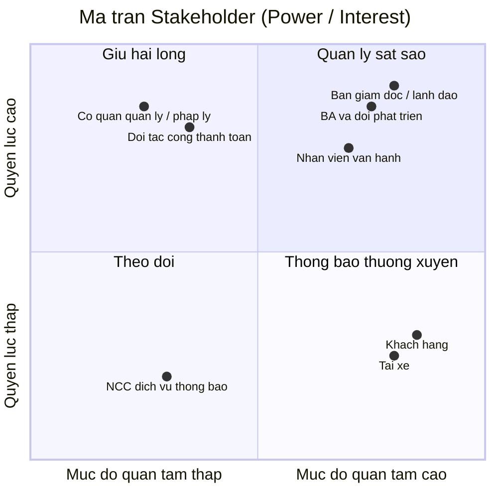

# CAB System — Nền tảng đặt xe

## 0. Tổng quan hệ thống

| Mục | Nội dung |
|---|---|
| **Tên dự án** | CAB System |
| **Loại hệ thống** | Nền tảng đặt xe trực tuyến (ride-hailing platform), tương tự mô hình Grab/Uber |
| **Khách hàng** | Công ty ABC — doanh nghiệp cung cấp dịch vụ đặt xe |
| **Thời gian triển khai** | 7 tuần |
| **Định hướng kiến trúc** | Service-Oriented Architecture / Microservices (do yêu cầu về khả năng mở rộng độc lập, triển khai từng phần, cô lập lỗi giữa các module) |
| **Phạm vi môn học** | Bài tập lớn môn Lập trình hướng dịch vụ (SOA) |

**Ý tưởng cốt lõi:** CAB System kết nối 3 nhóm người dùng — khách hàng, tài xế và nhân viên vận hành — thông qua một chuỗi nghiệp vụ xuyên suốt: *tạo yêu cầu đặt xe → tìm & phân công tài xế → thực hiện chuyến đi → tính cước & thanh toán → thông báo → đánh giá sau chuyến*. Hệ thống không chỉ là một ứng dụng đặt xe đơn thuần mà là một **nền tảng (platform)** có khả năng mở rộng thêm dịch vụ, phương thức thanh toán, kênh thông báo trong tương lai mà không phải xây dựng lại toàn bộ.

Vì hệ thống có nhiều nghiệp vụ độc lập nhưng liên kết chặt (đặt xe, matching, thanh toán, thông báo, quản trị), đây là bài toán rất phù hợp để thiết kế theo hướng **chia nhỏ thành các service riêng biệt**, giao tiếp với nhau qua API/message — đúng tinh thần môn SOA.

---

## Bước 1: Tìm hiểu nghiệp vụ

### 1.1 Vấn đề hiện tại của doanh nghiệp

Theo mô tả của khách hàng, hệ thống hiện tại (tổng đài + app đơn giản) đang gặp các vấn đề sau:

| # | Vấn đề hiện tại |
|---|---|
| 1 | **Phân công tài xế thủ công** — không có cơ chế tự động ghép tài xế phù hợp với khách hàng |
| 2 | **Khách hàng khó theo dõi trạng thái chuyến đi** — thiếu thông tin real-time (đang tìm tài xế, tài xế nhận chuyến, ETA...) |
| 3 | **Thông tin thanh toán không tập trung** — chưa có cơ chế quản lý thanh toán thống nhất, tích hợp |
| 4 | **Khó mở rộng hệ thống** — bộ phận vận hành gặp khó khăn khi muốn scale hoặc thêm tính năng mới |

### 1.2 Mục tiêu của hệ thống mới

- Xây dựng nền tảng CAB có khả năng **phục vụ số lượng lớn khách hàng và tài xế** cùng lúc, đặc biệt ổn định vào giờ cao điểm.
- **Tự động hóa việc tìm và phân công tài xế** dựa trên vị trí, trạng thái sẵn sàng và tiêu chí vận hành, có cơ chế fallback khi tài xế không phản hồi/từ chối.
- Cho khách hàng **theo dõi chuyến đi theo thời gian thực** từ lúc đặt xe đến khi hoàn thành.
- **Tập trung hóa nghiệp vụ thanh toán và tính cước**, hỗ trợ tiền mặt lẫn thanh toán điện tử qua bên thứ ba, không lưu trữ dữ liệu nhạy cảm của thẻ/tài khoản thanh toán trong hệ thống.
- Xây dựng hệ thống **thông báo (notification)** xuyên suốt vòng đời chuyến đi, có khả năng mở rộng thêm kênh thông báo mới sau này.
- Cung cấp **công cụ quản trị & báo cáo** cho vận hành: quản lý khách hàng/tài xế/xe/chuyến đi, phân quyền thao tác nhạy cảm, báo cáo doanh thu/tỷ lệ hoàn thành/hủy/hiệu quả tài xế.
- Đảm bảo **kiến trúc linh hoạt, có thể mở rộng độc lập từng thành phần**: lỗi ở một module (vd. thanh toán, thông báo) không được làm sập toàn bộ hệ thống đặt xe; triển khai tính năng mới từng phần, ít ảnh hưởng phần đang chạy.
- Đảm bảo **bảo mật**: xác thực người dùng, kiểm soát quyền truy cập cho thao tác quản trị, bảo vệ dữ liệu cá nhân/vị trí/giao dịch, lưu vết (audit log) các thao tác quan trọng.

### 1.3 Các nhóm người tham gia sử dụng hệ thống (Actors)

| Actor | Vai trò chính |
|---|---|
| **Khách hàng (Customer)** | Đăng ký/đăng nhập, cập nhật hồ sơ, đặt xe (điểm đón/đến, loại xe), theo dõi trạng thái chuyến, xem lịch sử, thanh toán, đánh giá tài xế sau chuyến |
| **Tài xế (Driver)** | Đăng ký/được vận hành tạo tài khoản, cập nhật hồ sơ & phương tiện, bật trạng thái sẵn sàng, nhận/từ chối chuyến, cập nhật trạng thái chuyến (đến điểm đón, đón khách, di chuyển, hoàn thành), gửi vị trí |
| **Nhân viên vận hành (Operator/Admin)** | Quản lý khách hàng, tài xế, phương tiện, chuyến đi; xử lý sự cố chuyến; tra cứu lịch sử giao dịch; xem báo cáo (số chuyến, doanh thu, tỷ lệ hoàn thành/hủy, hiệu quả tài xế) |
| **Cổng thanh toán bên thứ ba (Payment Gateway)** *(actor hệ thống/bên ngoài)* | Xử lý giao dịch thanh toán điện tử thay cho CAB System, tránh lưu thông tin nhạy cảm trong hệ thống |

> **Lưu ý:** Cổng thanh toán bên thứ ba tuy không phải "người dùng" nhưng đóng vai trò actor hệ thống (external system) vì có tương tác hai chiều với CAB System — đây là điểm cần thể hiện rõ trong sơ đồ Use Case ở bước sau.

### 1.4 Các điểm chưa rõ, cần làm rõ thêm với khách hàng (ghi nhận để xử lý ở bước sau)

Theo yêu cầu, doanh nghiệp **chưa chốt** các nội dung sau — Business Analyst cần làm rõ trước khi đội phát triển thiết kế giải pháp:

- Công thức/cách tính cước
- Tiêu chí ưu tiên tài xế khi matching
- Thời gian tối đa tài xế phải phản hồi một chuyến được đề xuất
- Chính sách hủy chuyến (ai được hủy, khi nào, có phí hủy không...)
- Cách xử lý khi mất kết nối mạng (khách hàng hoặc tài xế)
- Thời gian lưu trữ dữ liệu (lịch sử chuyến, vị trí, giao dịch...)

Trước tiên là bảng stakeholder (2.1), sau đó là ma trận Mendelow dạng sơ đồ (2.2).

## 2.1. Bảng Stakeholders

| Stakeholder | Vai trò | Tương tác với hệ thống |
|---|---|---|
| **Ban giám đốc / Ban lãnh đạo công ty ABC** | Người ra quyết định đầu tư, phê duyệt phạm vi & ngân sách dự án | Không thao tác trực tiếp lên hệ thống; nhận báo cáo tổng hợp (doanh thu, tỷ lệ hoàn thành/hủy, hiệu quả tài xế) để ra quyết định chiến lược |
| **Nhân viên vận hành (Operator)** | Vận hành hằng ngày: giám sát chuyến đi, xử lý sự cố, quản lý dữ liệu | Sử dụng giao diện quản trị (admin) trực tiếp: quản lý khách hàng/tài xế/xe/chuyến, tra cứu giao dịch, thao tác theo phân quyền |
| **Khách hàng (Customer)** | Người dùng cuối, tạo nhu cầu đặt xe | Tương tác trực tiếp qua app: đăng ký, đặt xe, theo dõi chuyến, thanh toán, đánh giá tài xế |
| **Tài xế (Driver)** | Người cung cấp dịch vụ vận chuyển | Tương tác trực tiếp qua app tài xế: nhận/từ chối chuyến, cập nhật trạng thái & vị trí, xem thu nhập |
| **Business Analyst & Đội phát triển** | Phân tích, thiết kế, xây dựng hệ thống | Không phải người dùng cuối nhưng quyết định kiến trúc, luồng nghiệp vụ; cần làm rõ các yêu cầu chưa chốt với khách hàng |
| **Đối tác cổng thanh toán (Payment Gateway)** | Bên thứ ba xử lý giao dịch điện tử | Tương tác qua API/tích hợp hệ thống: nhận yêu cầu thanh toán, trả kết quả giao dịch; không có giao diện người dùng trong CAB System |
| **Nhà cung cấp dịch vụ thông báo (SMS/Email/Push provider)** | Bên thứ ba gửi thông báo | Tương tác qua API tích hợp; hệ thống gọi để gửi thông báo cho khách hàng/tài xế |
| **Cơ quan quản lý / pháp lý** (giao thông, bảo vệ dữ liệu cá nhân) | Đặt ra quy định mà hệ thống phải tuân thủ | Không tương tác trực tiếp với hệ thống, nhưng chi phối yêu cầu về bảo mật dữ liệu, xác thực tài xế, lưu trữ dữ liệu |

## 2.2. Ma trận Stakeholder (Mendelow Matrix)

**Cách đọc và áp dụng ma trận:**

- **Quản lý sát sao** (Ban giám đốc, BA & đội phát triển, Nhân viên vận hành): quyền lực và mức quan tâm đều cao → cần thu hút tham gia thường xuyên, thông tin đầy đủ, xin phê duyệt/phản hồi liên tục trong suốt dự án.
- **Giữ hài lòng** (cơ quan quản lý/pháp lý, đối tác cổng thanh toán): quyền lực cao nhưng ít quan tâm chi tiết hằng ngày → cần đảm bảo tuân thủ yêu cầu của họ (quy định pháp lý, chuẩn tích hợp API) nhưng không cần trao đổi quá thường xuyên.
- **Thông báo thường xuyên** (khách hàng, tài xế): quan tâm cao nhưng quyền lực thấp (không quyết định thiết kế hệ thống) → cần cập nhật thông tin, thu thập phản hồi qua khảo sát/UX testing, nhưng họ không phải người phê duyệt yêu cầu.
- **Theo dõi** (nhà cung cấp dịch vụ thông báo bên thứ ba): quyền lực và quan tâm đều thấp → chỉ cần giám sát ở mức tối thiểu, không cần đầu tư nhiều công sức giao tiếp.

## Bước 3 – Mục đích nghiệp vụ

### 3.1. Mục đích tổng quát

Xây dựng **CAB System** — một nền tảng đặt xe trực tuyến hiện đại, thay thế mô hình vận hành thủ công hiện tại (tổng đài + app đơn giản) — nhằm giúp Công ty ABC:

- Tự động hóa toàn bộ quy trình từ đặt xe → tìm/phân công tài xế → thực hiện chuyến → tính cước → thanh toán → thông báo → đánh giá.
- Phục vụ được **quy mô lớn** khách hàng và tài xế cùng lúc, kể cả vào giờ cao điểm, mà không bị gián đoạn dịch vụ.
- Tạo nền tảng có **kiến trúc mở, dễ mở rộng** để doanh nghiệp phát triển thêm dịch vụ, tính năng trong tương lai mà không phải xây lại từ đầu.

Nói ngắn gọn: mục đích không phải là "làm ra một app đặt xe", mà là "xây một **nền tảng dịch vụ (platform)** đủ vững để doanh nghiệp vận hành và tăng trưởng lâu dài".

### 3.2. Các mục đích chính

| # | Mục đích chính | Giải quyết vấn đề gì |
|---|---|---|
| 1 | **Tự động hóa việc tìm và phân công tài xế** | Thay thế việc phân công thủ công, dựa trên vị trí + trạng thái sẵn sàng, có cơ chế fallback khi tài xế từ chối/không phản hồi |
| 2 | **Minh bạch hóa & theo dõi chuyến đi theo thời gian thực** | Khách hàng biết được trạng thái mỗi bước: đang tìm tài xế → tài xế nhận chuyến → ETA → đang di chuyển → hoàn thành |
| 3 | **Tập trung hóa thanh toán & tính cước** | Thống nhất một luồng thanh toán (tiền mặt + điện tử qua bên thứ ba), không lưu dữ liệu thẻ nhạy cảm trong hệ thống nội bộ |
| 4 | **Xây dựng hệ thống thông báo xuyên suốt vòng đời chuyến đi** | Đảm bảo khách hàng & tài xế luôn được cập nhật kịp thời tại mọi mốc quan trọng; kiến trúc mở để thêm kênh thông báo mới |
| 5 | **Cung cấp công cụ quản trị & báo cáo cho vận hành** | Cho nhân viên vận hành khả năng quản lý, xử lý sự cố, và cho ban lãnh đạo dữ liệu ra quyết định (doanh thu, tỷ lệ hoàn thành/hủy, hiệu quả tài xế) |
| 6 | **Đảm bảo hệ thống ổn định & có khả năng mở rộng độc lập** | Lỗi ở một module (thanh toán, thông báo) không được làm sập toàn hệ thống; scale riêng từng thành phần khi tải tăng |
| 7 | **Bảo mật dữ liệu và kiểm soát truy cập** | Xác thực người dùng, phân quyền thao tác nhạy cảm, bảo vệ dữ liệu cá nhân/vị trí/giao dịch, lưu vết thao tác để phục vụ audit |
| 8 | **Tạo kiến trúc linh hoạt cho tăng trưởng dài hạn** | Cho phép thêm loại dịch vụ mới, phương thức thanh toán mới, nhà cung cấp thông báo mới... mà không phải xây lại toàn bộ hệ thống |

> Các mục đích 6, 7, 8 chính là lý do bài toán này phù hợp để triển khai theo hướng **SOA/microservices** — tách các nghiệp vụ (đặt xe, matching, thanh toán, thông báo, quản trị) thành các service độc lập, giao tiếp qua API, để đáp ứng đúng yêu cầu "lỗi cục bộ không sập toàn hệ thống" và "mở rộng từng phần".

## Bước 4 – Xác định phạm vi dự án

### 4.1. Trong phạm vi (In-scope)

**Nhóm chức năng dành cho Khách hàng:**
- Đăng ký, đăng nhập, cập nhật thông tin cá nhân
- Nhập điểm đón/điểm đến, chọn loại xe, gửi yêu cầu đặt xe
- Theo dõi trạng thái chuyến đi theo thời gian thực (đang tìm tài xế, tài xế nhận chuyến, ETA, đang di chuyển, hoàn thành)
- Xem lịch sử chuyến đi, số tiền đã trả
- Thanh toán (tiền mặt + điện tử qua cổng thanh toán bên thứ ba)
- Đánh giá tài xế sau chuyến

**Nhóm chức năng dành cho Tài xế:**
- Đăng ký / được nhân viên vận hành tạo tài khoản
- Cập nhật hồ sơ cá nhân, thông tin phương tiện
- Bật/tắt trạng thái sẵn sàng nhận chuyến
- Nhận thông báo chuyến mới, chấp nhận/từ chối chuyến
- Cập nhật trạng thái chuyến (đến điểm đón, đón khách, đang di chuyển, hoàn thành)
- Gửi vị trí liên tục để hỗ trợ matching & ước tính ETA

**Nhóm chức năng cốt lõi (Core business logic):**
- Thuật toán tìm & phân công tài xế (matching), có cơ chế fallback khi tài xế không phản hồi/từ chối
- Tính cước sau khi hoàn thành chuyến
- Xử lý thanh toán, tích hợp cổng thanh toán bên thứ ba
- Hệ thống thông báo (notification) cho các sự kiện trong vòng đời chuyến đi

**Nhóm chức năng dành cho Nhân viên vận hành (Admin):**
- Quản lý khách hàng, tài xế, phương tiện, chuyến đi
- Giám sát chuyến đang diễn ra, xử lý sự cố chuyến bị lỗi
- Tra cứu lịch sử giao dịch
- Phân quyền cho các thao tác nhạy cảm
- Báo cáo: số lượng chuyến, doanh thu, tỷ lệ hoàn thành/hủy, hiệu quả tài xế

**Yêu cầu phi chức năng cần đáp ứng trong phạm vi:**
- Kiến trúc có khả năng mở rộng độc lập từng thành phần (scale riêng)
- Cô lập lỗi: lỗi ở module thanh toán/thông báo không làm sập toàn hệ thống
- Triển khai (deploy) từng phần, hạn chế ảnh hưởng đến chức năng đang chạy
- Xác thực, phân quyền, bảo vệ dữ liệu cá nhân/vị trí/giao dịch, audit log

### 4.2. Ngoài phạm vi (Out-of-scope)

| # | Nội dung ngoài phạm vi | Lý do |
|---|---|---|
| 1 | Xây dựng hệ thống xử lý thanh toán riêng (lưu trữ thông tin thẻ, tài khoản ngân hàng) | Khách hàng yêu cầu **tích hợp với nhà cung cấp thanh toán bên ngoài**, không tự lưu dữ liệu nhạy cảm |
| 2 | Xác định công thức tính cước cụ thể, chính sách hủy chuyến, tiêu chí ưu tiên tài xế chi tiết | Doanh nghiệp **chưa chốt**, cần BA làm rõ với các bên liên quan ở giai đoạn phân tích trước khi dev xây dựng — đây là input cho scope, không phải scope đã đóng băng |
| 3 | Xây dựng thêm loại dịch vụ mới, phương thức thanh toán mới, kênh thông báo mới (ngoài kênh cơ bản) | Chỉ yêu cầu **kiến trúc phải sẵn sàng cho mở rộng**, chưa yêu cầu triển khai ngay trong 7 tuần |
| 4 | Ứng dụng dành cho các nền tảng ngoài phạm vi đã thống nhất (nếu có, cần xác nhận: web, iOS, Android...) | Chưa được đề cập rõ trong yêu cầu — cần xác nhận thêm với khách hàng |
| 5 | Tích hợp bản đồ/định tuyến chi tiết (bên thứ ba cụ thể nào, thuật toán định tuyến tối ưu) | Yêu cầu chỉ nói đến "vị trí tài xế" và "ước tính thời gian đến", chưa xác định rõ nhà cung cấp bản đồ hay logic định tuyến |
| 6 | Chương trình khuyến mãi, mã giảm giá, chăm sóc khách hàng qua tổng đài | Không được đề cập trong yêu cầu ban đầu |

### 4.3. Ràng buộc (Constraints)

| Loại ràng buộc | Nội dung |
|---|---|
| **Thời gian** | Chỉ có **7 tuần** để xây dựng và triển khai — ảnh hưởng trực tiếp đến việc chọn kiến trúc và mức độ chi tiết có thể làm trong phạm vi |
| **Kỹ thuật** | Không được lưu trữ thông tin nhạy cảm của thẻ/tài khoản thanh toán trong hệ thống CAB (bắt buộc dùng bên thứ ba xử lý) |
| **Kiến trúc** | Phải đảm bảo khả năng mở rộng độc lập và cô lập lỗi giữa các thành phần — định hướng chọn microservices thay vì monolithic |
| **Nghiệp vụ chưa chốt** | Nhiều quy tắc nghiệp vụ quan trọng (cách tính cước, chính sách hủy, thời gian phản hồi...) **chưa được xác nhận**, có thể ảnh hưởng đến scope chi tiết sau khi làm rõ |

### 4.4. Giả định (Assumptions)

*(cần xác nhận lại với khách hàng ở các bước sau — liệt kê ở đây để không bỏ sót)*

- Giả định hệ thống được xây dựng dưới dạng **ứng dụng di động** cho khách hàng và tài xế, kèm **giao diện web** cho nhân viên vận hành (chưa có xác nhận chính thức từ khách hàng).
- Giả định trong 7 tuần chỉ triển khai **một loại dịch vụ đặt xe cơ bản** (chưa phân nhiều hạng xe phức tạp), kiến trúc chừa chỗ mở rộng sau.
- Giả định có tối thiểu **một** cổng thanh toán bên thứ ba được tích hợp trong giai đoạn đầu (không cần multi-gateway ngay).
- Giả định thông báo trong giai đoạn đầu dùng tối thiểu **1-2 kênh cơ bản** (ví dụ: push notification/SMS), kiến trúc phải cho phép thêm kênh sau này.

## Bước 5 – Xác định yêu cầu nghiệp vụ (Business Requirements)
### 5.1. Nhóm yêu cầu nghiệp vụ — Khách hàng

| Mã BR | Yêu cầu nghiệp vụ |
|---|---|
| BR-01 | Hệ thống phải cho phép khách hàng đăng ký tài khoản và đăng nhập để sử dụng dịch vụ |
| BR-02 | Hệ thống phải cho phép khách hàng cập nhật thông tin cá nhân |
| BR-03 | Hệ thống phải cho phép khách hàng tạo yêu cầu đặt xe bằng cách nhập điểm đón, điểm đến và chọn loại xe |
| BR-04 | Hệ thống phải hiển thị cho khách hàng trạng thái chuyến đi theo thời gian thực, bao gồm: đang tìm tài xế, tài xế đã nhận chuyến, thời gian dự kiến tài xế đến, và trạng thái hiện tại của chuyến |
| BR-05 | Hệ thống phải cho phép khách hàng xem lại lịch sử các chuyến đi đã thực hiện, kèm số tiền đã thanh toán |
| BR-06 | Hệ thống phải cho phép khách hàng đánh giá tài xế sau khi chuyến đi hoàn thành |
| BR-07 | Hệ thống phải thông báo rõ ràng cho khách hàng trong trường hợp không tìm được tài xế phù hợp |

### 5.2. Nhóm yêu cầu nghiệp vụ — Tài xế

| Mã BR | Yêu cầu nghiệp vụ |
|---|---|
| BR-08 | Hệ thống phải cho phép tài xế đăng ký tài khoản, hoặc được nhân viên vận hành tạo tài khoản thay |
| BR-09 | Hệ thống phải cho phép tài xế cập nhật hồ sơ cá nhân và thông tin phương tiện |
| BR-10 | Hệ thống phải cho phép tài xế chuyển đổi trạng thái sẵn sàng nhận chuyến khi đang làm việc |
| BR-11 | Hệ thống phải gửi thông báo cho tài xế khi có yêu cầu đặt xe phù hợp, và cho phép tài xế chấp nhận hoặc từ chối |
| BR-12 | Hệ thống phải cho phép tài xế cập nhật trạng thái chuyến đi theo từng mốc: đã đến điểm đón, đã đón khách, đang di chuyển, hoàn thành chuyến |
| BR-13 | Hệ thống phải ghi nhận vị trí của tài xế liên tục để phục vụ việc tìm tài xế gần khách hàng và ước tính thời gian đến |

### 5.3. Nhóm yêu cầu nghiệp vụ — Tìm & phân công tài xế (Matching)

| Mã BR | Yêu cầu nghiệp vụ |
|---|---|
| BR-14 | Hệ thống phải tự động xác định danh sách tài xế phù hợp dựa trên vị trí, trạng thái sẵn sàng và các tiêu chí vận hành khác khi khách hàng tạo yêu cầu đặt xe |
| BR-15 | Hệ thống phải ưu tiên đề xuất tài xế phù hợp và gần khách hàng nhất |
| BR-16 | Hệ thống phải tự động tìm tài xế khác nếu tài xế được đề xuất không phản hồi hoặc từ chối, mà không yêu cầu khách hàng tạo lại yêu cầu đặt xe |

### 5.4. Nhóm yêu cầu nghiệp vụ — Thanh toán & tính cước

| Mã BR | Yêu cầu nghiệp vụ |
|---|---|
| BR-17 | Hệ thống phải tự động xác định số tiền khách hàng phải trả sau khi chuyến đi hoàn thành, dựa trên loại dịch vụ và thông tin chuyến đi |
| BR-18 | Hệ thống phải hỗ trợ khách hàng thanh toán bằng tiền mặt hoặc phương thức thanh toán điện tử |
| BR-19 | Hệ thống phải tích hợp với nhà cung cấp thanh toán bên ngoài, không được lưu trực tiếp thông tin nhạy cảm của thẻ/tài khoản thanh toán trong hệ thống CAB |
| BR-20 | Hệ thống phải thông báo cho khách hàng và cho phép xử lý lại khi giao dịch thanh toán điện tử thất bại, theo chính sách của doanh nghiệp |

### 5.5. Nhóm yêu cầu nghiệp vụ — Thông báo (Notification)

| Mã BR | Yêu cầu nghiệp vụ |
|---|---|
| BR-21 | Hệ thống phải thông báo cho khách hàng tại các mốc: yêu cầu đặt xe được tiếp nhận, tài xế nhận chuyến, tài xế đến điểm đón, chuyến hoàn thành, kết quả thanh toán |
| BR-22 | Hệ thống phải thông báo cho tài xế về chuyến mới hoặc thay đổi liên quan đến chuyến đang thực hiện |
| BR-23 | Hệ thống phải có khả năng mở rộng thêm kênh thông báo mới trong tương lai mà không phải thay đổi toàn bộ hệ thống |

### 5.6. Nhóm yêu cầu nghiệp vụ — Vận hành & Quản trị

| Mã BR | Yêu cầu nghiệp vụ |
|---|---|
| BR-24 | Hệ thống phải cung cấp giao diện quản trị cho nhân viên vận hành để quản lý khách hàng, tài xế, phương tiện và chuyến đi |
| BR-25 | Hệ thống phải cho phép nhân viên vận hành xem các chuyến đang diễn ra và kiểm tra trạng thái tài xế |
| BR-26 | Hệ thống phải cho phép nhân viên vận hành hỗ trợ xử lý các chuyến bị lỗi và tra cứu lịch sử giao dịch |
| BR-27 | Hệ thống phải phân quyền chức năng quản trị, đảm bảo nhân viên thông thường không thể thực hiện thao tác nhạy cảm |
| BR-28 | Hệ thống phải cung cấp báo cáo về số lượng chuyến, doanh thu, tỷ lệ chuyến hoàn thành, tỷ lệ hủy, và hiệu quả hoạt động của tài xế |

### 5.7. Nhóm yêu cầu nghiệp vụ — Phi chức năng (ở mức nghiệp vụ)

| Mã BR | Yêu cầu nghiệp vụ |
|---|---|
| BR-29 | Hệ thống phải hoạt động ổn định vào các thời điểm nhu cầu tăng cao |
| BR-30 | Lỗi tại một chức năng (vd. thanh toán, thông báo) không được làm gián đoạn toàn bộ hệ thống đặt xe |
| BR-31 | Các thành phần hệ thống phải có khả năng mở rộng độc lập khi tải tăng |
| BR-32 | Hệ thống phải cho phép triển khai chức năng mới từng phần, hạn chế ảnh hưởng đến chức năng đang hoạt động |
| BR-33 | Hệ thống phải xác thực khách hàng và tài xế trước khi cho phép sử dụng các chức năng yêu cầu tài khoản |
| BR-34 | Hệ thống phải kiểm soát quyền truy cập đối với các thao tác quản trị |
| BR-35 | Hệ thống phải bảo vệ thông tin cá nhân, thông tin phương tiện, dữ liệu vị trí và dữ liệu giao dịch |
| BR-36 | Hệ thống phải lưu vết (audit log) các thao tác quan trọng để phục vụ kiểm tra khi có sự cố |

